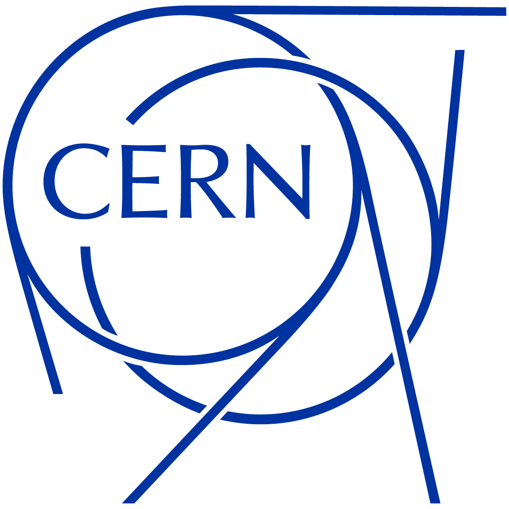

[](https://gitlab.cern.ch/cta/CTA/-/releases)
[](https://gitlab.cern.ch/cta/CTA/-/commits/main/)
[](https://sonarcloud.io/project/overview?id=cern-cta_CTA)
[](https://meter-cta.web.cern.ch/d/mpoGeGDSk/continuous-integration)
[](https://gitlab.cern.ch/cta/CTA/-/commits/main?ref_type=heads)
[](https://gitlab.cern.ch/cta/CTA/-/issues)
[](COPYING)

<br />
<div align="center">
  <a href="https://gitlab.cern.ch/cta/CTA/">
    
  </a>
<h3 align="center" style="padding-top: 0">CTA</h3>
  <p align="center">
    The CERN Tape Archive open source tape data management software.
    <br />
    <a href="https://eoscta.docs.cern.ch/"><strong>Explore the docs »</strong></a>
    <br />
    <br />
    <a href="https://eoscta.docs.cern.ch/latest/overview/getting_started/">Getting Started</a>
    ·
    <a href="https://cta.web.cern.ch/">CTA Website</a>
    ·
    <a href="https://cta-community.web.cern.ch/">Community Forum</a>
  </p>
</div>

___

## About CTA

The CERN Tape Archive (CTA) is the storage system for the custodial copy of all physics data at CERN. It keeps track of files stored on magnetic tape and handles user requests. CTA is the archival solution of choice for the 3rd activity period of the Large Hadron Collider, and beyond.

CTA is:

- The leading Free and Open Source tape data management software
- Home to more than 800PB of data at CERN
- Scalable, for small and large installations
- Self-hostable, on-premise
- Private and secure

## Getting Started

The simplest way to get start with CTA is by using the publically available RPMs.

**Install CTA**

1. Setup the cta-public repo for CTA:

    ```bash
    echo -e "[cta-public-5-alma9]\n \
              name=CTA artifacts\n \
              baseurl=https://cta-public-repo.web.cern.ch/stable/cta-5/el9/cta/x86_64/\n \
              gpgcheck=0\n \
              ena bled=1\n \
              priority=2" \
      > /etc/yum.repos.d/cta-public-5.repo
    ```

2. Install the `cta-release` package:

    ```bash
    yum install cta-release
    ```

3. Install CTA and EOS packages - choose the appropriate packages, as needed.
    On the CTA frontend:
    ```bash
    yum install cta-frontend cta-cli cta-common cta-catalogueutils cta-debuginfo cta-objectstore-tools
    yum install cta-lib cta-lib-catalogue cta-lib-common cta-lib-commoncta
    
    yum install eos-client eos-xrootd eos-grpc
    yum install eos-folly-2019.11.11.00 eos-folly-deps-2019.11.11.00
    ```
    On the CTA tape servers:
    ```bash
    yum install cta-taped cta-rmcd cta-smc cta-cli cta-common cta-debuginfo
    yum install cta-lib cta-lib-catalogue cta-lib-common
    yum install cta-readtp cta-tape-label-5.10.10.1-1.el9.el9.x86_64

    yum install eos-client eos-xrootd eos-grpc
    yum install eos-folly-2019.11.11.00 eos-folly-deps-2019.11.11.00
    ```

For more detailed instructions, please visit [the documentation](https://eoscta.docs.cern.ch/latest/overview/getting_started/).

## License

This project is licensed under the GNU General Public License - see the [COPYING](COPYING) file for details

___

<div align="center">
  <a href="https://home.cern/">
    
  </a>
</div>