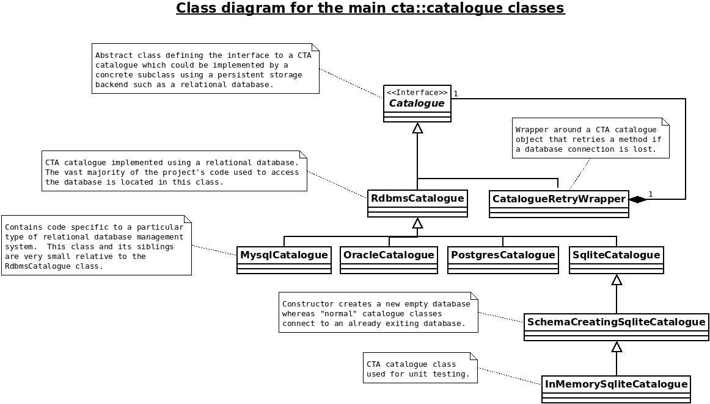

# What the CTA catalogue does

The CTA catalogue uses a database to store the following non exhaustive list of information:

  1. The location of each file stored on tape.
  2. The placement of tapes into tape libraries.
  3. The organisation of tapes into tape pools.
  4. The archive routes which decide which files get written to which tape pools.
  5. The rules defining when tapes get mounted for which users.

# Design overview of the CTA catalogue and the supporting `rdbms` layer

The CTA catalogue supports the following database management systems:

  1. Oracle.
  2. PostgreSQL.
  3. MySQL.
  4. SQLite.

SQLite is only used for implementing C++ unit-tests and in this capacity is configured to run as an “in memory” database.  Oracle is used at CERN for the production deployments of CTA because it has a team of database administrators behind it who ensure it’s smooth running and recovery in case of disaster.  PostgreSQL is actually the target database management system for CTA because it is open source.    MySQL is supported to enable IHEP in China to run CTA.  IHEP in China implemented the support for MySQL.

Database management systems differ in at least the following 3 areas with respect to developing software systems on top of them:

  1. Differences in SQL syntax and features.
  2. Differences in API syntax and functionality.
  3. Differences in transaction management.

The CTA catalogue is composed of three layers which together help tackle the differences between database management systems:

  1. The CTA Catalogue class and it’s sub-classes
  2. The rdbms layer
  3. The database schema

The main design goal is to implement the majority of the database persistency logic in common classes and code and to only write specialised code when absolutely necessary.  Please note that PL/SQL has been purposely avoided in the CTA project because it can easily lead to the project getting locked into one specific database management system.

Starting at the bottom of the three layers, the database schema of the CTA catalogue is visualised here:

  • https://gitlab.cern.ch/cta/CTA/-/blob/master/catalogue/catalogue_schema.pdf

The source of the schema is located here:

  1. [common_catalogue_schema.sql](https://gitlab.cern.ch/cta/CTA/-/blob/master/catalogue/common_catalogue_schema.sql)
  2. [mysql_catalogue_schema_header.sql](https://gitlab.cern.ch/cta/CTA/-/blob/master/catalogue/mysql_catalogue_schema_header.sql)
  3. [mysql_catalogue_schema_trailer.sql](https://gitlab.cern.ch/cta/CTA/-/blob/master/catalogue/mysql_catalogue_schema_trailer.sql)
  4. [oracle_catalogue_schema_header.sql](https://gitlab.cern.ch/cta/CTA/-/blob/master/catalogue/oracle_catalogue_schema_header.sql)
  5. [oracle_catalogue_schema_trailer.sql](https://gitlab.cern.ch/cta/CTA/-/blob/master/catalogue/oracle_catalogue_schema_trailer.sql)
  6. [postgres_catalogue_schema_header.sql](https://gitlab.cern.ch/cta/CTA/-/blob/master/catalogue/postgres_catalogue_schema_header.sql)
  7. [postgres_catalogue_schema_trailer.sql](https://gitlab.cern.ch/cta/CTA/-/blob/master/catalogue/postgres_catalogue_schema_trailer.sql)
  8. [sqlite_catalogue_schema_header.sql](https://gitlab.cern.ch/cta/CTA/-/blob/master/catalogue/sqlite_catalogue_schema_header.sql)
  9. [sqlite_catalogue_schema_trailer.sql](https://gitlab.cern.ch/cta/CTA/-/blob/master/catalogue/sqlite_catalogue_schema_trailer.sql)

Do not be alarmed by the number of SQL files.  99% of the schema is in `common_catalogue_schema.sql`.  The rest of the files contain very small amounts of SQL that show the differences between different database management systems.

Moving up the layers, the source code of the CTA rdbms layer is located here:

  * https://gitlab.cern.ch/cta/CTA/-/tree/master/rdbms

The goal of this layer is to hide as much as possible the difference in API syntax and functionality.  The main classes of the layer are:
  1. `ConnPool` - A database connection pool
  2. `ConnAndStmts` - A connection and its prepared statements
  3. `Conn` - A connection from which statements can be created
  4. `Stmt` - A database statement that can be executed
  5. `Rset` - The result set from the execution of a statement

Users of the these classes do not need to know which database technology is being used underneath.  The classes are smart with respect to the management of the underlying database resources.  The specific implementation details that make these classes work with different database management systems is coded within wrapper classes in the following location:

  • [rdbms/wrapper](https://gitlab.cern.ch/cta/CTA/-/tree/master/rdbms/wrapper)

Moving to the top layer, the classes representing the CTA catalogue are located here:

  • [catalogue](https://gitlab.cern.ch/cta/CTA/-/tree/master/catalogue)

The six main classes to note are:

  1. `Catalogue`
  2. `RdbmsCatalogue`
  3. `OracleCatalogue`
  4. `PostgresCatalogue`
  5. `MysqlCatalogue`
  6. `InMemoryCatalogue`

The `Catalogue` class is an interface class.  Its purpose is to allow the CTA catalogue to be implemented by any form of persistent store and not just relational database management systems.  The `RdbmsCatalogue` class inherits from `Catalogue` and implements the majority of the CTA catalogue logic.  The design goal is to implement as much of the logic in common code as is possible and to only implement specialised code when absolutely necessary.  The `InMemoryCatalogue` class is used solely for implementing C++ unit tests.  The remaining classes contain the code required to work with specific database management systems.

The following class diagram shows the above 6 main classes plus the `SchemaCreatingSQLiteCatalogue` and `CatalogueRetryWrapper` classes:



# Create a new version of the Catalogue Schema

## Introduction

The Catalogue schema is the description of the tables that represent the CTA Catalogue.

The Catalogue schema is associated to a number that has the following format :
```
SCHEMA_VERSION_MAJOR.SCHEMA_VERSION_MINOR
```
*Example: 1.0, 1.1, 2.0*

**WARNING**
    The changing of the *SCHEMA_VERSION_MAJOR* number has to be modified **ONLY** if the changes made to the schema are [not backward-compatible](https://eoscta.docs.cern.ch/catalogue/upgrade/backward_incompatible_upgrades/) with the currently running version of CTA.

**DANGER**
    While starting, CTA will check the *SCHEMA_VERSION_MAJOR* schema version it is supposed to run against. If the *SCHEMA_VERSION_MAJOR* is not the correct one, CTA will not start.

## Modify the Catalogue schema

**WARNING**
    Modifying the Catalogue schema means that a new version of the schema has to be created.

**DANGER**
    Do not modify any .sql files without changing the version of the schema first (follow the following step 1) ! If you do, the current schema will be overwritten by the modifications you made. (Rollbackable by removing your changes and by building CTA again). If any doubts, do a git diff and check that the current schema directory located in the catalogue folder does not contain any changes.

In order to modify the Catalogue schema, please follow the following steps.

1. Modify the **CTA_CATALOGUE_SCHEMA_VERSION_MAJOR** and the **CTA_CATALOGUE_SCHEMA_VERSION_MINOR** variables that are located in the directory *cmake/CTAVersions.cmake*. Update *ReleaseNotes.md* to reflect schema change.
2. Run the build of CTA

    --> It will create a new folder that will be named according to the schema versions variables modified at step 1. (Example: if the new schema version is 1.1, the directory 1.1 will be created in the catalogue directory).

3. Modify the schema by editing the .sql files located in the catalogue directory :
    - *databasetype*_catalogue_schema_header.sql
    - common_catalogue_schema.sql
    - *databasetype*_catalogue_schema_trailer.sql

    Where *databasetype* is either **oracle** or **postgres** or **sqlite** or **mysql**.

4. Run the build of CTA
    --> It will modify the files located in the folder created at step 2.

5. Try the new schema you created in an empty database. Your schema should work with Oracle, PostgreSQL, MySQL and SQLite.

**TIP**
        You can use the **cta-catalogue-schema-create** tool to create the new schema

6. If everything works, let's define a [upgrade strategy](https://eoscta.docs.cern.ch/catalogue/upgrade/).
