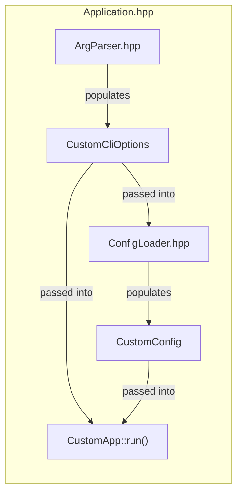

# Runtime Library

The files in this directory aim to provide a basic framework for every tool and every application in CTA.
Its main goals are (in order of importance):

- Improving consistency between the various apps and tools.
- Reducing the amount of mistakes a developer can introduce by accident.
- Reducing the amount of boilerplate code needed to set up a new tool/app.

This runtime library does this by providing a common framework that is easy to use and **checks as much as possible at compile time**.

## Running a Runtime-based Application with systemd

System services using the runtime library should let systemd create their ephemeral runtime and log directories. Use a service-specific runtime directory such as `/run/cta/<service>` rather than sharing `/run/cta` directly: the runtime library writes deterministic names including `config.toml` and `version.json`, which would collide if multiple services shared one directory.

A service unit should follow this pattern:

```systemd
[Service]
User=cta
Group=tape
RuntimeDirectory=cta/<service>
RuntimeDirectoryMode=0750
LogsDirectory=cta cta/old
LogsDirectoryMode=0755
ExecStart=/usr/bin/cta-<service> --runtime-dir=/run/cta/<service> --log-file=/var/log/cta/cta-<service>.log
```

For file logging, rotate by renaming the active file and then use `systemctl kill --kill-whom=main --signal=HUP <unit>` to make the service reopen it. Do not expose this as `ExecReload` unless the application genuinely reloads its configuration: operators reasonably expect `systemctl reload` to apply configuration changes. Do not use `copytruncate`: runtime-based applications refresh their log file descriptor on `SIGHUP`. Use `delaycompress` so compression cannot race with writes made before the signal is processed. If rotated files use an `olddir`, it must be on the same filesystem as the active log.

`cta-maintd` currently implements this convention. Other daemons should adopt it when they migrate to the runtime library. A container that runs exactly one CTA process may use `/run/cta` directly because there is no risk of another process overwriting the deterministic runtime filenames. The image must create that directory with the service account as owner; no runtime volume is required unless the metadata must survive container replacement. Container logging should normally use stdout rather than a systemd-managed log directory.

## Deploying Configuration

Packages should install a documented example configuration, but should not copy it automatically to the live configuration path. Examples necessarily contain deployment-specific placeholders or illustrative values; treating one as a working default can start a service against the wrong resources. This is especially important for services such as `cta-taped`, where values such as the drive name must be supplied by the operator.

Service units should pass the live configuration path explicitly and enable `--config-strict`. An operator or configuration-management system should create the live file from the packaged example, replace every site-specific value, and validate it before starting the service:

```console
cta-<service> --config=/etc/cta/cta-<service>.toml --config-strict --config-check
```

Leaving the live file absent is intentional: a fresh installation then fails closed until it has been configured. Example files remain useful as versioned references and may gain new settings during package upgrades without overwriting an operator's live configuration.

Each application/tool has the same two inputs:

1. The commandline arguments.
2. The config file.

The main idea behind the implementation library here is to separate between (1) what the code representation of these two inputs look like and (2) how this code representation is populated from what the user provided.

Both the commandline arguments and the config file are internally defined as simple immutable struct (a data class if you will).
In addition, the main App is specified as a simple class.
This means that the developer defines three things (in this order):
1. The struct to store the commandline options
2. The struct to store the config
3. The class of your main application

Then the way you define an app is as follows:

```c++
runtime::Application<CustomApp, CustomConfig, CustomCliOptions> app("my-app", "This is a description of my app");
app.run(argc, argv);
```

A picture is worth a few words; a very simplified view of `Application.hpp` is this:



## Config Loading

Config loading is done using a combination of [tomlplusplus](https://github.com/marzer/tomlplusplus) to read TOML files and a custom parser to populate the struct.

The only thing the developer needs to take care of is that the structure of the config struct matches the structure of TOML files. Both in terms of types and in terms of hierarchy and names. See e.g. `maintd/` for an example of what this looks like.

## Examples

As a general rule of thumb, you can also check the unit tests for various examples.

## Basic Example with Custom Config

```c++
struct CustomConfig final {
  // Add this if the app/tool uses the catalogue
  cta::runtime::CatalogueConfig catalogue;
  // Add this if the app/tool uses the scheduler
  cta::runtime::SchedulerConfig scheduler;
  // Must always be present; all tools and apps support logging
  cta::runtime::LoggingConfig logging;
  // Add this if the app should be able to produce telemetry
  cta::runtime::TelemetryConfig telemetry;
  // Add this if the app needs a separate health endpoint
  // Don't add this if the app already natively exposes a health endpoint (e.g. a REST API)
  cta::runtime::HealthServerConfig health_server;
  // Add this if the app has experimental options
  // For now, this must be added if telemetry is there as telemetry is considered experimental
  cta::runtime::ExperimentalConfig experimental;
  // Add this if the app uses XRootD
  cta::runtime::XRootDConfig xrootd;
  // Put whatever you want here; will be populated from the config file and available in the run() function
  MyCustomConfStruct customConf;

  // All configs must have this function (limitation of custom reflection implementation)
  // If this number is not consistent with the actual number of members, it won't compile
  static constexpr std::size_t memberCount() { return 8; }
};

class CustomApp {
public:
  CustomApp() = default;
  ~CustomApp() = default;
  void stop(); // Every app MUST have a stop() function
  // Consuming the CLI options
  int run(const CustomConfig& config, cta::log::Logger& log);
  // Alternatively this would compile as well:
  // int run(const CustomConfig& config, runtime::CommonCliOptions& opts, cta::log::Logger& log);
  bool isLive() const; // Since there is a health_server config, it MUST have an isLive() function
  bool isReady() const; // Since there is a health_server config, it MUST have an isReady() function
  // Optional program-owned OpenTelemetry resource attributes.
  std::map<std::string, std::string> getStaticTelemetryAttributes(const CustomConfig& config) const;
};

int main(const int argc, char** const argv) {
  using namespace cta;
  return runtime::safeRun([argc, argv]() {
    runtime::Application<CustomApp, CustomConfig, runtime::CommonCliOptions> app("cta-custom-app", "description");
    return app.run(argc, argv);
  });
}
```

Program-owned telemetry resource attributes can be returned by the optional `getStaticTelemetryAttributes()` application method.
Operator-configured resource attributes belong in the declarative OpenTelemetry configuration file.
The runtime uses the application name passed to `Application` unchanged as `service.name`.
Runtime identity attributes such as `service.name`, `service.version`, `service.instance.id`, `host.name`, and the scheduler namespace are reserved.
Attribute keys and values cannot contain commas, equals signs, carriage returns, or line feeds because they are serialized into `CTA_OTEL_RESOURCE_ATTRIBUTES`.

## App with Custom CLI options

```c++
struct CustomCliOptions : public cta::runtime::CommonCliOptions {
  std::string iAmExtra;
};

// Typically if you want to add custom CLI options, it means your app should consume them.
// As such, the run() method of CustomApp example would change to:
int run(const CustomConfig& config, const CustomCliOptions& opts, cta::log::Logger& log);

int main(const int argc, char** const argv) {
  using namespace cta;
  return runtime::safeRun([argc, argv]() {
    runtime::Application<CustomApp, CustomConfig, CustomCliOptions> app("cta-custom-app", "description");
    app.parser().withStringArg(&CustomCliOptions::iAmExtra, "extra", 'e', "STUFF", "my description");
    return app.run(argc, argv);
  });
}
```

## Most minimal example you can get away with

```c++
struct MinimalConfig final {
  cta::runtime::LoggingConfig logging;

  static constexpr std::size_t memberCount() { return 1; }
};

class MinimalApp {
public:
  MinimalApp() = default;
  ~MinimalApp() = default;
  void stop(); // Every app MUST have a stop() function
  // Consuming the CLI options
  int run(const MinimalConfig& config, cta::log::Logger& log);
  // Alternatively this would compile as well:
  // int run(const MinimalConfig& config, runtime::CommonCliOptions& opts, cta::log::Logger& log);
};

int main(const int argc, char** const argv) {
  using namespace cta;
  return runtime::safeRun([argc, argv]() {
    runtime::Application<MinimalApp, MinimalConfig, runtime::CommonCliOptions> app("cta-custom-app", "description");
    return app.run(argc, argv);
  });
}
```
