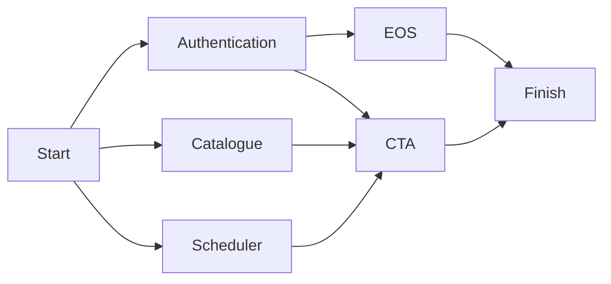

# CTA Orchestration

In this directory you can find all the necessary files to deploy CTA test instance on a (pre-configured) Kubernetes cluster.
If you are reading this, then you are most likely interesting in setting up a local development environment. This is done via the [CTA CI Minikube](https://gitlab.cern.ch/cta/minikube_cta_ci) repository. This setup does four important things:

- It install and configures MHVTL (virtual tape library)
- It installs and configures Minikube (for running a local cluster)
- Finally, it allows you to set up the necessary secrets to pull from the private registry.

Note that we are working on improving this setup and making it more portable. For specific details on how to get a local instance up and running, see [the development setup docs](https://eoscta.docs.cern.ch/latest/dev/development_setup/).

At the heart of the orchestration are two scripts:
- `create_instance.sh`: this script is responsible for creating the namespace and spawning all the pods. By the time this script has finished, a usable local CTA instance has been deployed.
- `delete_instance.sh`: at its simplest, this script simply deletes a given namespace. However, before doing so, it is able to collect logs and additional debug output. This is particularly useful in CI pipelines where all of these logs are stored as artifacts.

In addition to this, there is the `run_systemtest.sh` script. This script will do everything in one go. It will:
1. Cleanup/delete any old namespaces
2. Create a new CTA instance
3. Perform a setup script on this instance (e.g. intantiating some admin accounts, adding VOs, labeling tapes, etc)
4. Execute a provided test script (e.g. `tests/test_client.sh`).
5. Clean up the namespace again

Of course all of the above is configurable to a high degree; see the `--help` output of these scripts for additional details.

## How an instance is spawned

A CTA instance is fully deployed using [Helm](https://helm.sh/). Helm uses the concept of charts. To quote: "Helm uses a packaging format called charts. A chart is a collection of files that describe a related set of Kubernetes resources.". Helm makes it simpler for us to define a configurable complex Kubernetes application such as CTA. The configuration of the cluster is done through `values.yaml` files. Provided that the `values.yaml` has the expected structure (verified through the corresponding `schema.version.json`), we can pass in any configuration we want. The default `values.yaml` file provided in each corresponding chart will already have *most* of the required values set correctly. However, there are a few things that need to be provided manually, as they will either change frequently or are specific to your own setup.

To understand each of these required configuration options, we will go through the spawning of each component separately, detail how it works and what configuration is expected from you. Note that you most likely won't have to interact with Helm directly; all of the important/required configuration can be done through the `create_instance.sh` script.

Charts that have CTA-specific functionality (basically all of them), rely on an image `ctageneric`. This is the image built as specified in the `docker/` directory. This image contains all of the CTA RPMs, in addition to the startup-scripts required for each container.

The installation order of the charts details below is import. The order is as follows:



### Authentication

The first chart that will be installed is the `auth` chart. This chart sets up any required secrets (such as SSS and gRPC secrets) and a Key Distribution Center (KDC) which can be used to grant Kerberos tickets. In a production environment, this KDC would be a pre-existing centralized service somewhere. The Authentication chart must be installed first, because it creates the resources that other charts depend on.

The `auth` chart expects the following required parameters:
- `image.tag`: the tag for the `ctageneric` image to use. This is used by the `kdc` pod.
- `image.repository`: The full name of the image. Defaults to `gitlab-registry.cern.ch/cta/ctageneric`

### Catalogue

The `catalogue` chart does a few things:
- First and foremost, it will create a configmap with the database connection string, i.e. `cta-catalogue.conf`.
- If configured, it will spawn a job that wipes the catalogue database (i.e. the one defined in `cta-catalogue.conf`).
- If Postgres is used as a catalogue backend, it will spawn a local Postgres database.

The catalogue supports both Oracle and Postgres backends. A Postgres database can be deployed locally, but an Oracle database cannot. As such, **when using Oracle it will use a centralized database**. This is of course not ideal, but there is no way around this. For development purposes, you are expected to use your own Oracle account (see [internal docs](https://tapeoperations.docs.cern.ch/dev/centrally_managed_resources/#oracle-dbs-for-development-and-ci)). This is also something extremely important to be aware of for the CI. It is vitally important that there is only ever a single instance connecting with a given account. Multiple instances connecting with the same account **will interfere with eachother**. To prevent this, each of our custom CI runners has their own Oracle account and jobs are not allowed to run concurrently on the same runner.

For the sake of repeatable tests, it is therefore important to always wipe the catalogue. Not doing so will cause the database to have potential leftovers from previous runs. It should also be noted, that at the end of the wipe catalogue job, the catalogue will be re-initialised with the configured catalogue schema. That means even an empty database will need to be "wiped" in order to initialise the catalogue. As such, the only situation in which one would not want to wipe the catalogue is if there is important data in the catalogue that you want to test on.

The `catalogue` chart expects the following required parameters:
- `wipeImage.tag`: the tag for the `ctageneric` image to use. Used by the wipe catalogue job.
- `wipeImage.repository`: while not technically required, this can be provided to change the image repository. Defaults to `gitlab-registry.cern.ch/cta/ctageneric` otherwise.
- `schemaVersion`: the catalogue schema version to deploy.
- `wipeCatalogue`: whether to wipe the catalogue or not.
- `configuration`: the catalogue configuration.

The catalogue configuration is the second of the three "main" configurations. It can be explicitly provided using the `--catalogue-config` flag. If not provided, it will default to `presets/dev-catalogue-postgres-values.yaml`. The configuration looks as follows:

```yaml
backend: "" # Can be sqlite, oracle or postgres.
oracleConfig:
  username: ""
  database: ""
  password: ""
postgresConfig:
  remote: true/false
  username: ""
  password: ""
  server: ""
  database: ""
sqliteConfig:
  filepath: ""
```

Note that only one of these `*Config` fields needs to be provided (based on the backend).

### Scheduler

The `scheduler` chart:
- Generates a a configmap containing `cta-objectstore-tools.conf`.
- If CEPH is the configured backend, it will create an additional configmap with some CEPH configuration details
- If configured, spawns a job that wipes the scheduler.

The `scheduler` chart expects the following required parameters:
- `wipeImage.tag`: the tag for the `ctageneric` image to use. Used by the wipe scheduler job.
- `wipeImage.repository`: while not technically required, this can be provided to change the image repository. Defaults to `gitlab-registry.cern.ch/cta/ctageneric` otherwise.
- `wipeScheduler`: whether to wipe the scheduler or not.
- `configuration`: the scheduler configuration.

The `scheduler` can be configured to use one of three backends: CEPH, VFS (virtual file system), or Postgres. This is configured through the scheduler configuration: the third and final of the three "main" configurations. It can be explicitly provided using the `--scheduler-config` flag. If not provided, it will default to `presets/dev-scheduler-vfs-values.yaml`. The configuration looks as follows:

```yaml
backend: "" # Options: VFS, ceph, postgres
cephConfig:
  mon: ""
  monport: ""
  pool: ""
  namespace: ""
  id: ""
  key: ""
postgresConfig:
  remote: true/false
  username: ""
  password: ""
  database: ""
  server: ""
vfsConfig:
  path: ""
```

Note that only one of these `*Config` fields needs to be provided (based on the backend).

### Disk Buffer - EOS

The CTA instance will need a disk buffer in front. This can be either dCache or EOS. The EOS disk buffer is spawned using the EOS charts provided [here](https://gitlab.cern.ch/eos/eos-charts). It uses the values file in `presets/dev-eos-values.yaml`. Note that once the EOS instance has been spawned it is not yet fully ready. To finalize the setup, the `setup/configure_eoscta_tape.sh` script will need to be executed on the mgm. This is done automatically by the `create_instance.sh` script.

This chart requires the `authentication` chart to have been installed as there are init containers requiring access to the KDC, in addition to needing the secrets containing the EOS SSS keytab.

### CTA

Finally, we have the `cta` chart. This chart spawns the different components required to get a running instance of CTA:

- `cta-cli`
  * The cta command-line tool to be used by tape operators.
  * This pod has the keytab of `ctaadmin1` who is allowed to type `cta` admin commands.
- `cta-frontend`
  * One CTA front-end.
  * The CTA SSS of the EOS instance that will be used by the CTA front end to authenticate the cta command-line run by the workflow engine of the EOS instance.
- `cta-tpsrvxx-0`
  * One `cta-taped` daemon running in a `taped` container. Each pod will have as many `taped` containers as drives specified in the tapeservers config.
  * One `rmcd` daemon running in `rmcd` container of `tpsrvxx-0` pod.
  * The tape server SSS to be used by cta-taped to authenticate its file transfer requests with the EOS mgm (all tape servers will use the same SSS).
- `client`
  * This pod has the keytab of `user1` who is allowed to read-write file in `root://ctaeos//eos/ctaeos/cta`.

The `cta` chart expects the following required parameters:
- `global.image.tag`: the tag for the `ctageneric` image to use. Used by all the pods in the subcharts.
- `global.image.repository`: while not technically required, this can be provided to change the image repository. Defaults to `gitlab-registry.cern.ch/cta/ctageneric` otherwise.
- `tapeConfig`: this is the library configuration. This details which libraries are available, which tapes, which drives etc. This configuration is used by the MHVTL cleanup job.
- `global.catalogueSchemaVersion`: The schema version of the catalogue. This is not currently used, but once all the charts use Kubernetes deployments, this can be used to automatically redeploy the relevant pods when this version changes (the frontend and tape servers).
- `global.configuration.scheduler`: The scheduler configuration (same as detailed above). This is required as some pods need to mount specific volumes to specific places when CEPH is used as a backend.
- `tpsrv.tapeServers`: This contains the tape servers configuration. This details which tape servers should be spawned. For each tape server, it details the library type, library device, library name, and all the drives that this tape server is reponsible for.

The tapeservers configuration is the last of the three "main" configurations that determine the overall behaviour of the instance. The tapeservers configuration can be provided explicitly to `create_instance.sh` using `--tapeservers-config <config-file>`. Alternatively, if this file is not provided, the script will auto-generate one based on the (emulated) hardware it finds using `lsscsi` commands. Such a configuration looks as follows:

```yaml
tpsrv01:
  libraryType: "MHVTL"
  libraryDevice: "sg0"
  libraryName: "VLSTK10"
  drives:
    - name: "VDSTK01"
      device: "nst2"
    - name: "VDSTK02"
      device: "nst0"
tpsrv02:
  libraryType: "MHVTL"
  libraryDevice: "sg0"
  libraryName: "VLSTK10"
  drives:
    - name: "VDSTK03"
      device: "nst1"
```

Each Helm deployment of CTA will get an annotation to specify which libraries it is using. When spawning a new CTA instance, it will first check if there are libraries available by looking at all the available libraries and looking at what is deployed. If a config file is provided with a library that is already in use, the instance spawning will fail.

### The whole process

To summarise, the `create_instance.sh` script does the following:

1. Generate a library configuration if not provided.
2. Check whether the requested library is not in use.
3. Install the `authentication`, `catalogue`, and `scheduler` charts simultaneously.
  - The `authentication` chart sets up a KDC and generates some required secrets (such as SSS)
  - The `catalogue` chart produces a configmap containing `cta-catalogue.conf` and spawns a job that wipes the catalogue. If Postgres is the provided backend, will also spawn a local Postgres DB.
  - The `scheduler` chart generates a configmap `cta-objectstore-tools.conf` and spawns a job to wipe the scheduler. If Postgres is the provided backend, will also spawn a local Postgres DB.
4. Once the `authentication` chart is installed, it will start installing the `eos` chart, spawning components such as the MGM and FST.
5. Once the `authentication`, `catalogue` and `scheduler` charts are installed, it will start installing the `cta` chart, spawning all the different CTA pods: a number of tape servers, a frontend, a client to communicate with the frontend, and an admin client (`cta-cli`). The EOS instance does not need to be deployed before the CTA instance starts.
6. Wait for both `cta` and `eos` to be installed and then perform some simple initialization of the EOS workflow rules and kerberos tickets on the client/cta-cli pods.

Note that once this is done, the instance is still relatively barebones. For example, you won't be able to execute any `cta-admin` commands on the `cta-cli` yet. To get something to play with, you are advised to run `tests/prepare_tests.sh`, which will setup some basic resources.

## Deleting a CTA instance

The deletion of an instance is relatively straightforward and can be done through the `delete_instance.sh` script. At its simplest, it just deletes the namespace. However, this script has some extra features to collect logs from any of the pods it is about to delete. Note that this deletion script does not clean up any resources outside of the name. That means that it will not perform any clean up on centralized databases or do any unloading of tapes still in the drives. This is all expected to be done BEFORE tests start.

## Some example commands

- Creating a test instance from a local build:

  ```sh
  # Note that build_deploy.sh resides in build/
  ./build-deploy.sh
  ```
- Redeploying a local build:
  ```sh
  # Note that build_deploy.sh resides in build/
  ./build-deploy.sh --skip-build --skip-image-reload
  ```
- Spawning a test instance from a tagged `ctageneric` image `gitlab-registry.cern.ch/cta/ctageneric` (Postgres catalogue + VFS scheduler):

  ```sh
  ./create_instance.sh -n dev --cta-image-tag <some-tag>
  ```

- Running a system test locally from a tagged `ctageneric` image `gitlab-registry.cern.ch/cta/ctageneric` (Postgres catalogue + VFS scheduler):

  ```sh
  ./run_systemtest.sh -n dev --test-script tests/test_client.sh --scheduler-config presets/dev-scheduler-vfs-values.yaml --catalogue-config presets/dev-catalogue-postgres-values.yaml --cta-image-tag <some-tag>
  ```

- Running a system test locally from a local image (Postgres catalogue + VFS scheduler):

  ```sh
  ./run_systemtest.sh -n dev --test-script tests/test_client.sh --scheduler-config presets/dev-scheduler-vfs-values.yaml --catalogue-config presets/dev-catalogue-postgres-values.yaml --cta-image-tag <some-tag> --cta-image-repository localhost/ctageneric
  ```

Of course, once an instance is spawned, you can also run some simple tests manually instead of relying on `run_systemtest.sh`:

```sh
./tests/test_client.sh -n dev
```

## Troubleshooting

When something goes wrong, start by looking at the logs:
- If the pod did not start correctly, run `kubectl describe pod <pod> -n <namespace>` to get information on why it is not starting
- Run `kubectl logs <pod> -c <container> -n <namespace>` to get the logs of a given container in a pod (`-c is optional if there is only one container).
- Run `kubectl exec -it -n <namespace> <pod> -c <container> -- bash`. This will start an interactive shell session in the given container. You can use that to inspect the logs in e.g. `/var/log/`.

### Dump the objectstore content

Connect to a pod where the objectstore is configured, like `cta-frontend`:

```sh
kubectl --namespace $NAMESPACE exec cta-frontend -it bash
```

From there, you need to install the missing `protocolbuffer` tools like `protoc` binary, and then dump all the objects you want.

```sh
[root@cta-frontend /]# dnf install -y  protobuf-compiler
...
Installed:
  protobuf-compiler.x86_64 0:2.5.0-7.el7

Complete!

[root@cta-frontend /]# rados ls -p $SCHEDULER_CEPH_POOL --id $SCHEDULER_CEPH_ID --namespace $SCHEDULER_CEPH_NAMESPACE
OStoreDBFactory-tpsrv-340-20161216-14:17:51
OStoreDBFactory-cta-frontend-188-20161216-14:15:35
schedulerGlobalLock-makeMinimalVFS-init-624-20161216-14:14:17-2
driveRegister-makeMinimalVFS-init-624-20161216-14:14:17-1
makeMinimalVFS-init-624-20161216-14:14:17
agentRegister-makeMinimalVFS-init-624-20161216-14:14:17-0
root
RetrieveQueue-OStoreDBFactory-cta-frontend-188-20161216-14:15:35-3

[root@cta-frontend /]# rados get -p $SCHEDULER_CEPH_POOL --id $SCHEDULER_CEPH_ID \
 --namespace $SCHEDULER_CEPH_NAMESPACE RetrieveQueue-OStoreDBFactory-cta-frontend-188-20161216-14:15:35-3 \
 - | protoc --decode_raw
1: 10
2: 0
3: "root"
4: "root"
5 {
  10100: "V02001"
  10131 {
    9301: 1
    9302: 1
  }
  10132 {
    9301: 1
    9302: 1
  }
  10133 {
    9301: 1
    9302: 1
  }
  10140: 406
  10150: 0
}
```

### Long running tests

If some tests run for long, the kerberos token in the cli pod should be renewed with:

```sh
kubectl --namespace ${namespace} exec cta-cli -- kinit -kt /root/admin1.keytab admin1@TEST.CTA
```

## Gitlab CI integration

There are a number of custom runners in the `CTA` project on GitLab. Any job that has the tags `mhvtl` or `kubernetes` will go to these custom runners. All other jobs run on the shared runners.
A small issue: by default, `gitlab-runner` service runs as `gitlab-runner` user, which makes it impossible to run some tests as `root` inside the pods has not the privileges to run all the commands needed.

## Limitations

The current deployment of this CTA has a few limitations that make it unsuitable for a wider adoption. These limitations are listed below. Note that the list is not necessarily conclusive.

- It is not possible to define different schedulers for different tape servers (although this would be relatively easy to add support for).
- The GRPC frontend configuration has not been tested/implemented yet.
