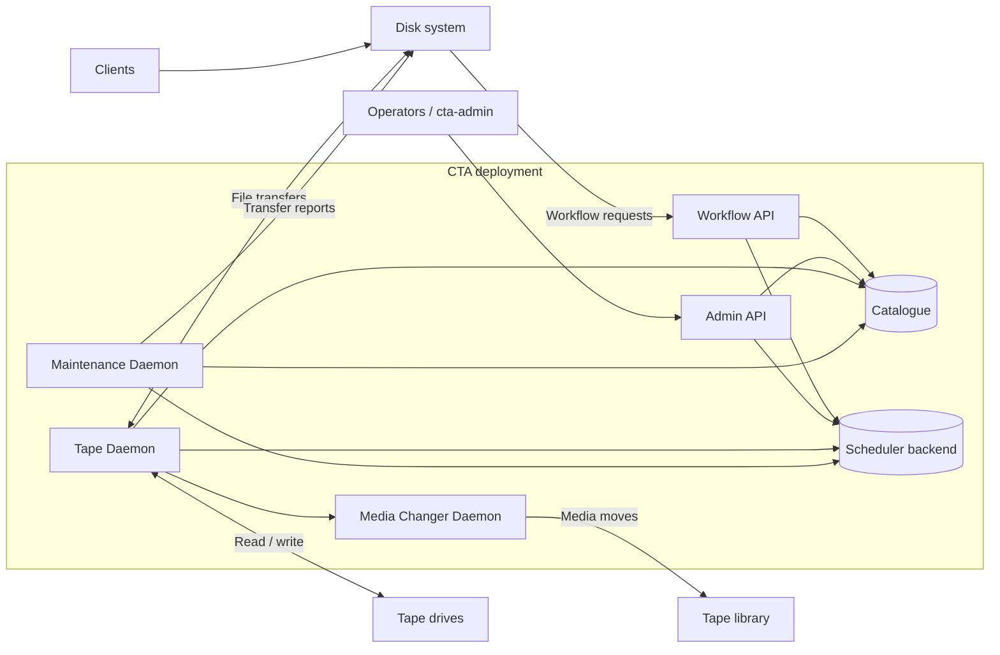

# Architecture

CTA manages tape storage behind a separate disk system. Clients interact with the disk system; operators manage CTA through the Admin API. The Workflow API connects disk-system requests to CTA's catalogue and scheduler.

## System boundaries and data flow

File data moves between disk and tape through the tape daemon. The APIs, catalogue, and scheduler handle requests and metadata rather than carrying file contents.

## Shared state and service placement

The catalogue stores persistent metadata about tape copies and resources. The scheduler backend holds work and coordination state used by the APIs, tape daemons, and maintenance daemon.

Tape services require access to the corresponding hardware, with one tape-daemon process per drive. The APIs and maintenance service can be placed separately. Deployment topology must account for database availability, network paths, and hardware access.

See [Components](components/index.md) for individual roles and [Deployment Planning](../ops/deployment/planning.md) for placement and availability decisions. Disk-system-specific setup belongs in [Disk Buffer Integration](../ops/integrations/index.md).
