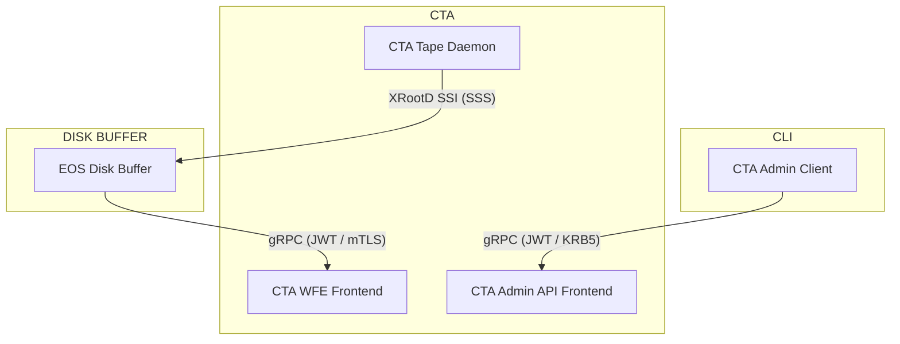

# Authentication

Globally, CTA supports multiple authentication methods: SSS (Simple Shared Secret), Kerberos, JWT (JSON Web Token), and mTLS (mutual TLS).
In CTA we distinguish between three different categories of authentication:

- The authentication between the disk buffer and the CTA frontend. The disk buffer will send workflow events to the frontend and needs to be authenticated in order to do so.
- The authentication between the tape daemons and the disk buffer. The tape daemons need to be able to read/write data from/to the Disk buffer directly.
- The authentication of users interacting with CTA via the `cta-admin` tool.

## Authentication Methods by Interface

### Service APIs
The APIs have separate authentication boundaries:

- [Workflow API](workflow-api.md): supports JWT and mTLS authentication for workflow events
(see [WFE Authentication Configuration](../../ops/configuration/authentication.md#mtls-authentication-wfe-only)).
- [Admin API](admin-api.md): supports JWT and Kerberos authentication for `cta-admin` commands
(see [Admin Authentication Configuration](../../ops/configuration/authentication.md#kerberos-admin-api)).

### Tape Daemon
The tape daemon reads and writes file data through the disk system's data-transfer interface. The credentials for this connection are separate from frontend workflow and admin credentials.

#### EOS

The EOS integration uses SSS authentication for tape-daemon data transfers. See [EOS Configuration](../../ops/integrations/eos/configuration.md).

The following diagram shows the EOS integration:

