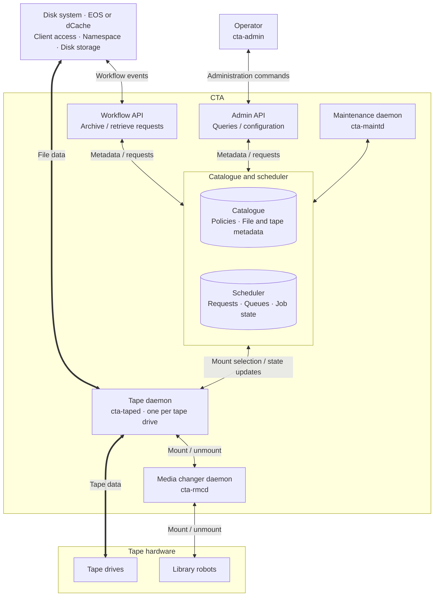

# Component Overview

CTA services coordinate tape storage through shared catalogue and scheduler backends. The disk system provides client access, the file namespace, and disk storage; operators access CTA through the Admin API.

## Architecture

<!-- Keep components and connections aligned with the main website's cta-architecture.html diagram. -->

**Thick arrows** trace the file-data path: disk system ↔ tape daemon ↔ tape drives. Thin arrows show requests, metadata, and hardware control; both arrowheads indicate exchanges in either direction. The catalogue and scheduler are grouped to keep their shared connections readable, while remaining separate components.

[Authentication](authentication.md) introduces the access boundaries for the API and data-transfer connections before the individual service descriptions.

## Services

- [Workflow API](workflow-api.md): accepts archive, retrieve, and delete requests from the disk system.
- [Admin API](admin-api.md): serves operator commands, including those from `cta-admin`.
- [Tape Daemon](tape-daemon.md) (`cta-taped`): selects and executes tape work and transfers files between tape and disk.
- [Maintenance Daemon](maintenance-daemon.md) (`cta-maintd`): runs background reporting, repack, and scheduler maintenance routines.
- [Media Changer Daemon](media-changer-daemon.md) (`cta-rmcd`): provides access to tape-library robotics.

## Databases and backends

- [Catalogue](catalogue.md): stores persistent metadata for files, tapes, libraries, and policies.
- [Scheduler](scheduler.md): queues archive and retrieve work and coordinates its assignment to tape drives.

## Integration and access boundaries

The [Disk Buffer](disk-buffer.md) manages the client-facing namespace and disk replicas. [Authentication](authentication.md) explains access boundaries between the disk system, CTA services, and operators.

## Service placement

Tape services require access to the corresponding hardware, with one tape-daemon process per drive. The APIs and maintenance service can be placed separately. See [Deployment Planning](../../ops/deployment/planning.md) for availability, network, and placement decisions, and [Disk Buffer Integration](../../ops/integrations/index.md) for system-specific setup.
