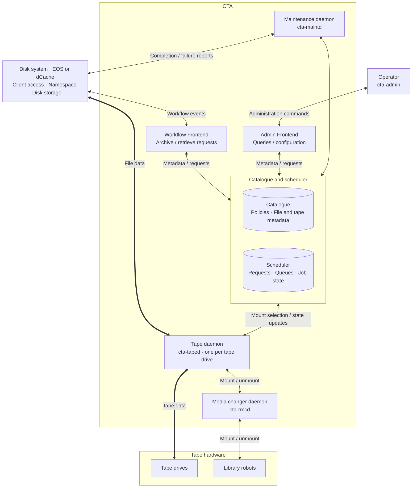

# Component Overview

CTA services coordinate tape storage through shared catalogue and scheduler backends. The disk system provides client access, the file namespace, and disk storage; operators access CTA through the Admin Frontend.

## Architecture

<!-- Keep components and connections aligned with the main website's cta-architecture.html diagram. -->

```mermaid
flowchart TB
    disk["Disk system · EOS or dCache<br/>Client access · Namespace · Disk storage"]
    operator["Operator<br/>cta-admin"]

    subgraph CTA["CTA"]
        workflow["Workflow Frontend<br/>Archive / retrieve requests"]
        admin["Admin Frontend<br/>Queries / configuration"]
        subgraph stores["Catalogue and scheduler"]
            catalogue[("Catalogue<br/>Policies · File and tape metadata")]
            scheduler[("Scheduler<br/>Requests · Queues · Job state")]
        end
        maintd["Maintenance daemon<br/>cta-maintd"]
        taped["Tape daemon<br/>cta-taped · one per tape drive"]
        rmcd["Media changer daemon<br/>cta-rmcd"]
    end

    subgraph hardware["Tape hardware"]
        drives["Tape drives"]
        robots["Library robots"]
    end

    disk <-->|Workflow events| workflow
    operator <-->|Administration commands| admin
    workflow <-->|Metadata / requests| stores
    admin <-->|Metadata / requests| stores
    maintd <--> stores
    maintd <-->|Completion / failure reports| disk
    stores <-->|Mount selection / state updates| taped
    taped <-->|Mount / unmount| rmcd
    taped <==>|Tape data| drives
    rmcd <-->|Mount / unmount| robots
    disk <==>|File data| taped
```

**Thick arrows** trace the file-data path: disk system ↔ tape daemon ↔ tape drives. Thin arrows show requests, metadata, and hardware control; both arrowheads indicate exchanges in either direction. The catalogue and scheduler are grouped to keep their shared connections readable, while remaining separate components.

[Authentication](authentication.md) introduces the access boundaries for the API and data-transfer connections before the individual service descriptions.

## Services

| Component | Role |
| --- | --- |
| [Workflow Frontend](workflow-frontend.md) | Accepts disk-system registration, archive, retrieve, cancellation and deletion requests. |
| [Admin Frontend](admin-frontend.md) | Accepts operator queries and resource-management commands. |
| [Tape Daemon](tape-daemon.md) | Controls one drive and transfers files between tape and disk. |
| [Maintenance Daemon](maintenance-daemon.md) | Sends queued reports, advances repack and recovers or cleans up scheduler work. |
| [Media Changer Daemon](media-changer-daemon.md) | Handles cartridge movements through library robotics. |

## Databases and backends

- [Catalogue](catalogue.md): stores **non-transient metadata** describing archived files, tape copies, resources and policies. These records remain necessary after individual transfers finish.
- [Scheduler](scheduler.md): stores **transient work state**, including requests, queues and job progress, and coordinates work across tape drives. This state is needed while work is pending or in progress, including reporting and cleanup.

Transient does not mean held only in memory: the scheduler backend persists work across service restarts. Losing that backend's stored state means losing the work it tracks, even if the catalogue and recorded tape copies remain intact.

## Catalogue and scheduler topology

A CTA deployment normally has **one logical catalogue**, shared by its services, and **one or more scheduler backends**. Each scheduler backend holds its own requests, queues, and coordination state. A typical reason to use two is to separate normal archival and retrieval from repack. Both use the same catalogue, but a request queued in one backend is not automatically visible in the other.

Services connect directly to the catalogue and the scheduler backend they serve; they do not send all database access through an API service.
For example, a separate repack scheduler has an Admin Frontend endpoint, maintenance daemon processing, and tape daemons assigned to it. The Workflow Frontend continues submitting ordinary requests to the normal-workload backend. This separates scheduler workloads, but the catalogue and any shared disk or tape infrastructure remain common resources.

## Integration and access boundaries

The [Disk System](disk-system.md) manages the client-facing namespace and disk replicas. [Authentication](authentication.md) explains access boundaries between the disk system, CTA services, and operators.

## Service placement

A tape server hosts one tape daemon instance per drive and needs connectivity to the disk system, backend stores and media changer. The tape daemons and remote media changer daemons run on tape servers, while frontends and maintenance daemons can run separately from the tape hardware.

Use [Deployment Planning](../../ops/deploy-and-configure/deployment/planning.md) for placement and availability decisions and [Disk Buffer Integration](../../ops/deploy-and-configure/integrations/index.md) for integration requirements.
