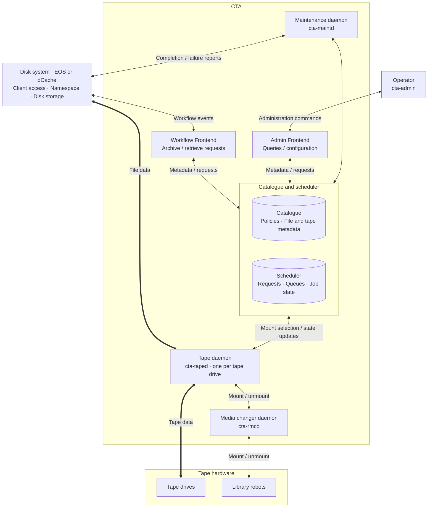

# Component Overview

CTA services coordinate tape storage through shared catalogue and scheduler backends. The disk system provides client access, the file namespace, and disk storage; operators access CTA through the Admin Frontend.

## Architecture

<!-- Keep components and connections aligned with the main website's cta-architecture.html diagram. -->

```mermaid
flowchart TB
    disk["Disk system · EOS or dCache<br/>Client access · Namespace · Disk storage"]
    operator["Operator<br/>cta-admin"]

    subgraph CTA["CTA"]
        workflow["Workflow Frontend<br/>Archive / retrieve requests"]
        admin["Admin Frontend<br/>Queries / configuration"]
        subgraph stores["Catalogue and scheduler"]
            catalogue[("Catalogue<br/>Policies · File and tape metadata")]
            scheduler[("Scheduler<br/>Requests · Queues · Job state")]
        end
        maintd["Maintenance daemon<br/>cta-maintd"]
        taped["Tape daemon<br/>cta-taped · one per tape drive"]
        rmcd["Media changer daemon<br/>cta-rmcd"]
    end

    subgraph hardware["Tape hardware"]
        drives["Tape drives"]
        robots["Library robots"]
    end

    disk <-->|Workflow events| workflow
    operator <-->|Administration commands| admin
    workflow <-->|Metadata / requests| stores
    admin <-->|Metadata / requests| stores
    maintd <--> stores
    maintd <-->|Completion / failure reports| disk
    stores <-->|Mount selection / state updates| taped
    taped <-->|Mount / unmount| rmcd
    taped <==>|Tape data| drives
    rmcd <-->|Mount / unmount| robots
    disk <==>|File data| taped
```

**Thick arrows** trace the file-data path: disk system ↔ tape daemon ↔ tape drives. Thin arrows show requests, metadata, and hardware control; both arrowheads indicate exchanges in either direction. The catalogue and scheduler are grouped to keep their shared connections readable, while remaining separate components.

[Authentication](authentication.md) introduces the access boundaries for the API and data-transfer connections before the individual service descriptions.

## Services

- [Workflow Frontend](workflow-api.md): accepts archive, retrieve, and delete requests from the disk system.
- [Admin Frontend](admin-api.md): serves operator commands, including those from `cta-admin`.
- [Tape Daemon](tape-daemon.md) (`cta-taped`): selects and executes tape work and transfers files between tape and disk.
- [Maintenance Daemon](maintenance-daemon.md) (`cta-maintd`): runs background reporting, repack, and scheduler maintenance routines.
- [Media Changer Daemon](media-changer-daemon.md) (`cta-rmcd`): provides access to tape-library robotics.

## Databases and backends

- [Catalogue](catalogue.md): stores persistent metadata for files, tapes, libraries, and policies.
- [Scheduler](scheduler.md): queues archive and retrieve work and coordinates its assignment to tape drives.

## Catalogue and scheduler topology

A CTA deployment normally has **one logical catalogue**, shared by its services, and **one or more scheduler backends**. A catalogue may use database replication or high-availability infrastructure without becoming several independent catalogues: it remains the common view of files, tape copies, resources, and policies.

Each scheduler backend holds its own requests, queues, and coordination state. A typical reason to use two is to separate normal archival and retrieval from repack. Both use the same catalogue, but a request queued in one backend is not automatically visible in the other. Adding service instances connected to an existing backend is different from creating another independent scheduler backend.

Services connect directly to the catalogue and the scheduler backend they serve; they do not send all database access through an API service.

| Service | Catalogue connection | Scheduler connection |
| --- | --- | --- |
| **Workflow Frontend** | Validates file metadata and policies against the shared catalogue. | Queues disk-system requests in its configured backend. |
| **Admin Frontend** | Reads and changes shared catalogue resources and policies. | Inspects and manages work in its configured backend. Operators use the corresponding endpoint for that backend's requests. |
| **Tape Daemon** | Reads tape and file metadata and records successful writes. | Selects work and updates job state in its configured backend. A drive serves one scheduler backend at a time. |
| **Maintenance Daemon** | Uses shared metadata for background processing. | Processes reports, repack, and maintenance for its configured backend. Each backend needs the appropriate maintenance routines. |
| **Media Changer Daemon** | No direct connection. | No direct connection; tape daemons ask it to operate the library robotics. |

For example, a separate repack backend has an Admin Frontend endpoint, maintenance daemon processing, and tape daemons assigned to it. The Workflow Frontend continues submitting ordinary requests to the normal-workload backend. This separates scheduler workloads, but the catalogue and any shared disk or tape infrastructure remain common resources.

The architecture diagram above shows component roles, not the number of service instances or backends. See [Scheduler Configuration](../../ops/deploy-and-configure/configuration/scheduler.md#isolate-repack-with-separate-scheduler-backends) for the operational setup.

## Integration and access boundaries

The [Disk Buffer](disk-buffer.md) manages the client-facing namespace and disk replicas. [Authentication](authentication.md) explains access boundaries between the disk system, CTA services, and operators.

## Service placement

Tape services require access to the corresponding hardware, with one tape-daemon process per drive. The APIs and maintenance service can be placed separately. See [Deployment Planning](../../ops/deploy-and-configure/deployment/planning.md) for availability, network, and placement decisions, and [Disk Buffer Integration](../../ops/deploy-and-configure/integrations/index.md) for system-specific setup.
