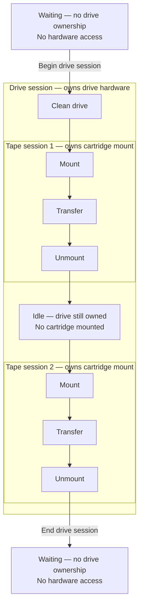
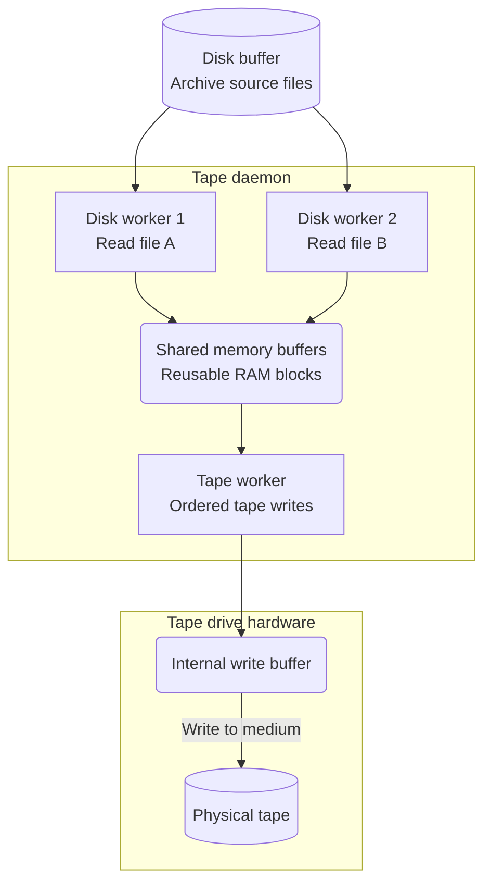
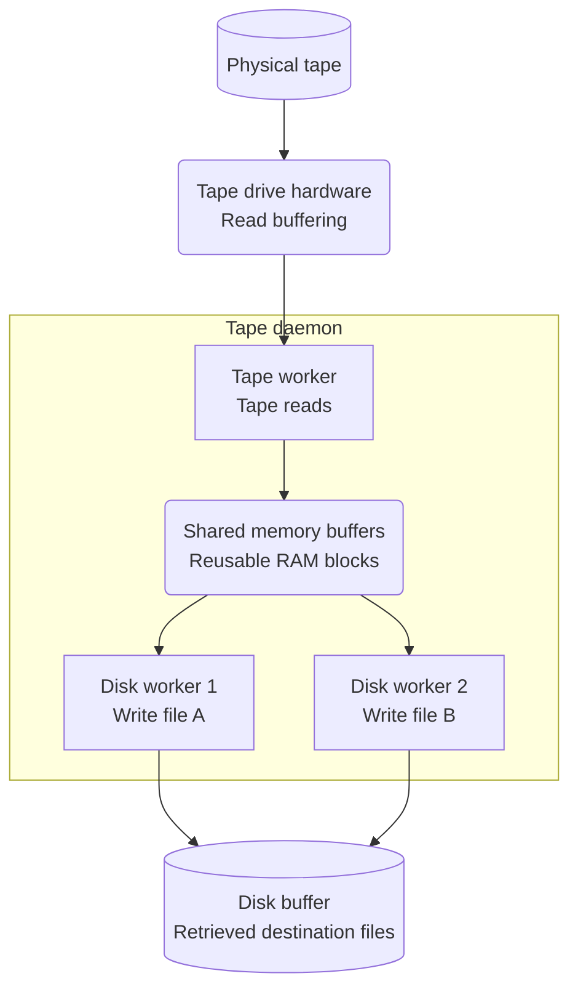

# CTA Tape Daemon

The **tape daemon** (`cta-taped`) runs on a [Tape Server](../tape/servers.md) and controls a single tape drive.
It obtains scheduled work, transfers files between disk and tape, and coordinates cartridge movements with the [Media Changer Daemon](media-changer-daemon.md).

## Sessions and ownership

A **drive session** is a period during which the daemon owns access to the drive hardware.
One daemon run can contain several drive sessions, separated by periods when the daemon does not use the hardware (e.g. to allow for maintenance).
It can contain zero or more tape sessions, including idle time while waiting for work.

Within a drive session, a **tape session** owns the physical mount of one cartridge in that drive.
It is responsible for mounting the cartridge, transferring its scheduled files, and unmounting it when finished.
On completion, it releases the cartridge mount while the enclosing drive session retains ownership of the drive hardware.

A tape session's lifecycle has three phases:

- **Mount:** move the cartridge into the drive and prepare it for reading or writing.
- **Transfer:** read files from tape to disk, or write files from disk to tape. One mounted cartridge can serve many files.
- **Unmount:** unload the tape and return the cartridge to the library, leaving the drive empty and ready for reuse.

The diagram follows time from top to bottom, showing a drive session between two periods without hardware ownership.
Inside the drive session, two tape sessions run in sequence, separated by an idle period.
The daemon still owns the drive while idle between tape sessions; outside the drive session, it does not access the hardware.
A drive session may also end without running any tape sessions, and failures can prevent the normal sequence from completing.

## Desired state and reported activity

Operators need to control when the daemon may use the hardware, for example to replace a drive, perform maintenance, or investigate a problem.
Hardware faults can also make a drive unusable: a cartridge may become stuck, or the drive may fail to load, unload, or transfer data.
When the drive cannot safely continue, it must stop accepting new work and relinquish hardware control until it can be made usable again.

Operators and the daemon therefore need a way to request that the drive stop accepting work, and operators need to know when the daemon has relinquished the hardware.
Desired and reported state distinguish that request from the resulting activity.

The **desired state** is either UP or DOWN, while the **reported state** describes the daemon's current activity.
Operators can set the desired state, and the daemon also sets it as part of startup, shutdown, or failure handling.

The desired state has two values:

| Desired state | Meaning |
| --- | --- |
| **UP** | Permits the daemon to clean and use the drive for scheduled work. |
| **DOWN** | Requests the daemon to stop scheduling and relinquish ownership of the drive hardware. |

The reported state is more granular: it distinguishes mounting, transfer, cleanup, idle availability, and reported `Down`.

Desired and reported state need not match immediately.
Before scheduling begins in a new drive session, the daemon cleans the drive: it removes any remaining cartridge and resets drive configuration as necessary.
Setting desired UP permits this hardware access; scheduling begins only after cleanup establishes that the drive is empty and reusable.
A change to desired DOWN can arrive during an active tape session, which can finish its transfer and cleanup before the daemon relinquishes ownership.
**Hardware ownership is relinquished only when the drive is reported `Down`.**
Until then, the transition requested by desired DOWN is pending and the daemon may still be using the hardware to finish the active session and clean up.
Once reported `Down`, the daemon does not access the hardware until desired UP is explicitly requested, which permits a new drive session to begin.

## From startup to shutdown

This section describes the normal lifecycle.
Many of these operations can fail; how the daemon handles those failures is covered separately in [Failure scenarios](#failure-scenarios).

Each lifetime has its own entry and exit actions.
Finishing a tape session need not end the drive session, and ending a drive session need not stop the daemon.

### Daemon lifetime

**Contract:** The daemon runs drive sessions sequentially: each drive session must end before the next can begin.
Once the drive is reported `Down` and the daemon is waiting, it must not access the drive hardware until desired UP authorises a new drive session.

**On startup:**

1. Register the configured drive name, which uniquely identifies its catalogue entry. Create an entry if none exists; for an existing entry, require its host and logical library to match the daemon configuration.
2. Decide whether to request desired UP automatically, using the catalogue state found before registration as described below.
3. Wait for the configured logical library to exist before attempting to start drive sessions. Scheduling requires the logical library to exist, so starting a drive session before it exists would not allow work to proceed. The catalogue does not enforce that a registered drive references an existing logical library, so drive registration alone does not establish this prerequisite.

Registration does not by itself make the hardware ready for transfers.

**Automatic-UP eligibility**

The startup decision separates an existing request for desired UP from permission to set desired UP automatically.
Automatic UP is configurable; the table describes the policy.

| State found before registration | Startup decision |
| --- | --- |
| Existing desired UP | Preserve desired UP. |
| No existing drive entry | Eligible for automatic UP, subject to configuration. |
| Existing desired DOWN with a clean-shutdown reason | Eligible for automatic UP, subject to configuration. |
| Existing desired DOWN with an operator or failure reason | Preserve desired DOWN and its reason. |

Every drive session starts with drive cleanup, whether desired UP was preserved, set automatically, or requested later by an operator.

When automatic UP is disabled, eligible drives remain desired DOWN and are reported `Down` with the startup reason, waiting for an explicit request for desired UP.

**Eligibility permits drive cleanup; it does not establish that the hardware is empty or reusable.**
A new entry or clean-shutdown reason indicates no recorded condition requiring the drive to remain unavailable.
That cleanup must still establish whether the hardware can be reused before scheduling begins.

**While running**, the daemon waits for desired UP and starts drive sessions.
It stays alive between drive sessions, refreshing reported `Down` without accessing hardware while waiting for desired UP.

**On shutdown:**

The daemon is intended to run indefinitely.
Finishing a tape session, having no eligible work, or setting desired DOWN does not stop the daemon; it continues running and waits for work or desired UP.
An orderly shutdown begins when the process receives a stop request, such as `SIGTERM` during a service stop or restart.
Startup failures and fatal runtime failures can also end the process; those cases are covered under [Failure scenarios](#failure-scenarios).

For an orderly shutdown:

1. Signal the scheduling loop to stop starting new tape sessions. Set desired DOWN without replacing an existing down reason.
2. Allow an active tape session to finish transferring files, unmount its cartridge, and finish outstanding disk writes and reporting. Then end the drive session, relinquishing hardware ownership and reporting `Down`.
3. Record a clean shutdown reason unless an existing operator or failure reason must be preserved.
4. Exit, leaving the catalogue entry available to explain the drive's state.

Shutdown relies on tape session completion to release an active cartridge mount; it does not perform an additional physical cleanup after the drive session ends.
The division of responsibility is explained under [Cleanup guarantees](#cleanup-guarantees).
For fatal failures and abrupt termination, see [Failure scenarios](#failure-scenarios).

### Drive session lifetime

**Contract:** Establish that the drive is empty and reusable before scheduling tape sessions.
The drive session owns access to the drive hardware throughout its lifetime, including idle periods between tape sessions.
Run tape sessions sequentially and permit another only after safe reuse has been established.

**On entry:**

1. Check that the drive still has desired UP before accessing hardware.
2. Clean the drive: remove any remaining cartridge and reset drive configuration as necessary.
3. Recheck desired state after successful cleanup. Begin scheduling only if desired UP is still set.

If desired DOWN is set during drive cleanup, cleanup already in progress finishes, but scheduling does not begin.
For drive-cleanup failures, see [Failure scenarios](#failure-scenarios).

**While active**, the drive session retains ownership of the hardware across tape sessions and idle waits.
Successful tape sessions and idle scheduling attempts do not repeat the initial drive cleanup.
Work selection is described in [Scheduling](../data-management/scheduling.md).

**On exit:**

A drive session ends when desired DOWN is observed or the daemon is stopping.
If the drive has already been reported `Down`, the current session also ends, even if desired UP has since been requested.
Resuming work then requires a new drive session that cleans the drive before scheduling.
Failures can also end a drive session; those cases are covered under [Failure scenarios](#failure-scenarios).
Completing a tape session or having no eligible work does not end the drive session.

1. Stop starting further tape sessions.
2. Relinquish access to the drive hardware. Tape session completion has already handled normal cartridge cleanup; no additional physical cleanup is performed on drive session exit.
3. Report `Down`. Ending the drive session does not itself change the desired state.

If desired UP remains set, the daemon may start a new drive session after the previous one ends.
The new session must clean the drive again before scheduling, including after a daemon restart.

### Tape session lifetime

**Contract:** Begin with scheduled work for one cartridge and an empty, reusable drive supplied by the enclosing drive session.
Own the physical cartridge mount and attempt to leave the drive empty and reusable on completion.
On completion, establish whether cleanup left the drive empty and reusable, and report that outcome to the enclosing drive session.
The limits of physical cleanup are explained under [Cleanup guarantees](#cleanup-guarantees).

**On entry:**

1. Fetch an initial batch of file-transfer jobs from the scheduler and confirm that work is available for the selected cartridge before mounting it.
2. Request that the cartridge be mounted in the drive.
3. Wait for the drive to finish loading the tape. Configure encryption and data protection as required, and check the tape label before reading or writing files.

If the initial fetch finds no file-transfer jobs, the session ends before the cartridge is mounted.

**During transfer**, the session owns that cartridge mount while processing its files.
The disk and tape workers exchange data through the buffers described under [Transfer workers and buffers](#transfer-workers-and-buffers).
File-transfer checks are described in [Data Integrity](../data-management/data-integrity.md).

**On completion:**

1. Finish reading or writing the session's files. For writes, flush the tape drive's internal write buffer to the physical tape before unloading.
2. Clean up the physical mount: unload the tape and return the cartridge to the library.
3. Wait for disk workers to finish writing retrieved data from the daemon’s memory buffers to disk, and finish reporting file-transfer outcomes. Disk writes can continue after the cartridge has been unmounted.
4. Notify the scheduler that the mount has ended, and report the cleanup outcome to the enclosing drive session so it can decide whether to schedule another tape session.

Tape cleanup and disk processing can overlap; these steps describe the completion responsibilities rather than a strictly serial pipeline.
An empty drive therefore does not necessarily mean the tape session has finished processing its data.
After reusable completion with desired UP, another tape session can follow within the same drive session.
For mount, transfer, or cleanup failures, see [Failure scenarios](#failure-scenarios).

## Reading the reported state

Reported activity makes the lifecycle visible to operators.
The lifetime sections describe the actions and ownership boundaries; this table maps those activities to the states operators see.
The table uses the display labels for states reported during normal operation.

| Reported state | Meaning |
| --- | --- |
| `Free` | The drive is available for scheduled work. |
| `Start` | Work has been assigned and a tape session is starting. |
| `Mount` | The cartridge is being mounted and prepared for transfer. |
| `Transfer` | Files are being read from or written to tape. |
| `Unload` | The tape is being unloaded within the drive before the cartridge can be removed. |
| `Unmount` | The cartridge is being removed from the drive and returned to the library. |
| `DrainToDisk` | Tape reading and unmounting have finished, but buffered retrieval data is still being written to disk. |
| `CleanUp` | The daemon is cleaning the drive, including removing any remaining cartridge and resetting drive configuration. |
| `Down` | The daemon has relinquished hardware ownership and is not scheduling work. |

## Cleanup guarantees

The key invariant is that **the daemon must establish that the drive is empty and reusable before starting another tape session**.
Responsibility for establishing this depends on which ownership period is beginning or ending.

### Cleaning the drive at the start of a drive session

At the start of a drive session, the daemon cannot assume the drive is empty.
A cartridge may remain from an interrupted daemon run or from hardware operations performed outside a drive session.

The daemon therefore performs [drive cleanup on entry](#drive-session-lifetime).
It removes any remaining cartridge and resets drive configuration as necessary, even if the daemon did not mount that cartridge and does not know its identity.
This access is permitted by desired UP: the daemon is taking ownership of the drive hardware and establishing that it can be used.

### Completing a tape session

Each tape session owns the physical cartridge mount that it creates.
It is responsible for unloading and unmounting that cartridge when its work finishes, leaving the drive empty and reusable for the next tape session.
The drive session retains hardware ownership between tape sessions; it does not repeat cleaning after every successful session.

### Ending a drive session or shutting down

On normal completion of the last tape session, its cartridge has already been unmounted.
If no tape session ran, initial drive cleanup has already established that the drive is empty.
Neither ending the drive session nor shutting down the daemon therefore needs another physical cleanup.

This also matters when the daemon is stopped while the drive is already reported `Down`.
Hardware ownership has been relinquished, and a cartridge may have been loaded by another operation.
Shutdown must not access the hardware to remove it; removing it requires a new request for desired UP and cleanup in a new drive session.

**Reported `Down` does not mean empty.**
If normal cleanup cannot complete, the daemon must not assume that the cartridge was removed.
Recovery or deferred cleanup is covered under [Failure scenarios](#failure-scenarios); cleanup at the start of the next drive session establishes whether the drive can safely be reused.

## Operator-requested transitions and shutdown

### Operator-requested down

Desired DOWN is checked at scheduling boundaries; it does not currently interrupt an active tape session.
The following table describes normal completion after the request; failures are covered under [Failure scenarios](#failure-scenarios).

| Reported state when desired DOWN is set | Daemon behavior |
| --- | --- |
| `Free` | Stops scheduling, reports `Down`, and waits for desired UP. |
| `Start`, `Mount`, `Transfer` | Does not interrupt the active tape session. It finishes the session and cleanup before reporting `Down`. |
| `Unload`, `Unmount` | Finishes cleanup, then reports `Down` without starting another tape session. |
| `DrainToDisk` | Finishes writing buffered retrieval data before ending the session and reporting `Down`. |
| `CleanUp` | Finishes cleanup already in progress, then observes desired DOWN and reports `Down`. |
| `Down` | Continues waiting without accessing hardware. |

Changes to desired DOWN are not observed instantaneously. A request therefore does not itself establish that hardware ownership has been relinquished; operators must wait for reported `Down`.

### Daemon shutdown

Unlike setting desired DOWN alone, stopping the daemon also ends the daemon run.
Active transfers and blocking operations are not immediately interrupted; the shutdown sequence is described under [Daemon lifetime](#daemon-lifetime).

## Failure scenarios

The response to a failure depends on whether the daemon can still establish safe hardware reuse and whether it remains running.
A failed transfer does not automatically require desired DOWN; an unusable drive does.
The table describes operational failure categories rather than every possible error.

**Operator action** marks recovery steps that require intervention, such as correcting configuration, addressing a hardware problem, or requesting desired UP.
Where recovery is conditional, the marker applies only to that branch.
Daemon restarts may be performed by service supervision; a restart alone is not marked as manual intervention.

| Scenario | Daemon behavior | How work can resume |
| --- | --- | --- |
| **The configured drive name belongs to another host or logical library** | Rejects registration and exits without accessing hardware or changing the existing drive's state. | **Operator action:** Correct the conflicting configuration or catalogue registration, then restart the daemon. |
| **Registration fails, for example because the catalogue is unavailable** | Exits before starting a drive session. It does not attempt shutdown state publication or hardware cleanup; registration updates already made may remain. | Restart once the registration problem is resolved. Startup checks the catalogue state again. |
| **The configured logical library does not exist** | Waits for the library entry without starting drive sessions or accessing hardware. Absence alone is not fatal. | **Operator action:** Create the library entry; the running daemon can then continue startup. |
| **The drive's catalogue entry disappears** | Exits without recreating the entry during that run. | A later daemon run registers the drive again and applies the startup policy. |
| **The drive cannot be opened, reset, or emptied at the start of a drive session** | Sets desired DOWN and reports `Down`, preserving a specific failure reason. Does not schedule tape sessions. | **Operator action:** Resolve the underlying problem and request desired UP. A new drive session attempts drive cleanup again. |
| **A recoverable scheduling error or timeout occurs** | Waits and retries within the current drive session, without repeating the initial drive cleanup. | Scheduling continues when the scheduler can supply work. No operator state change is required. |
| **A tape session cannot access the drive or returns an unusable-drive outcome** | Sets desired DOWN and reports `Down`, recording or preserving the failure reason. | **Operator action:** Resolve the problem and request desired UP. |
| **Mounting or transferring fails, but cleanup leaves the drive reusable** | Completes cleanup and reports the failed work. The drive session can continue if desired UP remains set. | Further work can be scheduled. Recovery of failed file-transfer jobs is separate from recovery of the drive. |
| **An unexpected tape session failure occurs after its workers have stopped** | If desired UP remains set, attempts recovery cleanup before further scheduling. If desired DOWN is already set, defers that cleanup. | Successful recovery with continued desired UP permits scheduling to resume. **Operator action if desired DOWN is set:** Resolve any remaining problem and request desired UP to start a new drive session with drive cleanup. |
| **Cleanup fails, including a stuck cartridge** | Sets desired DOWN and reports `Down`; no further tape sessions are scheduled. A cartridge may remain loaded. | **Operator action:** Address the hardware or cleanup problem, then request desired UP. |
| **The daemon cannot confirm that a failed tape session has finished using the drive** | An error while starting transfer workers or waiting for them to finish prevents the daemon from confirming that all drive access has stopped. The daemon skips recovery cleanup to prevent unloading or unmounting from overlapping with operations such as reading or writing, and exits after attempting to set desired DOWN and report `Down`, with the down reason `Session did not stop safely` (see [Down reasons](#down-reasons)). | The old process must end before a replacement takes control. Restart the daemon; drive cleanup is required. **Operator action if desired DOWN was recorded:** Request desired UP. |
| **The process crashes or is abruptly terminated before shutdown runs** | Cannot finish cleanup or publish shutdown state. It leaves the last successfully recorded desired state unchanged, which is normally desired UP during an active drive session. The reported activity may be stale and a cartridge may remain loaded. | Restart the daemon. Existing desired UP permits drive cleanup on restart without a new operator request, as described below. |

When the daemon cannot confirm that the failed tape session has stopped using the drive, recovery cleanup is unsafe.
Unloading the drive or unmounting the cartridge could overlap with a worker still reading, writing, positioning the tape, or performing its own cleanup.
The daemon must first confirm that all such access has stopped before it can safely attempt recovery cleanup.

Whenever a failure requests desired DOWN, an existing specific operator or failure reason is preserved where possible.

### Tape session failures and counters

Throughout a tape session, the daemon counts failed operations by category, such as disk reads, tape writes, cleanup, and reporting.
It separately tracks informational events, such as reaching the end of a tape, and hardware tape alerts.
These records describe what happened during the session and determine its overall outcome.

A completed session is considered unsuccessful if any failure counter is nonzero, including failures during cleanup or final reporting.
Informational events and tape alerts alone do not make it unsuccessful.
Successfully transferring some files or subsequently cleaning the drive does not erase an earlier failure.

Session success and drive reusability are separate: a failed session can leave an empty, reusable drive and allow further scheduling, while unsafe reuse requires the drive to stop accepting work.
For the corresponding log fields and how to interpret the final session summary, see [Tape session logging](../../ops/run-and-maintain/monitoring/logging.md#tape-session-logging).

#### Failure counters

These counters identify the operation that failed, rather than counting failed files or independently identifying root causes.
One file can encounter several failures, such as a transfer error followed by a reporting error.
Propagating an already classified error between workers does not by itself require another failure count.

| Failure category | What is tracked |
| --- | --- |
| Reading from disk | Opening or reading an archive source file failed. |
| Checking source size | The source size differs from the expected size, either at the initial check or while reading. |
| Writing to disk | Opening, writing, or closing a retrieval destination failed. |
| Mounting and loading | Mounting the cartridge or waiting for the drive to load it failed. |
| Checking tape suitability | A tape-alert check, writeability check, or label check prevented tape access. |
| Configuring the drive | Enabling or clearing encryption, or disabling logical block protection, failed. |
| Positioning and file sequence | Positioning for tape access failed, or the write file sequence was inconsistent. |
| Reading tape | Reading a file from tape failed. |
| Writing tape | Writing a file's header, data, or trailer, or flushing the drive's internal write buffer, failed. |
| Skipping an archive file | A file was not archived. This counts as a failure even if the session continues with other files. |
| Physical cleanup | Unloading, returning the cartridge to the library, or another cleanup operation failed. |
| Reporting | Recording or publishing session activity, transfer outcomes, completion, or statistics failed. This can make a session unsuccessful even after data transfer and cleanup succeeded. |
| Supplying work and coordinating workers | Supplying transfer tasks or signalling a worker failed. |
| Otherwise unclassified failures | A session or file operation failed without a more specific recorded classification. |

#### Informational events and tape alerts

The following events do not by themselves make a session fail.
A session that transfers no files can therefore finish successfully if no failure was recorded.

| Tracked event | Meaning |
| --- | --- |
| Disk-space reservation test failure; disk-space reservation failure | The disk-space reservation test or reservation did not succeed, preventing the associated retrieval work from proceeding. |
| No retrieval files; no archival files; empty mount | No work was available for the session or mount. |
| Tape full | The tape reached capacity. This is recorded once per session, rather than counting every subsequent observation. |

Tape alerts are counted separately by alert code.
Recording an alert alone does not mark the session as failed.
If an alert check rejects an operation, the corresponding operation failure is also recorded and makes the session unsuccessful.

### Recovery after a crash

An abrupt crash cannot publish shutdown state, so the last recorded desired state remains unchanged unless another actor changes it.
Once the old process has ended, restarting the daemon follows the normal [startup behavior](#daemon-lifetime): existing desired UP permits a new [drive session](#drive-session-lifetime), including cleanup before scheduling; existing desired DOWN leaves the daemon waiting without hardware access.
Preserving desired UP does not depend on the automatic-UP policy, because the request already exists.

A handled fatal failure or orderly shutdown can instead record desired DOWN before exiting, requiring a new request for desired UP.
Recovering the drive does not establish that interrupted file transfers completed successfully.

## Down reasons

When desired DOWN is set, the **down reason** records why the drive is unavailable.
The reason accompanies the desired state, so it can be recorded while the daemon is still finishing the transition to reported `Down`.
It can describe an operator's intent, such as maintenance, or a condition detected by the daemon.

Reasons set by the tape daemon identify their source with `[cta-taped]`, followed by a severity and a message.
The table lists the base messages; the recorded down reason may also include details about the underlying problem, such as the error encountered while opening the drive or unloading a cartridge.

| Base daemon reason (may include additional details) | Meaning |
| --- | --- |
| `[cta-taped] INFO Startup` | The daemon has registered desired DOWN and reported `Down`. It has not started a Drive Session and is waiting for desired UP. |
| `[cta-taped] INFO Shutdown` | The daemon is exiting and sets desired DOWN. This is the normal reason on a clean exit when no specific down reason needs to be preserved. |
| `[cta-taped] ERROR Session drive access failed` | The daemon could not discover, locate, or open the drive for a tape session. |
| `[cta-taped] ERROR Drive cleanup failed` | Drive cleanup could not establish that the drive was reusable. Additional details can identify an access, configuration, or cartridge-removal failure. |
| `[cta-taped] ERROR Session left drive unusable` | A tape session left the drive unusable and no more specific existing reason was available. |
| `[cta-taped] ERROR Session did not stop safely` | The daemon could not confirm that tape session access to the drive had stopped. |

An existing operator or failure reason is preserved instead of being replaced by startup or shutdown messages.
With automatic UP disabled, a previous clean-shutdown reason is replaced by the startup reason when the daemon starts again.
The intended configurable policy is described under [Daemon lifetime](#daemon-lifetime).

The reason should be read together with the reported activity and logs: a shutdown reason by itself does not prove that every preceding operation succeeded.

## Transfer workers and buffers

A tape session moves data through a pipeline rather than reading and writing each file in a single thread.
Several **disk worker threads** can perform disk I/O concurrently, while a single **tape worker thread** performs the session's tape reads or writes.
A pool of memory blocks in the tape daemon passes data between these workers, allowing disk I/O and tape I/O to overlap.

There are three distinct places where data can be buffered:

| Buffer | Location and purpose |
| --- | --- |
| **Disk buffer** | Storage holding archive source files or retrieved destination files. This is the disk endpoint of a transfer, not the daemon's RAM. |
| **Daemon memory buffers** | A bounded pool of RAM blocks in the tape daemon. Disk and tape workers exchange file data through these blocks and reuse them after their contents have been consumed. |
| **Tape drive buffer** | Memory inside the physical tape drive. In particular, the drive can accept writes into its internal buffer before committing them to tape. |

The daemon's memory buffers absorb short differences in disk and tape transfer rates; they do not remove sustained bottlenecks.
When no free memory blocks remain, a worker producing data must wait for blocks to be released.
When no data is available, the consuming worker must wait for it.

### Archival: disk to tape

The arrows show file-data flow; disk reads and tape writes can overlap through the daemon's memory buffers.
Two disk workers are shown as an example; the number of workers is configurable.

1. Disk workers read source files from the disk buffer into the daemon's memory blocks.
2. The tape worker consumes those blocks in tape-write order and sends their contents to the drive. The memory blocks can then be reused for more disk reads.
3. The drive writes the data from its internal buffer onto the physical tape.

Passing data to the drive does not by itself establish that it has reached the tape medium.
The tape worker periodically flushes the drive's internal write buffer and performs a final flush when there is no more data to write.
Successful flushing allows the associated batch of archive writes to be reported as successful.
Thus, flushing before unloading refers to data buffered **inside the tape drive**, after the daemon has supplied it, rather than data still waiting in the daemon's RAM.

### Retrieval: tape to disk

After tape reading ends, data already in the daemon's memory buffers can continue flowing to disk without the cartridge remaining mounted.

1. The tape worker reads file data from the drive into the daemon's memory blocks.
2. Disk workers consume those blocks and write the retrieved files to the disk buffer.
3. Consumed memory blocks return to the pool for further tape reads.

The tape worker can finish reading all required data before the disk workers finish writing it.
The cartridge can then be unmounted while the disk workers continue consuming data already held in the daemon's memory buffers.
This is the activity reported as `DrainToDisk`: it concerns the disk side of retrieval, not flushing the tape drive's write buffer.
The tape session finishes only after the outstanding disk work and reporting have also completed.
