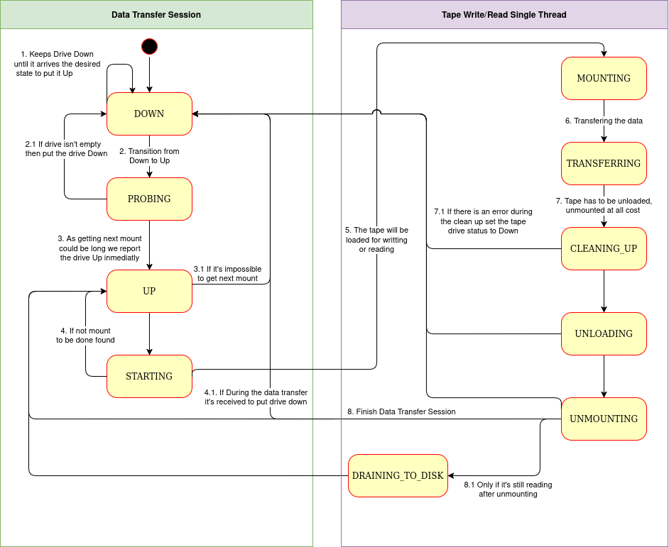

# CTA Tape Daemon

The CTA tape daemon (`cta-taped`) runs on a tape server and transfers data between the disk buffer and a tape drive. Each daemon controls one drive. Its main process forks a **drive process** to perform a data transfer session.

## Drive Process

A data transfer session includes waiting for scheduled work, mounting a tape, transferring data, and unmounting the tape. The drive process periodically reports its state to the catalogue.

When the session ends, the drive process exits and the parent process creates a new one. Errors can also end a session; depending on the error, the parent may shut down the daemon.

### Drive States

The operator's desired drive state (`UP` or `DOWN`) is separate from the daemon's reported activity. A drive that is down waits for a request to bring it up. The daemon probes the drive before making it available for work; a failed probe leaves it down.

After obtaining a mount, the drive progresses through `STARTING`, `MOUNTING`, and `TRANSFERRING`. Cleanup includes unloading the tape from the drive and unmounting the cartridge through the media changer. The drive then becomes available again, or goes down if requested.

During retrieval, disk-writing threads may still be flushing buffered data after the tape has been unmounted. The daemon reports `DRAINING_TO_DISK` until those threads finish. Tape reading has already ended at this point.

See [Scheduling](../data-management/scheduling.md) for how the daemon selects a tape mount.
