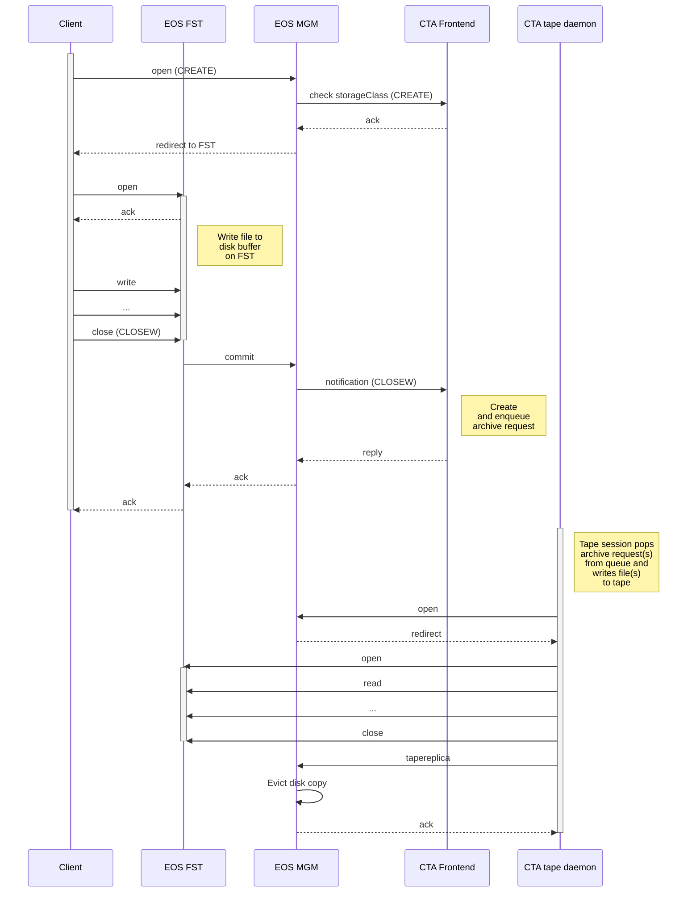

# Archival

The disk system submits an archive request when a file is ready for tape. CTA validates the storage class, queues the work, transfers the data to tape, records the tape copy, and reports the result to the disk system. Namespace updates and disk-copy retention are responsibilities of the disk system.

## EOS

On the EOS side of EOSCTA side, files are created in the namespace by a **CREATE** workflow event and then archived to tape following a **CLOSEW** (CLOSE Write) workflow event.

It is important to note that the EOS instance in EOSCTA is a temporary staging area for files on their way to/from tape. When the file is successfully archived, the disk buffer copy will be automatically deleted.

Likewise, if archiving fails before the archive request is queued, the file will be deleted from the EOS disk buffer, and an error will be reported to the client. It is expected that the client will attempt to re-send the file in this case. See below for more details on how different errors are handled.

### Archive workflow

The figure below shows the sequence of a client writing a file to EOS. The storage class is checked on **CREATE** and a synchronous archive request is queued on **CLOSEW**.

#### EOS events handled by the CTA Frontend

- **CREATE**: Validate Storage Class, allocate Archive ID
- **CLOSEW**: Archive the file to tape

The EOS-CTA events are synchronous. \
If CTA fails during either event, no archive request is queued. The file will be deleted from the EOS buffer and an error reported to the client.

For more details on error handling, see How failures are handled before and after the Archive Request is queued.

#### EOS events not handled by the CTA Frontend

- **OPENW**: We do not handle OPENW events, because files on tape are immutable

Despite EOS generating an OPENW event when an already-existing file is opened for writing, CTA does not allow file modifications. \
Therefore, the OPENW workflow is not supported by CTA. \
This should be enforced by system administrators by adding an immutable flag (!u) to the ACL of tape-backed directories in EOS, or as a rule.

#### How failures are handled before and after the archive request is queued

##### 1. Before queueing the archive request

Up until the point where the archive request is queued, failures are **synchronous** and are reported immediately to the client. \
The file will be deleted from the EOS disk cache, to ensure that the disk buffer does not fill up with failed transfers and to allow the client to retry.

If there is a failure during **CREATE**, no file is written and the MGM will delete the file metadata from the EOS namespace. If there is a failure while writing the file to the EOS disk buffer, the FST will delete the file and the **CLOSEW** event will not be executed. The FST will also delete the file if there is a failure during the processing of the **CLOSEW** event in the CTA Frontend.

##### 2. After queueing the archive request

After the request has been queued, failures in the archival process are **asynchronous**. The client must poll the status of the file to determine if an error has occurred.

If there is a failure on the CTA side (ex: can't authenticate to EOS or read the file, can't mount a tape, tape write error, etc.), the CTA tape daemon will retry to write the file to tape several times (usually three times per mount session, over two separate mounts). \
If all these attempts fail, the CTA tape daemon will call back EOS with the **archive failed** workflow event, to report the failure. \
When EOS receives the **archive failed** event, the MGM updates the file metadata with the error message, in the extended attributes. The file is left in the disk cache to allow an operator to investigate and possibly resubmit the archive request manually.

## Integrity and empty files

See [Data Integrity](data-integrity.md) for the planned coverage of checksums and zero-length files, including the separate EOS policy.
