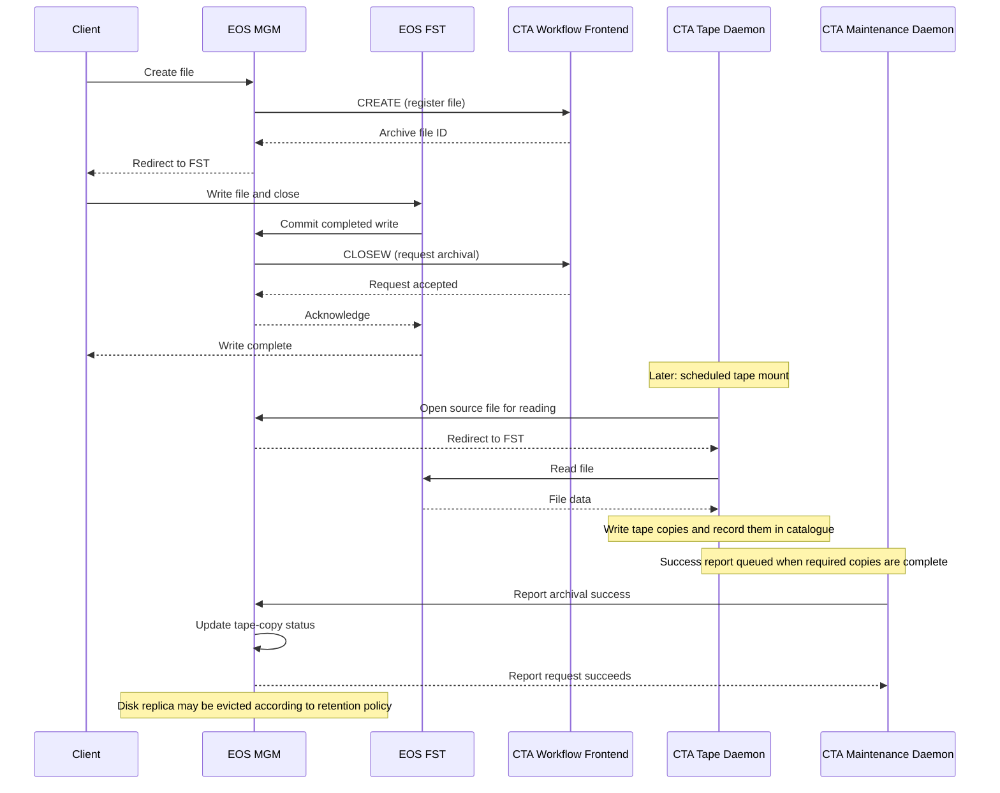

# Archival

Archival creates the tape copies required by a file's storage class. The file must first be fully written and available in the disk buffer. CTA reads its data, writes the copies to tape, records their locations in the catalogue, and reports the result to the disk system. The disk system remains responsible for the namespace and disk-replica retention.

## Archival workflow

1. **Register the file (`CREATE`).** The disk system contacts the [Workflow Frontend](../components/workflow-api.md) to validate the storage class and archive routes and obtain an archive file ID. Registration does not transfer data to tape.
2. **Submit the archive request (`CLOSEW`).** Once writing to disk finishes, the disk system supplies the information needed to archive the file, including its identity, size, checksum, and disk location.
3. **Queue the required copies.** The storage class specifies the number of copies, and archive routes select a destination tape pool for each. Copies are queued for pools, not individual tapes; see [Storage Model](storage-model.md).
4. **Write and record each copy.** When [scheduling](scheduling.md) allocates a suitable tape and drive, the tape daemon reads the file from disk and writes it to tape. Successful copies are recorded in the catalogue with their tape locations.
5. **Report the result.** Once the required copies are complete, a success report is queued. The [Maintenance Daemon](../components/maintenance-daemon.md) delivers the report to the disk system, which updates its own state and applies its disk-replica retention policy.

The file's contents must remain unchanged and readable in the disk buffer while CTA still needs them. Multiple tape copies can be written at different times; completing one copy does not necessarily complete the archive request.

## Completion and failures

Acceptance of the archive request confirms that work has been queued, not that the file is safely stored on tape. Transfer completion and delivery of the completion report are also separate stages: the disk system may still be awaiting notification after the tape copies have been written.

Validation failures can be returned when the request is submitted. Failures during later transfers are asynchronous. CTA retries failed work according to its retry handling; if the request ultimately fails, it queues a failure report for the disk system. If sending the completion report fails, CTA makes it available for another reporting attempt, up to a retry limit. This retries the report, not the tape write.

The disk system must retain the source data until archival succeeds, or until an explicit failure-handling decision is made. An unsuccessful archive request must not be treated as permission to evict the only remaining copy. The integration determines how failures are exposed to clients and operators.

File size and checksum checks protect the transfer; see [Data Integrity](data-integrity.md) for checksum responsibilities and empty-file handling.

## EOS example

EOS implements this workflow using its namespace manager (**MGM**) and disk storage servers (**FSTs**). A client first creates the namespace entry, then writes data to an FST. EOS sends `CREATE` to register the file with CTA and `CLOSEW` once the write is complete to request archival.

These API exchanges are synchronous, but the tape transfer happens asynchronously after the archive request has been accepted. After successful archival is reported, EOS can evict the disk replica according to its configured retention policy.

### Archive workflow

The diagram shows the successful path. Scheduler coordination and catalogue updates are summarised to keep the focus on EOS interactions.

```mermaid
sequenceDiagram
    participant Client
    participant MGM as EOS MGM
    participant FST as EOS FST
    participant API as CTA Workflow Frontend
    participant TD as CTA Tape Daemon
    participant MD as CTA Maintenance Daemon

    Client ->> MGM: Create file
    MGM ->> API: CREATE (register file)
    API -->> MGM: Archive file ID
    MGM -->> Client: Redirect to FST
    Client ->> FST: Write file and close
    FST ->> MGM: Commit completed write
    MGM ->> API: CLOSEW (request archival)
    API -->> MGM: Request accepted
    MGM -->> FST: Acknowledge
    FST -->> Client: Write complete

    Note over TD: Later: scheduled tape mount
    TD ->> MGM: Open source file for reading
    MGM -->> TD: Redirect to FST
    TD ->> FST: Read file
    FST -->> TD: File data
    Note over TD: Write tape copies and record them in catalogue
    Note over TD,MD: Success report queued when required copies are complete
    MD ->> MGM: Report archival success
    MGM ->> MGM: Update tape-copy status
    MGM -->> MD: Report request succeeds
    Note over MGM: Disk replica may be evicted according to retention policy
```

### EOS events not handled by the Workflow Frontend {#eos-events-not-handled-by-the-workflow-api}

EOS generates `OPENW` when an existing file is opened for writing. CTA does not handle this event: archived file contents are immutable, and modifying the disk file would not update its tape copies. EOS must prevent such modifications for tape-backed files; see [EOS Configuration](../../ops/deploy-and-configure/integrations/eos/configuration.md) for the immutability ACL settings.

EOS read events such as `OPENR` and `CLOSER` are also not tape-transfer requests. Clients read an available disk replica; retrieving a missing replica from tape requires a separate `PREPARE` request, described under [Retrieval](retrieval.md).

### Failure handling in EOS

#### Before the archive request is queued

Failures during registration or submission are reported synchronously through the client write workflow. In the EOS workflow described here, a failed `CREATE` removes the newly created namespace entry. If the disk write fails, `CLOSEW` is not sent; failures during the write or processing of `CLOSEW` trigger cleanup of the unsuccessful disk write. The client receives an error and can retry the upload.

#### After the archive request is queued

A later archival failure cannot be returned through the already completed client write. Clients must check the file's archival status to discover such failures.

For example, CTA may fail to read the file from EOS or write it to tape. If retries are exhausted, the maintenance daemon reports the archival failure to EOS. The MGM records the error in the file's extended attributes, and the disk replica is retained so an operator can investigate and, where appropriate, resubmit the archive request.
