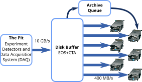
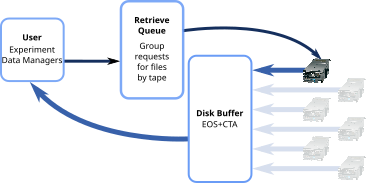

# File Lifecycle Overview

This section describes the CTA workflows (archival, retrieval and deletion of files).

File archival and retrieval is triggered by **Workflow Events** sent from the disk buffer system to the frontend.
EOS and dCache are equipped with the necessary support and in principle it can be hooked into other disk systems.

## Workflow Events

CTA supports the following Workflow Events:

* **CREATE:** Triggered when a file is copied into the disk buffer. The **CREATE** event is triggered on the creation 
  of the namespace entry, before the first data byte is transferred. CTA performs some basic checks (storage class
  exists and maps to a valid archive route) and synchronously returns a unique Archive File ID that should be used for 
  all further operations on this file.
* **CLOSEW:** Close Write, triggered when the last data byte is written to the disk buffer. This event tells CTA that
  the file is ready for archival, creating an archive request and adding it to the queue specified by the archive route.
* **PREPARE:** Creates a retrieve request and adds it to the retrieve queue for the tape where the file is stored.
* **ABORT_PREPARE:** Cancels a retrieve request.
* **DELETE:** Mark the file as deleted in the CTA Catalogue and copy its metadata to the Recycle Bin. If the file has 
  not yet been archived, cancel the archive request.

## Workflows

- [Archival](archival.md)
- [Retrieval](retrieval.md)
- [Deletion](deletion.md)
- [Repack](repack.md)
- [Recycle Bin](recycle-bin.md)

## Disk buffer integrations

### EOS

EOS supports several other workflow events that are not supported by CTA (OPENR, CLOSER, OPENW). Read operations are 
not supported as clients cannot read directly from tape (files must first be transferred to disk). Open for write
(OPENW) is not supported as files on tape are immutable.

#### Archive Workflow

[Details of Archive Workflow](archival.md)

#### Retrieve Workflow

[Details of Retrieve Workflow](retrieval.md)

#### Delete Workflow

[Details of Delete Workflow](deletion.md)
