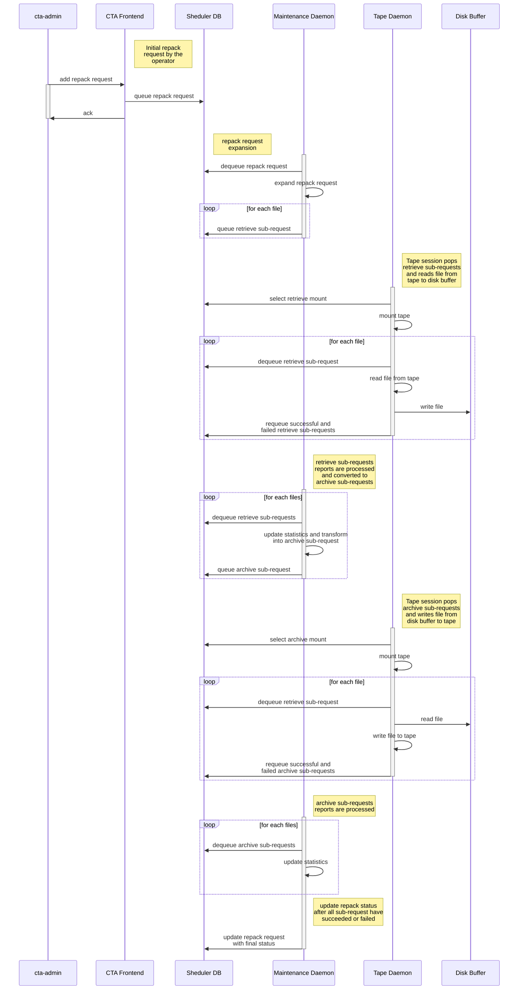

# Repack

Repacking retrieves files from a source tape into a repack buffer and archives them onto destination tapes. It is used for media migration, creating additional copies, and tape repair.

## Repack modes

- **Move:** migrate existing copies to other tapes.
- **Add copies:** create missing copies required by the storage class.
- **Move and add copies:** combine both operations.
- **Tape repair:** supply recovered files in the repack buffer.

## Repack workflow

## Recycle bin and reclamation

Metadata for replaced tape copies is retained in the [recycle bin](recycle-bin.md). Reclaiming the source tape is a separate operator action.

See [Repacking Tapes](../../ops/administration/repack.md) for prerequisites, commands, status checks, and cancellation.
