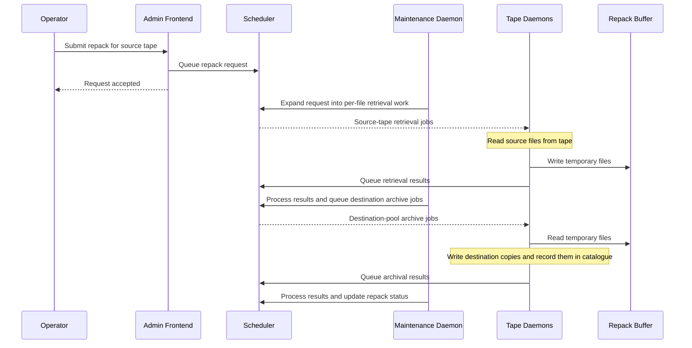

# Repack

Repack reads catalogued files from a source tape into a temporary disk buffer and writes them onto destination tapes. Operators use it to migrate to newer media, consolidate active data from partially used tapes, or create missing copies required by a storage class.

Repack works with individual files and tape copies; it is not a raw clone of a cartridge. Archive file identities remain unchanged, while copy locations are replaced or additional copies are recorded. Files that exist only in the recycle bin are not part of the active data selected for repack.

## Repack modes

| Mode | Work performed | Source copies |
| --- | --- | --- |
| **Move** | Write replacement copies onto destination tapes, preserving their copy numbers. | Replaced in the active catalogue as the new copies are recorded. |
| **Add copies** | Create missing copies required by the files' storage classes. | Retained as active copies. |
| **Move and add copies** | Replace source copies and create missing copies. | Replaced in the active catalogue as the new copies are recorded. |

### Destination selection

The source tape determines which files are considered for repack; it does not specify a single destination tape or pool. For each copy to be written, CTA looks up the archive route for the file's **storage class and destination copy number**. A repack-specific route takes precedence over the default route for that pair; otherwise, the default route is used.

For example, suppose a source tape holds copy 1 of files in a storage class requiring two copies:

| Work required | Route used | Example destination pool |
| --- | --- | --- |
| Move the existing copy 1 | Storage class + copy 1 | `primary-new-media` |
| Add a missing copy 2 | Storage class + copy 2 | `secondary` |

In move mode, CTA writes a replacement copy 1 to `primary-new-media`. In move-and-add-copies mode, a file missing copy 2 is also written to `secondary`; an existing copy 2 does not need to be recreated. Repack-specific routes can direct these writes to new pools without changing the default destinations for ordinary archival.

The routes select **pools**, not cartridges. The scheduler chooses eligible writable tapes in each pool as work is served. Even when all files target one pool, they may be spread over multiple destination tapes. If the source contains files from different storage classes, their routes may also lead to different pools. See [Storage Model](storage-model.md) for the relationships between storage classes, copy numbers, and archive routes.

## Repack workflow

1. **Submit the request.** An operator requests repack of a source tape through the [Admin Frontend](../components/admin-frontend.md), selecting the mode and repack buffer.
2. **Expand into per-file work.** The [Maintenance Daemon](../components/maintenance-daemon.md) uses the catalogue to identify the source tape's active files and the copies to move or add, then queues the necessary retrieval work.
3. **Read into the repack buffer.** Tape daemons read the source files into temporary disk storage. Retrieval jobs target the source tape.
4. **Queue and write destination copies.** The maintenance daemon processes successful retrieval results and advances the files to archival. Tape daemons read the buffered files and write the required copies to destination tapes, recording them in the catalogue. Archival jobs target destination tape pools.
5. **Track completion.** The maintenance daemon processes the archival results and updates the repack's progress and final status.

Tape daemons use the same read and write machinery as ordinary retrieval and archival. Jobs retain their repack identity for accounting and result handling, while the maintenance daemon coordinates the overall repack workflow.

The **repack buffer** stages data between the read and write phases. It need not be the client-facing disk buffer, but must be accessible to the daemons involved and retain each file while its destination writes still need it. Repack results are processed internally to advance the workflow, rather than as ordinary client retrieval requests.

### Expansion: turning a tape request into file jobs

The initial request identifies a source tape and the intended operation. **Expansion** turns that tape-level request into the individual file jobs needed to perform it. The maintenance daemon promotes pending requests for expansion within the configured limit, then uses the scheduler to:

- Read the source tape's active file entries from the catalogue, applying any selection limits on the request.
- Determine which copy numbers must be replaced or added for each file, and check that the required storage classes and destination routes exist. In add-copies mode, files that already have the required copies need no work.
- Prepare the tape's repack-buffer directory and assign a buffer location to each selected file. Suitable files already supplied in the buffer can bypass the tape-read phase.
- Create the per-file subrequests, recording their destination copies, progress, and expected file and byte totals in the scheduler backend.

Expansion prepares and queues work; it does not read the tape itself. Missing routes or problems accessing the repack buffer can therefore fail a request before any tape transfer takes place. Finishing expansion means the work has been defined, not that repack is complete.

### Advancing files through the workflow

A separate maintenance daemon routine processes batches of repack results. A successful retrieval makes that file eligible for its destination writes: the routine advances it to archival work for the planned copy numbers. One read into the buffer can thus supply several destination copies, without waiting for every file on the source tape to be retrieved.

Archival results update the repack's successful or failed copy counts; retrieval failures are also accounted for. Once expansion and the resulting work have finished, these outcomes determine the final repack status. Tape daemons perform the data transfers, while the maintenance daemon connects the stages and records their progress. If result processing is delayed, a file can already be present in the buffer while its destination writes are still waiting to be queued.

The diagram shows the successful path for a file; different files can progress through these stages at different times. Scheduling and catalogue updates are summarised.

```mermaid
sequenceDiagram
    participant Operator
    participant API as Admin Frontend
    participant S as Scheduler
    participant MD as Maintenance Daemon
    participant TD as Tape Daemons
    participant B as Repack Buffer

    Operator ->> API: Submit repack for source tape
    API ->> S: Queue repack request
    API -->> Operator: Request accepted
    MD ->> S: Expand request into per-file retrieval work
    S -->> TD: Source-tape retrieval jobs
    Note over TD: Read source files from tape
    TD ->> B: Write temporary files
    TD ->> S: Queue retrieval results
    MD ->> S: Process results and queue destination archive jobs
    S -->> TD: Destination-pool archive jobs
    TD ->> B: Read temporary files
    Note over TD: Write destination copies and record them in catalogue
    TD ->> S: Queue archival results
    MD ->> S: Process results and update repack status
```

Both phases consume tape-drive capacity and disk bandwidth. Repack uses its designated VO's resource limits and competes for hardware with other work; see [Scheduling](scheduling.md) and [Repacking Tapes](../../ops/run-and-maintain/administration/repack.md) for policy and setup.

## Completion and partial failures

Repack progresses per file, not as one atomic operation over the whole tape. Successfully recorded destination copies remain valid even if another file fails. A failed repack can therefore leave some copies moved and others still active on the source tape; failure does not roll back completed moves.

A completed request means its selected work succeeded. It does not by itself make the source tape reclaimable: add-copies mode retains source copies, and a request that processes only part of a tape leaves other active copies behind. Operators must check the remaining active copies and reclamation conditions separately.

See [Recovering from partial failures](../../ops/run-and-maintain/administration/repack.md#recovering-from-partial-failures) for assessing completed work and planning a retry.

## Using recovered files

If files have been recovered outside the normal tape-read workflow, an operator can place them in the repack buffer for CTA to write onto destination tapes. This is often called **tape repair**, but it recovers file copies rather than repairing the cartridge itself.

The supplied files must correspond to the existing catalogue entries and satisfy the normal integrity checks. This is an alternative source of file data within repack, not a separate placement mode. Buffer naming requirements and submission options belong in the [Tape Repair procedure](../../ops/run-and-maintain/administration/repack.md#tape-repair).

## Source copies and reclamation

When a replacement copy is recorded, the previous copy's metadata moves to the [Recycle Bin](recycle-bin.md); it is no longer the active location for that copy number. Merely queueing repack or reading a file into the buffer does not replace its source catalogue entry. Add-copies mode leaves the original copies active.

Repack does not erase the source tape. Once no active copies remain, reclamation is a separate operator action subject to the [Tape Lifecycle](../tape/lifecycle.md) conditions. Reclamation removes recycle-bin entries; subsequent relabelling establishes a new end of data and makes old records beyond it inaccessible to normal reads. See [Reclamation and reuse](recycle-bin.md#reclamation-and-reuse) for the recovery boundary.

See [Repacking Tapes](../../ops/run-and-maintain/administration/repack.md) for prerequisites, commands, status checks, and cancellation, and [Media Initialisation](../../ops/run-and-maintain/administration/media-initialisation.md) for labelling.
