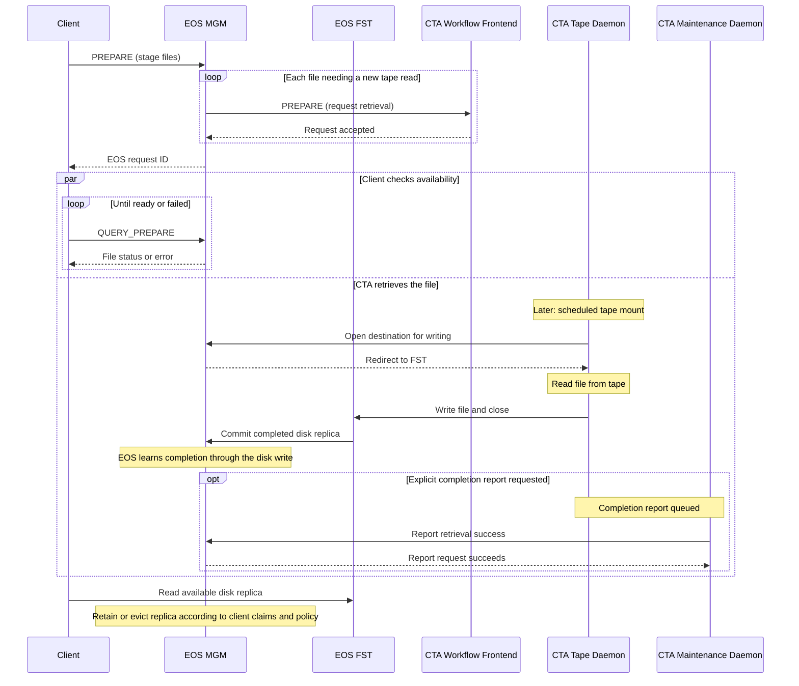

# Retrieval

Retrieval copies a file from tape into the disk buffer so that clients can access it through the disk system. It leaves the tape copy unchanged. CTA schedules and performs the tape read; the disk system manages client requests, access to the resulting replica, and how long that replica remains on disk.

## Retrieval workflow

1. **Request retrieval (`PREPARE`).** The disk system asks the [Workflow Frontend](../components/workflow-api.md) to retrieve a file and supplies a destination in its buffer. If a usable disk replica is already available, the disk system can serve it without requesting a tape read.
2. **Select a copy and queue the read.** CTA uses the catalogue to find a suitable tape copy. The request is queued for that specific tape, not its tape pool. Requests for files on the same tape can share a mount.
3. **Schedule and transfer.** When a suitable drive is available and the scheduling criteria are met, a tape daemon mounts the tape, reads the requested files, and writes them to the disk buffer. [Recommended Access Order](../tape/rao.md) can reduce positioning time within a batch; see [Scheduling](scheduling.md) for mount selection and [Data Integrity](data-integrity.md) for verification.
4. **Make the disk replica available.** The disk system learns that the transfer has completed, updates its state, and makes the replica available to waiting clients. Clients read from disk, not directly from the tape drive.

Retrieval does not create a new archive file identity or remove the source tape copy. The disk replica can subsequently be evicted and retrieved again when needed.

## Completion, cancellation, and failures

Acceptance of a retrieval request means it has been queued, not that the file is available on disk. Depending on the integration, the disk system recognises successful completion through the disk write itself or an explicit completion report. The [Maintenance Daemon](../components/maintenance-daemon.md) processes queued reports; see [Disk Buffer](../components/disk-buffer.md#reporting-results).

**Cancellation (`ABORT_PREPARE`)** asks CTA to cancel a previously submitted retrieval. It does not delete the tape copy. Cancellation and release of an existing disk replica are separate operations, and the disk system must account for other clients that still need the file.

Validation errors can be returned when the request is submitted. Later failures, such as tape-read or disk-write errors, are asynchronous. CTA retries failed work according to its retry handling and reports terminal failures to the disk system. Clients learn the outcome through the disk system's request or file-status interface. A failed or incomplete transfer must not be treated as a ready disk replica.

## EOS example

EOS coordinates retrieval through its namespace manager (**MGM**) and disk storage servers (**FSTs**). Clients can submit staging requests for multiple files, for example through FTS. EOS tracks those requests and asks CTA to retrieve files that need a tape read.

### Events and responsibilities

| EOS operation | Purpose | Interaction with CTA |
| --- | --- | --- |
| `PREPARE` | Request that files be staged on disk. | Sends a retrieval request when a new tape read is needed; overlapping requests for a file can share an existing retrieval. |
| `QUERY_PREPARE` | Query file availability, pending retrievals, and errors. | Handled by EOS; not forwarded to CTA. |
| `ABORT_PREPARE` | Cancel a client's staging request. | Can cancel the CTA retrieval when no remaining request needs it. |
| `EVICT_PREPARE` | Release a client's claim on a staged replica so it can be removed when no longer needed. | Handled by EOS; does not delete the tape copy or submit a CTA deletion request. |

### Shared requests and disk-replica retention

Several clients can request the same file. EOS tracks their outstanding claims on the disk replica, commonly described as the **evict counter**, so that releasing one request does not remove data still needed by another. These claims are EOS state, separate from the CTA request that performs the tape read.

Cancelling a pending staging request, releasing a staged file, and physically evicting its disk replica are distinct actions. When no client claim remains, EOS can cancel an unnecessary retrieval or evict a replica according to the operation and its retention policy. Neither action removes the tape copy.

### Request IDs

An EOS `PREPARE` request can contain multiple files and returns an EOS request ID. A file can also appear in several requests, so the relationship between request IDs and files is many-to-many. This client-facing ID is distinct from the archive file ID identifying a file in CTA.

For the XRootD interface, clients such as FTS maintain the list of files associated with each request ID; EOS tracks request associations on individual files. The HTTP Tape REST API provides bulk-request tracking. Clients must use the tracking and status facilities of the interface through which they submitted the request.

### Retrieve workflow

The diagram shows a file that needs to be read from tape. Client polling can continue while scheduling and transfer take place. Scheduler coordination and catalogue lookups are summarised.

### Failure handling in EOS

A rejected submission is returned through the staging request. If retrieval fails after acceptance, CTA reports the failure to EOS, which exposes it through file or request status. The client can therefore receive a successful submission response and later discover a retrieval error when polling.

An error does not remove the tape copy. Investigation and any resubmission are separate from releasing other clients' claims or evicting disk replicas.
