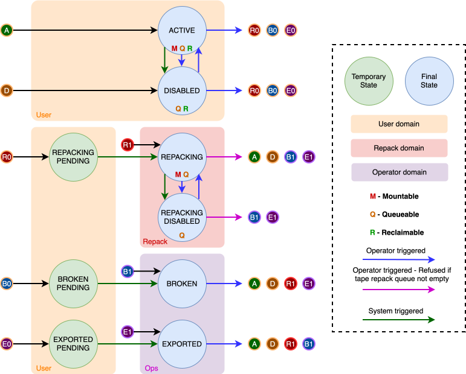

# Tape Lifecycle

CTA records each tape and its state in the [Catalogue](../components/catalogue.md). State changes are managed through the [Admin API](../components/admin-api.md); operator procedures belong under [Tapes, Drives, and Libraries](../../ops/administration/tapes-and-drives.md).

A tape's state controls which kinds of work it may serve. It is separate from properties such as whether the tape is full, and from the availability of its drives and library. An `ACTIVE` tape can therefore remain readable after it becomes full, while no longer being eligible for further archival.

## Tape states and their transitions

The figure distinguishes final states from internal pending states. “Final” means that the transition has completed, not that the tape can never change state again.

### What can be done on each final state

| Operation | `ACTIVE` | `DISABLED` | `REPACKING` | `REPACKING_DISABLED` | `BROKEN` | `EXPORTED` |
| --- | --- | --- | --- | --- | --- | --- |
| Queue normal retrievals | Yes | Yes | No | No | No | No |
| Queue repack requests | No | No | Yes | Yes | No | No |
| Queue repack reads | No | No | Yes | Yes | No | No |
| Eligible archive destination (normal or repack) | Yes | No | No | No | No | No |
| Mountable | Yes | No | Yes | No | No | No |
| Reclaimable | Yes | Yes | No | No | Yes | No |

“Yes” indicates permission based on tape state, not immediate execution. A `DISABLED` tape can have retrievals queued without being mounted. Mounts also require an available, compatible drive and library; archive destinations must additionally be writable and not full.

Archive requests are queued according to storage classes and archive routes to tape pools, rather than to a specific destination tape. This also applies to the archive work generated by repacking. The destination column describes tape selection for writing, not whether an archive request can be accepted. Repack reads refer to the source tape, and their queueing is handled by the maintenance daemon.

“Reclaimable” is also conditional: the implementation requires the tape to be marked full, contain no active file copies in the catalogue, and satisfy the recycle-log quarantine checks. Reclamation removes the tape's recycle-log entries and resets catalogue counters so it can be reused; it does not physically erase the recorded data. See [Verify and reclaim tapes](../../ops/administration/tapes-and-drives.md#verify-and-reclaim-tapes) for the operator procedure.

### Tape states explained

- **ACTIVE:** eligible for normal retrieval and, when writable and not full, archival. This is the default state for newly registered tapes.
- **DISABLED:** temporarily excluded from mounting, for example while an operator investigates a media or mount problem. Normal retrieval requests may still queue for this tape.
- **REPACKING:** reserved as a source for repack work. Normal retrievals cannot be queued for it, and it is not an archive destination.
- **REPACKING_DISABLED:** repack work may queue, but the tape cannot be mounted. This pauses tape access without leaving the repack state family.
- **BROKEN:** unavailable for normal or repack transfers because the media is considered faulty or requires recovery outside the normal workflow. The state does not itself delete catalogue file records.
- **EXPORTED:** records that the tape is outside the library and unavailable to CTA for transfers. Setting this state does not physically eject a cartridge or delete its catalogue records.

### Pending states and queue cleanup

Transitions to `REPACKING`, `BROKEN`, or `EXPORTED` can require existing retrieval queues to be cleaned before the destination state takes effect. CTA uses `REPACKING_PENDING`, `BROKEN_PENDING`, and `EXPORTED_PENDING` for this intermediate work. These states are internal and cannot be selected directly by an operator; unrelated state changes are rejected while a transition is pending.

Cleanup handles affected requests, including reassignment to another eligible tape copy or failure reporting where appropriate. With the objectstore scheduler, the [Maintenance Daemon](../components/maintenance-daemon.md#scheduler-recovery-and-cleanup) performs this work asynchronously. With the PostgreSQL scheduler, cleanup and completion of the pending transition are invoked through the state-change path.

Not every transition requires cleanup: for example, resuming from `REPACKING_DISABLED` to `REPACKING` is direct.

### Transition constraints

A repack request requires the source tape to be in `REPACKING` or `REPACKING_DISABLED`. While a repack request exists, the tape cannot leave those two states. `REPACKING_DISABLED` can only be entered from `REPACKING`.

The Admin API's operating mode also restricts permitted state transitions. Normal-operation and repack-only deployments do not accept the same transitions; a permitted tape-state change must be submitted to an API instance whose operating mode allows it.
