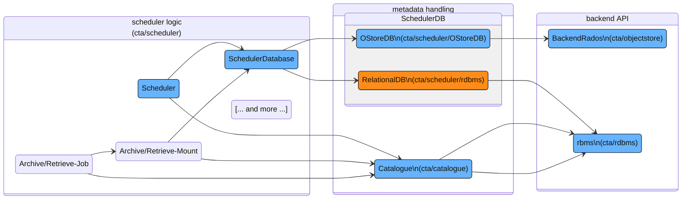

# Scheduler

The scheduler code can be seen as having 3 main sub-parts as depicted below (class names start with capital letter, directory names in parentheses, arrow pointing to class members). These 3 main components relate to the scheduler logic, the metadata handling and the backend API. 

- **Scheduler Logic**: 
  
  The Scheduler class implementing a tape resource scheduler. This class is the main entry point for most of the operations on both the tape file catalogue and the object store for queues. An exception is although used for operations that would trivially map to catalogue operations. In the same directory you can find all the different classes with methods relevant for the scheduling workflow itself. Contains an abstract `SchedulerDatabase` class providing an interface to the metadata handling side of the Scheduler. 

- **Metadata Handling**: 
  
  Contains a concrete implementation for a particular metadata handling use-case. One use-case is a Catalogue serving as a permanent metadata data store. Second use case is a scheduler backend related to the either an ObjectStore (OStoreDB, used in production) or a RelationalDB (PostgreSQL, pre-production deployment 2026).

- **Backend API**: 
  
  Low level interface specific to the SchedulerDB. For example, contains classes handling of the objects in the ObjectStore, or handling of the statements and SQL queries for the relational databases in use.

The [Scheduling Workflow](../workflows/scheduling.md) is documented under the Workflows section. 
The code itself can be found [here](https://gitlab.cern.ch/cta/CTA). 

