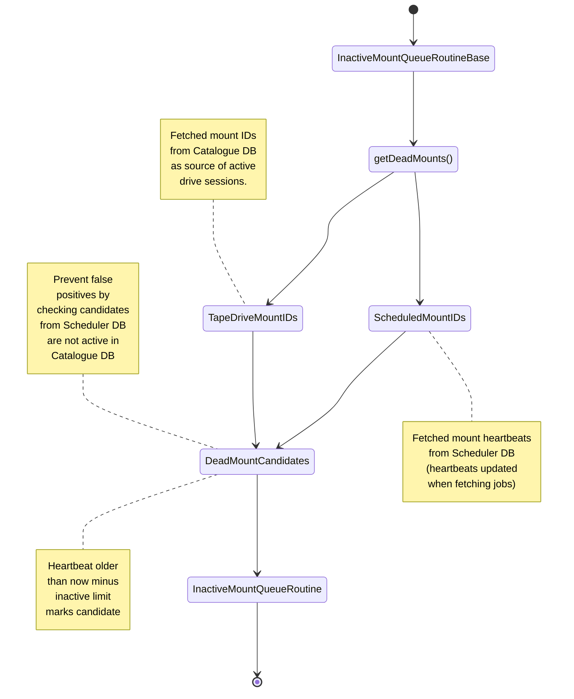

# Garbage Collection for Postgres Scheduler Backend

We have altogether 12 distinct tables in the Postgres backend which may contain jobs in various states. These are: 

```
ARCHIVE_ACTIVE_QUEUE
ARCHIVE_FAILED_QUEUE
ARCHIVE_PENDING_QUEUE
RETRIEVE_ACTIVE_QUEUE
RETRIEVE_FAILED_QUEUE
RETRIEVE_PENDING_QUEUE   
REPACK_ARCHIVE_ACTIVE_QUEUE
REPACK_ARCHIVE_FAILED_QUEUE
REPACK_ARCHIVE_PENDING_QUEUE
REPACK_RETRIEVE_ACTIVE_QUEUE
REPACK_RETRIEVE_FAILED_QUEUE
REPACK_RETRIEVE_PENDING_QUEUE
```


In case of a power cut or an unexpected crash of a mount session, some jobs may be left stranded with no process taking care of them. For this purpose, we have introduced specific routines listed further below performing the garbage collection. 

The `*PendingQueueRoutine` acts on the `PENDING` tables where the jobs get first inserted. Normally the jobs have no monut ID until they are picked up by a mount, but in some cases jobs casn be re-queued after failure tot he same mount ID. In case the mount session dies before picking up such jobs, they need to have `MOUNT_ID` reset to `NULL` in order to be eligible to be picked up by anotther active mount. 


The `*ActiveQueueRoutine` acts on the `ACTIVE` tables where the jobs get moved after they were picked up by a mount. In case the mount dies before reporting job success or failure, there jobs need to be requeued back to `PENDING` table. 

The currently implemented routines are the following:

- `ArchiveInactiveMountActiveQueueRoutine`
    - Handles jobs owned by dead archive mounts. The routine requeues dead jobs from active queue table to the pending queue table. 
    - Only jobs for which reporting did not start yet are selected. Jobs in reporting stage, will be picked up again for reporting automatically.

- `RetrieveInactiveMountActiveQueueRoutine`
    - Handles jobs owned by dead retrieve mounts. The routine requeues dead jobs from active queue table to the pending queue table. 
    - Only jobs for which reporting did not start yet are selected. Jobs in reporting stage, will be picked up again for reporting automatically.

- `ArchiveInactiveMountPendingQueueRoutine`
    - Handles jobs owned by dead archive mounts. The routine requeues dead jobs from pending queue table after they have been requeued previously to the same mount which is now dead.

- `RetrieveInactiveMountPendingQueueRoutine`
    - Handles jobs owned by dead retrieve mounts. The routine requeues dead jobs from pending queue table after they have been requeued previously to the same mount which is now dead.


- `RepackArchiveInactiveMountActiveQueueRoutine`
    - Handles jobs owned by dead repack archive mounts. The routine requeues dead jobs from active queue table to the pending queue table. 

- `RepackRetrieveInactiveMountActiveQueueRoutine`
    - Handles jobs owned by dead repack repack retrieve mounts. The routine requeues dead jobs from active queue table to the pending queue table.

- `RepackArchiveInactiveMountPendingQueueRoutine`
    - Handles jobs owned by dead repack archive mounts. The routine requeues dead jobs from pending queue table after they have been requeued previously to the same mount which is now dead.

- `RepackRetrieveInactiveMountPendingQueueRoutine`
    - Handles jobs owned by dead repack repack retrieve mounts. The routine requeues dead jobs from pending queue table after they have been requeued previously to the same mount which is now dead.

For all the routines above, the following applies as well: 
    - After all clean up has been done for the respective (MOUNT_ID, QUEUE_TYPE), the corresponding row is deleted from MOUNT_QUEUE_LAST_FETCH tracking table preventing further cleanup.


- `DeleteOldFailedQueuesRoutine`
    - Deletes all jobs which hang in the failed queue tables for too long (2 weeks).

- `CleanMountLastFetchTimeRoutine`
    - Deletes all tracking MOUNT_QUEUE_LAST_FETCH entries for which the mount was not active since a very long time (e.g. 4 weeks; longer than the time limit defined for the collection routines). 


Regarding the cleanup of the jobs in the reporting workflows (user archive/retrieve), this is partially resolved by a gc_delay in the SQL query picking up the jobs for reporting again in case their status did not change since a timeout. Investigation of this and other cases will be the next step.


## Getting candidates for dead mounts




Catalogue query gives us set of active mount IDs which are recorded as sessionId in the DRIVE_STATE table. Whenever session finishes, crashes, drive is put down etc., the drive state is updated and the session ID is set to nullopt. At this point we are sure no session processes are taking care of picking up more jobs and we can safely clean all jobs in ACTIVE table which have IS_REPORTING False and status of type *ToTransfer*. Also, we can clean any potential jobs from the PENDING table which would have this specific mount ID assigned since no mount would pick them up anymore (they could be present after a workflow decided to requeue the job on the same mount e.g.). A `MOUNT_QUEUE_LAST_FETCH` table has been created and is being updated anytime a mount fetches new jobs, of when a specific job for specific mount ID has been requeued to the `PENDING` table for the same mount ID (separate use-case). If the heartbeat of unique (`MOUNT_ID`, `QUEUE_TYPE`) combination gets too old, we check if the session still exists in the catalogue and if not, a cleanup is triggered.


