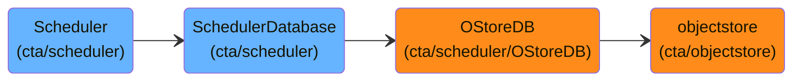
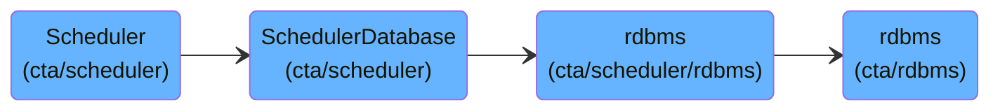
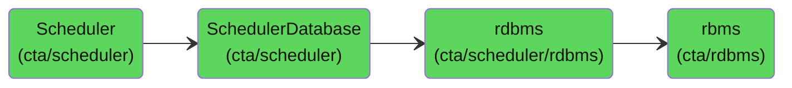

# Introduction

The PostgreSQL Scheduler is a recent alternative implementation of the CTA scheduler's job queue management system that uses a PostgreSQL relational database instead of a Ceph RADOS object store (or VFS) for persistent storage. This page describes the PostgreSQL-based scheduler backend evolution. 

**Starting point:**

The development has  
- ensuring compatibility with Scheduler:
    - copy of OStoreDB methods put in `cta/scheduler/rdbms` making them throw exceptions
    - useful strategy to learn/review all the bits from the very start (i.e. neither `taped` not `ctafrontend` start up)
    - to start running the system, **step by step approach: crash --> implement --> test**

**Current status:**

- functional PostgresSched backend (Archive/Retrieve and Repack workflows)
- functional garbage collection routines requeueing jobs in case of power outage or mount failure
- functional support for multi-copy replicas in all workflows 

**Our longterm target:**

- re-think and re-implement part of the `Scheduler` and `SchedulerDatabase` (+ refactor the `cta/scheduler/rdbms` code) to exploit the advantages of relational DB (PostgreSQL) and remove biases in scheduling introduced by `objectstore`

**Current development:**

- Scaling infrastructure and deployment for performance tests.
- Expanding generic scheduler algorithm unit tests (the existing ones were tailored only to objectstore).
- Testing garbage collection routines. 
- No changes/improvements to the `Scheduler` or `SchedulerDatabase` unless necessary (creating tickets with these for the future)

