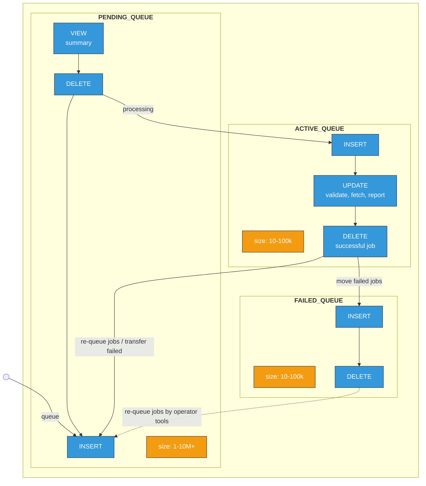

# Scheduler Workflow Integration

In the diagram you can see the the relative sizes of the tables (orange). By far the biggest table is the pending queue table type. For the moment (shall be changed with redesign of the scheduler logic) each tape server calls a `VIEW` on the full table summarising all the queued jobs in order to decide if a tape shall be mounted or not. Once it has been decided that there is enough work, the mount process will start deleting jobs from the `PENDING_QUEUE` while interting them to the `ACTIVE_QUEUE`. The `ACTIVE_QUEUE` is further partitioned by the tape identifier for retrieve or tape pool for archive which allows to keep the table size considerably smaller than the original `PENDING_QUEUE` (same for the `FAILED_QUEUE`). 

In the `ACTIVE_QUEUE` the most active queries are update and select statements necessary for the followup of the job status and its reporting to the disk system. If the job has been successfuly completed (file transferred and disk reporting has been successful) it will be deleted from this table. Several retries, depending on the workflow configuration, are possible. In such a case, the job that failed the file transfer will be moved back to the `PENDING_QUEUE` and picked up again either by the same or by another mount process (also depending on the specific workflow configuration). In case the reporting has failed it will be retried several times. In case of reporting did not succeed, the job will be moved to the `FAILED_QUEUE` table from which it can be moved back to the `PENDING_TABLE`.

