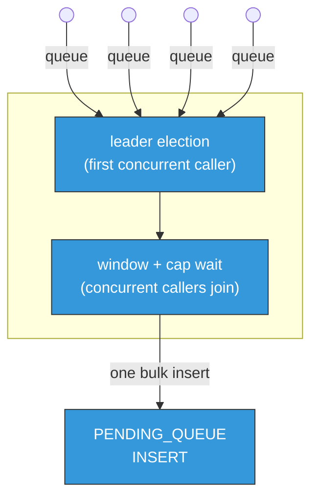

## Opportunistic batching of PENDING_QUEUE inserts

The `INSERT` step into `PENDING_QUEUE` is on the hot path of every archive
and retrieve request: with the file-by-file scheme, each request pays its own catalogue lookup plus
its own scheduler-DB round trip, one connection at a time per request. Under high concurrency this
serializes DB connection usage across every frontend worker handling `CREATE`/`CLOSEW`/`PREPARE`
events, and it's the step most exposed to connection-pool pressure as request rate grows.

Opportunistic batching is implemented for the postgres scheduler backend pgsched only; the objectstore scheduler always queues file by file. It merges several concurrent requests' inserts into a single bulk `INSERT`, so `PENDING_QUEUE` fires once for a whole batch of requests instead of once per request — fewer, larger round trips instead of many small ones hammering the DB.

Each caller resolves its own catalogue criteria (storage class routing for archive, tape-file
lookup for retrieve) on its own thread before it ever competes for leadership, so that work runs in
parallel across concurrent callers rather than serialized inside the batch. The first caller to
arrive becomes the batch's leader: it waits up to `opportunistic_batching_window_ms`, or until the
batch reaches `opportunistic_batching_max_batch_size` requests, whichever comes first, then issues
the single bulk `INSERT` and releases every request in the batch (including itself) with its result.
A request that fails its own catalogue lookup never joins a batch at all — it fails immediately, in
isolation, exactly as it would under the file-by-file scheme.

**Configuration** (`cta.schedulerdb.*`, pgsched only):

| Key | Default | Meaning |
|---|---|---|
| `opportunistic_batching_enabled` | `false` | Enables batching for archive and retrieve queueing. |
| `opportunistic_batching_window_ms` | `50` | Max time a batch's leader waits for concurrent requests to join before inserting. |
| `opportunistic_batching_max_batch_size` | `1000` | Safety ceiling on requests per batch; real workloads should rarely reach it — the window normally ends a batch first. |

A longer window trades added per-request latency for bigger, more efficient batches; a shorter one
does the opposite. In practice, once enough concurrent load exists to make batching worthwhile, the
cap-based early exit ends the wait long before the window elapses — so the window mainly bounds
latency during quieter periods, when there's little to batch with anyway, rather than shaping
throughput under real load.

### Stage 1: per-caller catalogue resolution

For archive, `Scheduler::resolveArchiveInsertCriteria()` resolves the request's `copyToPoolMap`/
`mountPolicy` via the catalogue's `getArchiveFileQueueCriteria()`, backed by a cache keyed on
`(instanceName, storageClass, requesterName, requesterGroup)` — several concurrent requests sharing
a storage class and requester reuse the same lookup. For retrieve, `Scheduler::
resolveRetrieveInsertCriteria()` resolves the request's `RetrieveFileQueueCriteria` via
`prepareToRetrieveFile()`, which is inherently per-request (keyed on `archiveFileID`, essentially
unique every time, so not cached), plus a disk-system-name resolution against a separately cached,
single, globally-shared disk system list (`getCachedDiskSystemList()`).

Both run entirely on the calling thread, before `enqueueAndWait()` is ever called. That's what lets
concurrent requests' catalogue work run in parallel instead of serialized one at a time inside a
single leader thread, which is what stage 1 used to do before it was moved out of the batch
resolution functions. A request whose stage 1 lookup fails (an unknown storage class, a nonexistent
archive file ID) throws directly from here and never reaches the batcher at all — the same
per-request isolation as before, just resolved earlier and without needing per-item exception
handling inside the batch itself.

#### The two caches

Both caches follow the same shape: a TTL-bounded cache (a map, for the per-key archive criteria; a
single value, for the disk system list) plus single-flight coalescing, so several concurrent callers
missing the same key at once share one fetch instead of each repeating it.

| Cache | Scope | TTL | Why cached |
|---|---|---|---|
| Archive insert-queue criteria | Per `(instanceName, storageClass, requesterName, requesterGroup)` | 30s | Many concurrent archive requests typically share a storage class and requester; a stale hit just costs one avoidable catalogue call, so the TTL only needs to be long enough to matter and short enough that a routing/mount-policy change is picked up promptly. |
| Disk system list | One value, shared by every retrieve request | 30s | `catalogue.DiskSystem()->getAllDiskSystems()` is a real DB join query that also holds a catalogue connection for its duration — expensive enough to be worth caching even though only one thing reads from it (dstURL → disk system name resolution), not per-key data. |

Single-flight coalescing matters specifically because a cold or just-expired key can be missed by
several concurrent callers at almost the same instant. Without it, every one of them would
independently repeat the same catalogue call; with it, the first caller to miss becomes the
"fetcher" and registers a `std::shared_future` for the result, and every other caller that misses
the same key while that fetch is still in flight just waits on the future and reuses the outcome
(the result, or the same exception) instead of repeating the lookup itself.

### Stage 2: the bulk insert

Once a batch's leader has waited out its window (or the cap is reached), it steals the accumulated
batch and hands it to `Scheduler::resolveArchiveBatch()` or `resolveRetrieveBatch()`. By this point
every item already carries its resolved criteria from stage 1, so this is purely the DB-facing half
of queueing: one call to `RelationalDB::queueArchive(batch, lc)` or `queueRetrieve(batch, lc)`, each
building a single bulk `INSERT` for the whole batch (`ArchiveJobQueueRow::insertRequestBatch()` /
`RetrieveJobQueueRow::insertBatch()`) rather than one `INSERT` per item.

- On success, every item's promise is resolved with its own result and marked `queued`.
- On failure, the whole batch fails together. A bulk-insert failure is almost always systemic (a
  lost connection, a deadlock, a timeout) rather than specific to one row, so retrying item by item
  would just repeat the same failure N times while every follower in the batch sits blocked waiting
  for it; a genuine one-off case (e.g. a duplicate ID from a client retry) is left to the caller's
  normal retry path instead.
- Duration and job-count metrics are recorded here, once per batch, on the leader thread only — they
  measure the bulk insert's own cost and the number of jobs it actually wrote, not per-request
  latency.

After the batch's promises are resolved and followers are released, the leader runs the slower,
non-blocking `afterRelease` step (`logQueuedArchiveItems()` / `logQueuedRetrieveItems()`) — per-item
audit logging that no follower ever waits on, since it only starts once every result already exists.
