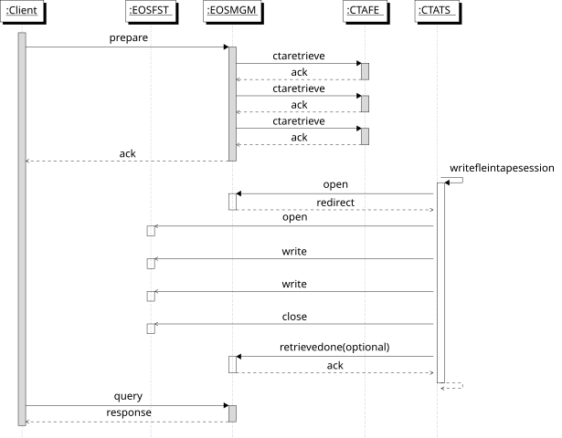

!!! warning "Deprecated"
    This page is deprecated and may contain information that is no longer up to date.

# Retrieve Workflows

!!! Presentation
        See also [this presentation to the X-Section meeting](https://codimd.web.cern.ch/p/H1JjS3Xh8#/).

## Introduction and Overview

The communication protocol for CTA retrieve workflows are shown in the figure below:



To recall files from tape to disk, a **PREPARE** request is sent to EOSCTA using the XRootD protocol (`xrdfs prepare`).
ATLAS, CMS and LHCb use FTS, which sends bulk PREPARE requests of 200 files at a time. ALICE uses JAlien, which sends
one PREPARE request for each file.

The four main workflows associated with retrieving files from tape are:

* [PREPARE](#prepare): stage a file from tape to the EOS disk buffer; increment the evict counter
* [QUERY_PREPARE](#query_prepare): query the status of a file (replica on disk or not; replica on tape or not; details of any in-flight requests; any errors)
* [ABORT_PREPARE](#abort_prepare): cancel a previous PREPARE request
* [EVICT_PREPARE](#evict_prepare): decrement the evict counter of a previously-retrieved file replica and, if the value reached zero, remove it from the EOS buffer

Note that not all requests are communicated to the CTA Frontend:

* **PREPARE** requests will be passed to CTA if it is the first request for a file
* **ABORT_PREPARE** requests will be passed to CTA if it is the last request to abort a retrieve for a file
* **QUERY_PREPARE** and **EVICT_PREPARE** are handled entirely by EOS and are never communicated to CTA

*Note:* Evict counter logic is only available with EOS version >= 4.8.70. Before this version any EVICT_PREPARE will trigger an eviction, regardless of the number of users requesting/using the file.

### PREPARE Request IDs

* **PREPARE** takes a *list of files* and returns a request ID *ReqId*.
* **QUERY_PREPARE**, **ABORT_PREPARE** and **EVICT_PREPARE** use this same *ReqId + list of files* to reference the request.

The *ReqId* is a unique ID generated by the XRootD server. One ID is generated for each request, and there can be multiple
different requests for the same file. In other words, the relationship between *ReqId* and a file is many-to-many.

The XRootD protocol supports overriding the default *ReqId* in the MGM, replacing it with an ID generated by EOS. (The
configuration option `xrootd.fslib -2 libXrdEosMgm.so` must be set).

EOS does not maintain the mapping between *ReqId* and *list of files*; this is done by FTS. EOS on its own does not
provide a mechanism to look up the list of files associated with a given request. However, a file can be queried to
see which *ReqId*s are attached to the file metadata.

If FTS is not used, it is the responsibility of the client to keep track of which files belong to a given *ReqId*.

## PREPARE

The figure below shows the sequence for queuing a **PREPARE** request and retrieving the file to EOS disk.


### PREPARE Workflow Event

The `prepare.default` workflow event is triggered by `xrdfs prepare` on a list of files. The `prepare` event is handled by the
standard XRootD FileSystem call, which passes it to the MGM OFS plugin. Here the *list of files* is unpacked and processed in series:

1. Check if the file exists and the requester has permission to retrieve it. If not, skip it and move to next file.
1. Dispatch the file to a handler function in the EOS WorkFlow Engine (WFE): `WFE::Job::HandleProtoMethodPrepareEvent()`
1. The WFE handler function generates a Google protocol buffer which is transmitted to the CTA Frontend (across the SSI interface).
This call returns synchronously with success or an error message for each file.
1. If there is an error for any file, skip it and move to the next file

All files are treated with idempotency.

Once the list of files has been processed - even if there was an error for some of them - *SFS_OK* is returned to the XRootD framework. An error is only returned if all file requests fail before the request is sent to the WFE.

If the MGM has been configured to override the default XRootD-generated request ID, *SFS_DATA* is returned with the new *ReqId*. In either
case, the *ReqId* is returned to the client.

The WFE handler function contains the following steps:

1. Check if the file is already on disk; if so, there is nothing further to do apart from incrementing the evict counter (`sys.retrieve.evict_counter`) by 1. Return success.
1. Check if the `sys.retrieve.req_id` is set:
    * If **yes**: there is already an in-flight request. Add the *ReqId* to the list of requests waiting for this file (`sys.retrieve.req_id`).
    * If **no**: this is the first request for this file. Set `sys.retrieve.req_id` to the *ReqId* and set
      `sys.retrieve.error` to empty. Send the **PREPARE** request to the CTA Frontend. Set `sys.retrieve.req_time`
      to the time that the PREPARE request was sent.
1. If a PREPARE request for the file is successfully queued, the CTA Frontend sets the extended attribute `sys.cta.objectstore.id`
   to the address of the retrieve request in the CTA Object Store. This attribute is required for **ABORT_PREPARE**, because the Object
   Store has no way to dereference the XRootD request ID into the address of the request object to be deleted.
1. If the CTA Frontend returns an error:
    * Clear the list of requests by setting `sys.retrieve.req_id` to empty and set the error message in `sys.retrieve.error`. `sys.retrieve.req_time` is also cleared.

!!! Note
    `sys.retrieve.error` can also be set by the MGM Garbage Collector.

### CLOSEW.retrieve_written Workflow Event

The `retrieve_written` event is executed when a file has been successfully recalled to disk. See `WFE::Job::HandleProtoMethodCloseEvent()`:

```c++
if(mActions[0].mWorkflow == RETRIEVE_WRITTEN_WORKFLOW_NAME)
{
  resetRetrieveIdListAndErrorMsg(fullPath);
}
```

This code clears the attributes `sys.retrieve.req_id`, `sys.retrieve.error`, `sys.retrieve.req_time` and `sys.cta.objectstore.id`.
In addition, it initializes the attribute `sys.retrieve.evict_counter` to the number of requests that were stored in `sys.retrieve.req_id`.

### retrieve_failed Workflow Event

CTA may be unable to retrieve the file, due to an error mounting or reading the tape or an error writing to the disk buffer.

In either case, the tape daemon will retry three times per mount session. If all three attempts fail, the file is requeued for
a second mount. If the file cannot be retrieved after two mount sessions (six attempts in total), the recall is failed and reported to the disk buffer:

1. Record the error in `sys.retrieve.error`
1. Clear the list of pending retrieve requests in `sys.retrieve.req_id`
1. Clear `sys.retrieve.req_time`
1. Remove the request from the ObjectStore

If the reporting fails, the retrieve request is then transformed into a failed request and it is put into the Failed Request queue in the Object Store. It can be examined or deleted using the `cta-admin failedrequest` command.

### Stale requests

Stale requests are those where the file has not been retrieved after some time, but there is no error. Stale requests can
be detected by checking `sys.retrieve.req_time`. This is set to the last time a **PREPARE** request for the file was sent
to the CTA Frontend. If the `req_time` is more than a few days old, the request may be stuck or lost. It should be manually
cancelled, allowing the client to retry.

At present there is no mechanism for the automatic detection of stale requests, see issue [#663](https://gitlab.cern.ch/cta/CTA/-/issues/663).

## QUERY_PREPARE

**QUERY_PREPARE** allows the client to check the status of files which have been requested by a prior **PREPARE** request.

The XRootD server implements `query prepare` not as a kind of query, but as a kind of prepare. The following code in
the MGM OFS plugin dispatches `prepare` and `query prepare` to the right place:

```c++
int XrdMgmOfs::prepare(XrdSfsPrep& pargs, XrdOucErrInfo& error,
                   const XrdSecEntity* client)
{
  if (pargs.opts & Prep_QUERY) {
    return _prepare_query(pargs, error, client);
  } else {
    return _prepare(pargs, error, client);
  }
}
```

### STAT vs. QUERY_PREPARE

Previously FTS checked the status of files in a **PREPARE** request using STAT. The online status of a file is checked using
[XrdPosixMap::Flags2Mode](https://github.com/xrootd/xrootd/blob/14021ca9b58e37d9460f4ed51b831e6c539f9254/src/XrdPosix/XrdPosixMap.cc#L64):

```c++
if (flags & XrdCl::StatInfo::Offline) *rdv |= XRDSFS_OFFLINE;
```

The `XrdCl::StatInfo::Offline` flag is set if and only if the file has no disk copy (*i.e.*, `d0::t1`).

The error status of a file is checked by checking the `sys.retrieve.error` extended attribute.

There were several problems with using STAT:

* A STAT request queries the status of a single file, so it breaks the normal FTS workflow which is to send requests in batches of 200.
      **QUERY_PREPARE** allows FTS to query the status of all files in a request at once.
* STAT is not transparent. Some parts of the PREPARE request status are stored in XRootD flags, other parts are stored in EOS
      extended attributes. If any of these internal implementation details change, FTS has to be updated. In contrast, QUERY_PREPARE
      is a standard part of the XRootD protocol. It will provide a single, consistent abstract interface to FTS and any future client software.

### Request

The XRootD protocol for **QUERY_PREPARE** takes a *ReqId* and an optional list of files as its arguments. As the MGM does
not maintain the mapping from *ReqId* to files, the list of files is mandatory when querying EOS.

We can effectively ignore the *ReqId* as we can query the file using only the filename. However, the supplied *ReqId* is returned
in the response. If the client makes asynchronous queries, it allows the client to tie up which response belongs to which query.

### Response

The XRootD protocol does not specify the format of the response (other than it is a string). `xrdfs query prepare`
simply displays this string on stdout.

As the reply from **QUERY_PREPARE** needs to be both human-readable and able to be parsed by clients such as FTS, EOS
sends the reply in JSON format.

The response format is as follows:

```json
{
  "request_id": "<supplied request ID>",
  "responses": [
    {
      "path": "/path/to/file",
      "path_exists": true/false,
      "on_tape": true/false,
      "online": true/false,
      "requested": true/false,
      "has_reqid": true/false,
      "req_time": "<UNIX timestamp>",
      "error_text": "<error text>"
    }
  ]
}
```

In detail, the response is a JSON object which consists of:

* The same request ID that was passed in the request
* An array of JSON structs, one per file from the original request. The number of array elements will match exactly the number
  of files in the request. If the file does not exist or is inaccessible, there will be a response struct with the
  `error_text` attribute set.

Each array element has the following fields:

* String `path`: The absolute path to the file (relative paths are explicitly forbidden by the XRoot protocol)
* Boolean `path_exists`: True if the path exists in the EOS namespace
* Boolean `on_tape`: True if there are one or more copies of the file on tape
* Boolean `online`: True if there are one or more replicas of the file on disk
* Boolean `requested`: True if there is at least one request ID attached to the file
* Boolean `has_reqid`: True if the supplied request ID is in the list of request IDs attached to the file
* String `req_time`: UNIX timestamp indicating when the request was sent to CTA to be serviced. The value is a 64-bit number, but it is transmitted as a string as not all JSON parsers have a 64-bit type.
* String `error_text`: If an error occurred, a human-readable error message will be returned here

The client logic for each response should be something like:

```
    if(online):
       SUCCESS
    elif(not exists):
       BAD REQUEST: Unrecoverable error, file does not exist
    elif(requested):
       WAIT: come back later
    else:
       ERROR: pass error_text to data management software stack
    endif
```

There are a couple of corner cases which can be detected as follows:

* If `online` is false AND `requested` is false AND `error_text` is empty,
      something happened in the MGM and the request never made it to the CTA Frontend. This should be
      treated as a transient error (resend the request).
* If `requested` is true, but `has_reqid` is false, this means that our request
      never made it to the CTA Frontend, but anyway the file is being retrieved as someone else managed
      to request it. This should also be treated as a transient error (resend the request), to cover the
      case where the other requester cancels their request.
* If `req_time` is very old (e.g. > 1 week), probably something went badly wrong and the
  request has been lost. See [stale requests](#stale-requests) above.

## ABORT_PREPARE

**ABORT_PREPARE** allows the client to cancel **PREPARE** requests which are not "interesting" any more. It can be triggered using `xrdfs prepare -a`.

All files in the list are treated with idempotency, even if some of them failed to abort. In these cases an error is returned to the client, but the abort request is still sent for all the other remaining files.

One typical use case (commonly used by ATLAS) is when the PREPARE request for a file is simultaneously
sent to CERN T0 and one or more T1 sites. As soon as one of the requests succeeds, the other ones
are cancelled.

In CASTOR, the queue for "bring online" is seven days long. Users can cancel "bring online" at any
time. CTA follows this same behaviour.

The ABORT_PREPARE workflow is implemented as follows:

```
    if(req_id in sys.retrieve.req_id):
      // Request is still in-flight
      Remove req_id from sys.retrieve.req_id
      if(sys.retrieve.req_id is empty):
        Send ABORT_PREPARE request to the CTA Frontend
        Clear sys.retrieve.error and sys.retrieve.req_time
      endif
    else:
      // Either the file has been retrieved successfully,
      // an error has occurred,
      // or the client did not provided the correct req_id
      No action
    endif
```

## EVICT_PREPARE

The **EVICT_PREPARE** workflow offers an analogous functionality to the CASTOR `stager_rm` command. It can
be triggered using `eos stagerrm` or `xrdfs prepare -e`.

Whereas **ABORT_PREPARE** is typically triggered by an experiment's data management software, EVICT_PREPARE is intended
for internal use. ABORT_PREPARE is for cancelling in-flight requests, while EVICT_PREPARE is for removing files
which have been successfully retrieved.

The **EVICT_PREPARE** starts by decrementing the attribute `sys.retrieve.evict_counter` by 1.
When the counter reaches zero, it triggers the eviction of the disk replica, removing it from disk.
This guarantees that multiple clients can trigger a PREPARE of the same file and use it safely, because it will only be removed once the last client has sent the EVICT_PREPARE.

All files in the list are treated with idempotency, even if some of them failed to evict. In these cases an error is returned to the client, but the evict request is still sent for all the other remaining files.

!!! ToDo
    Detailed description of how EVICT_PREPARE works, including which xattrs are updated.
