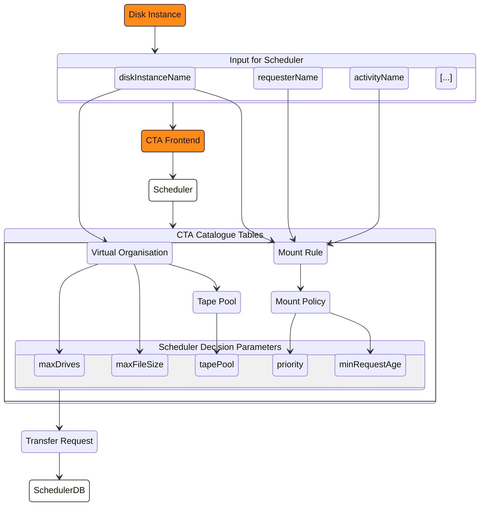
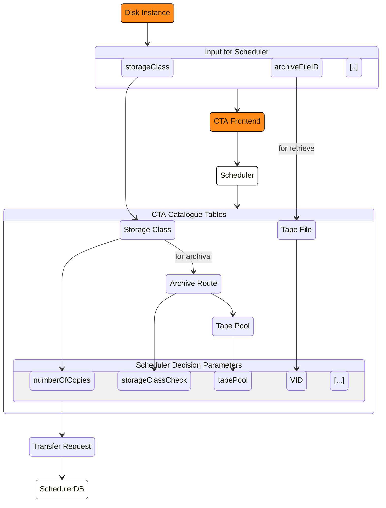
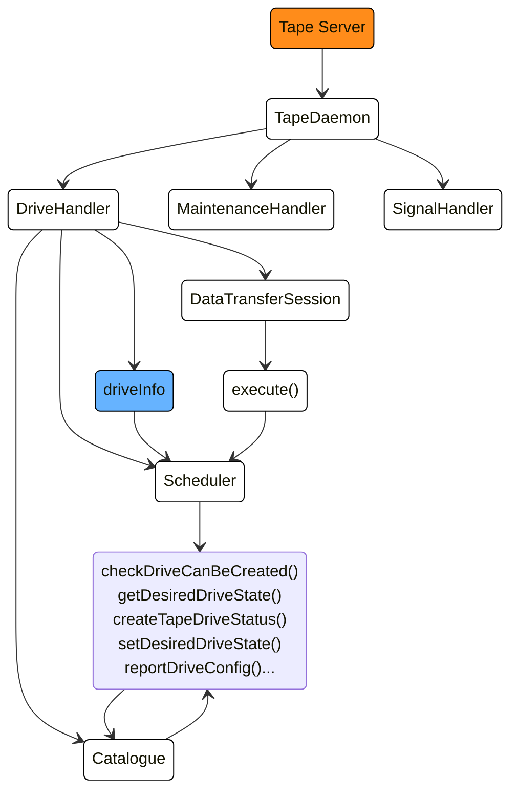
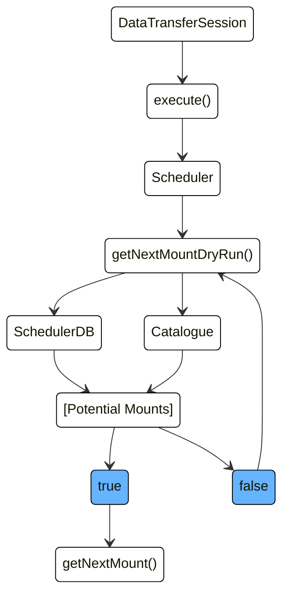
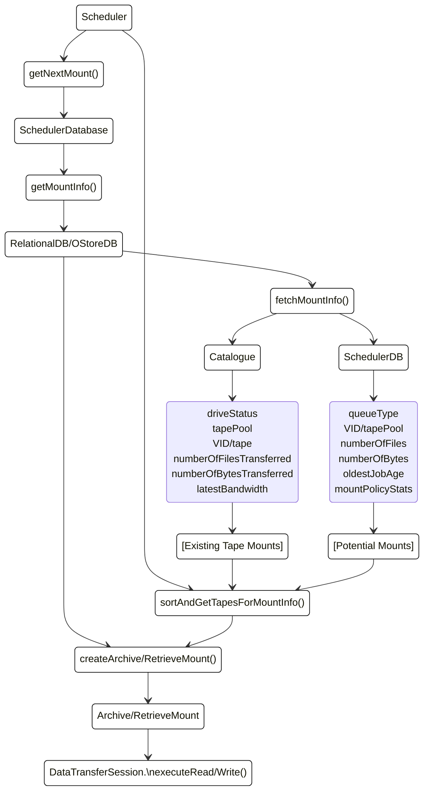

!!! info "WIP"
    This page is still work in progress.


# Scheduling Workflow


For the basic idea of the workflow, we recommend reading the [overview](./../../../overview/components/scheduler.md). This section describes the current implementation of the scheduling mechanism more in detail.

## 1. CTA Frontend Queueing Requests


The Scheduler workflow starts by queueing the transfer requests (archive/retrieve) into the SchedulerDB.

The insertion itself is made by the CTA Frontend which interacts with the Disk Instance, this is described in [File Lifecycle](./../../../overview/file-lifecycle/introduction.md) and more in detail in [Workflows](workflows.md#cta-workflows). In the next two sub-sections you can see how are the input values mapped to scheduling parameters (all blue in the pictures below) which are either stored in the SchedulerDB with other request metadata or determine whether the transfer request shall be refused (since there is no mapping, e.g. no archive route, no mount policy, non existing archive ID, etc.). These scheduling parameters are later used by the tape daemon to determine if it is worth to mount a tape for the set of existing requests in the SchedulerDB.


### Mount Policy Resolution

The `requesterName`, `activityName` and `diskInstanceName` as you can see in the picture below are used by the Scheduler to look up the 3 [Mount Rule tables](./../components/catalogue.md#mount-rule-tables) to see if it can find a defined `mount_policy_name` . If that is the case, then it uses this `mount_policy_name`  to look up the Mount Policy table and resolve the values of the parameters needed by the scheduler, namely minimum request age and request priority, which will be used in the assessment of when it is worth to mount a tape for such a request.

The arrows point from the input parameters to the relevant tables in the Catalogue which are being checked by the Scheduler.



#### Mount Rules

There are tree types of mount rules:

* Activity Mount Rule - Matches a mount policy to a username and activity regex pair. The username and must be the same as those of the user performing the request. The activity of the queued request must match the regex of the activity mount rule. In case more than one activity mount rule matches a request, the one whose mount policy has highest retrieve priority is chosen.

* Requester Mount Rule - Matches a mount policy to the username of the user performing the archive or retrieve request.

* Group Mount Rule - Matches a mount policy to the group of the user performing the archive or retrieve request.

All mount rules are associated with a Disk Instance. Only mount rules with the same Disk Instance of the archive/retrieve request are used for resolution.

The queueing fails if no mount rule matches the archive/retrieve request.

#### Mount Policy

The mount policy of archive requests is defined by a matching Requester Mount Rule, or failing that, a matching Group Mount Rule. The mount policy of retrieve requests is defined by a matching Activity Mount Rule, failing that a Requester Mount Rule and failing that a Group Mount Rule.

In CTA, a Mount Policy is named and defined in the Catalogue (see the [description](./../components/catalogue.md#mount-policy-table)).

Each request is then matched with a specific `mount_policy_name` and assigned two values. These are the minimum age of the queued request to trigger a mount `minRequestAge` and the `prioriy` of the request (higher number means higher priority). If no Mount Policy is found, the queueing fails.

The only way to change the priority of a queued request is to change the priority of the mount policy selected.


### Storage Class and Archive File ID

In the flowchart below, you can see 2 more input parameters and their mapping throughout the Scheduler queueing time. The `storageClass` input parameter  maps to the Storage Class table which contains information about the number of copies to be created on tape for that particular request and checks if there exists a tape pool for that particular storageClass in the Archive Route table. In addition, for retrieval, the disk instance request delivers the `archiveFileID` to the Scheduler which is mapped via the Tape File table to the particular tape where the file is stored (VID). All these parameters are used later to determine when this tape is worth to be mounted.




Each transfer request is acknowledged synchronously back to the Disk Instance.

At this point, we can consider having already the SchedulerDB filled with transfers requests and we will concentrate on explaining the scheduling algorithm running on the tape daemons themselves.


## 2. Tape Drive Scheduling


### Checking the Tape Drive Status

Each CTA Tape Server may have several `TapeDaemon` processes running. Each takes care of a particular Tape Drive. In particular, the `DriveHandler` thread takes care of handling all the drive session subprocesses and communication with the Tape Drive (the blue driveInfo, represents the configuration of the Tape Drive in the picture below). There are two additional threads, the MaintenanceHandler and SignalHanlder processes which we mention here just for completeness. The `DataTransferSession` then probes the status of its tape drive via the Scheduler which is checking the Catalogue. As soon as the Tape Drive is `UP` (opposite of `DOWN`/inactive), the session starts polling the SchedulerDB for work and the Scheduler tries to determine if it is worth to mount a drive - see the next paragraph.





### Polling SchedulerDB for work

The Scheduler running as a part of the DataTransferSession looks for work in the SchedulerDB every 10 seconds by using the `Scheduler::getNextMountDryRun()` and `Scheduler::getNextMount()` methods. `Scheduler::getNextMountDryRun()` returns true if there is a mount to schedule, false otherwise. The `Scheduler::getNextMount()` method returns the actual mount to be done in order to create the tape session (Read or Write). These two methods work exactly the same, here are the steps that are executed:

* Look all queues statistics for work to be done (each queue is also called a **Potential Mount**)
* Look for existing Tape Mounts
* For all Potential Mount, determine the best mount to be returned and hence trigger the tape session

Below you can see a simplified diagram of the workflow:



**WARNING**: If the Logical Library of the Tape Drive is disabled, no mount will be triggered.

The picture below referres to the next few subsections which describe how the Potential and Existing mounts are built, sorted and passed to the DataTransferSession for executing the reads or writes requested.




#### Look-up the queues for work to be done

This step is done by the `fetchMountInfo()` method which has an implementation specific to each SchedulerDB backend (it is a member of RelationalDB and OStoreDB classes; only one used depending on the Scheduler Backend chosen to be used at code compilation time).

The following queues are looked at (in the picture above referred to as `queueType`):
* **RetrieveQueueToTransfer** that contains *User* and *Repack* retrieve requests
* **ArchiveQueueToTransferForUser** that contains only *User* archive requests
* **ArchiveQueueToTransferForRepack** that contains only *Repack* archive requests

Apart of `queueType`, each queue can be distinguished from other queues also by the `VID` (for Retrieve queues) or the `TapePool` (for Archive queues) assigned.

The resulting `PotentialMount` object will be created and will contain the following statistics associated to the queue:

* the VID (for Retrieve queues) or the TapePool (for Archive queues)
* the queueType
* the number of files queued
* the number of bytes queued
* the time the oldest job in the queue was created
* the **mount policies** related statistics (`mountPolicyStats` in the picture above):
  * the mount policy name
  * the priority
  * the minimum request age to trigger a mount

Here is an example to explain how the mount policies statistics are stored in a queue depending on the implementation (RelationalDB or OStoreDB).

Suppose we have two mount policies:

|  MountPolicy | Archive priority | Retrieve priority   | Archive min request age  | Retrieve min request age |
|---|---|---|---|---|
|  MP1 | 1 | 3  | 300 | 300 |
|  MP2 | 2 | 2  | 100 | 400 |

This is what you can then find in the Catalogue Mount Policy table, see the [Catalogue Mount Policy Table](./../components/catalogue.md#mount-policy-table).

Let's suppose a user queues the following 3 requests:

- 2 Retrieve Requests for VID1 which will map (via Mount Rules) to the mount policy MP1
- 1 Archive Request with the mount policy MP2

In the RelationalDB implementation of the scheduler, the 3 requests will translate into 3 rows (assuming 1 copy per archive job only requested) in the `ARCHIVE_JOB_QUEUE` table with the corresponding values assigned per job.

In the OStoreDB implementation the mount policies statistics of the queues are stored as key value maps `ValueCountMap`. One map for each mount policy item. The key is the value of the mount policy item, the value is the number of jobs that have been queued with the value of the job's associated mount policy item.

This means that in the OStoreDB implementation, the Retrieve queue VID1 mount policy statistics will be the following set of key-value pairs:

|   | Key | Value  |
|---|---|---|
| name | MP1 | 2 |
| Retrieve Priority | 3 | 2 |
| Retrieve min request age | 300 | 2 |

and the Archive queue mount policy statistics will be:

|   | Key | Value  |
|---|---|---|
| name | MP2 | 1 |
| Archive Priority | 2 | 1 |
| Archive min request age | 100 | 1 |


**WARNING** The best mount policy statistics *values* will be given to the `PotentialMount` created.

#### Look for Existing Tape Mounts

This step is done by the end of the `fetchMountInfo()` method. It locks the DriveRegister table in the Catalogue and gets for each drive:

* its status
* the tapepool of the mounted tape
* the vid of the mounted tape
* the number of transferred files
* the number of transferred bytes
* the latest bandwidth

These existing mount informations will be given to the `Scheduler::getNextMount()` methods to eventually assign them to one of the `PotentialMounts`.

#### Filtering the list of Potential Mounts


Among all the `PotentialMounts` returned by the steps above, the scheduler has to filter them. This is done in the `Scheduler::sortAndGetTapesForMountInfo()` method.

-----


First we look into the PotentialMounts list and we filter all mounts of the Retrieve type:

- select from the Catalogue all tapes in state ACTIVE or REPACKING with logicalLibrary name compatible with the currently used drive and save them into `eligibleTapeMap`

- filter the PotentialMounts for only those who's type is retrieve and which have a tape VID compatible with `eligibleTapeMap`.


Once this is done, we collect all the tapePools requested in the PotentialMounts list or Existing Mounts (currently mounted) info which was collected earlier from the Catalogue.


For each of the tape pools collected we then get the VO which maps to the `tapePool` (there is a local cache of these on the each tape daemon).


 filtering all of the mount types (Retrieve and Archive) for tapePool. In case tapePool information is missing an error is logged and the process does not proceed any further.


of Archive mounts:

We check


- add tapes in REPACKING state (independent of logicallibrary info)

Build the eligible set of tapes in the library and with required status so
  we can filter the potential retrieve mounts to the ones that this tape daemon can serve.


-----

First, a filtering on the compatible *logical libraries* is done for Retrieve `PotentialMount`. Indeed, as the step above looped over all the queues, we need to filter them in order to have a potential mount for the logical library where the drive is located.

A second filtering is applied on each `PotentialMount` to see if it contains enough files bytes / files queued. These values are configurable in the `cta-taped` configuration file :

```
taped MountCriteria 500000000000,10000
```

If these values are not reach, but there is a Request that is older than the queue's minimum request age mount policy statistic, then the `PotentialMount` will be considered - see also `maxFileSize`, `minRequestAge` in the picture in the Mount Policy Resolution section.

A last filtering is done. If the virtual organization of the tapepool of the potential mount is using all the drives it is allowed to use, the mount will be removed from the potential mounts list.

The number of drives a virtual organization is allowed to use for read and for write can be configured by using the following commands:

```none
cta-admin virtualorganization ch --vo VO --readmaxdrives x --writemaxdrives y
```

Where `x` is the number of drives the virtual organization is allowed to use for reading, and `y` is the number of drives the virtual organization is allowed to use for writing (all types of Archive mounts) - see `maxDrives` in the picture in the Mount Policy Resolution section.

### Determine the best mount to be triggered

The determination of the best mount to be triggered is also done in the `Scheduler::sortAndGetTapesForMountInfo()` method.

Once all these filtering are done, the remaining `PotentialMount` will be sorted according to the `PotentialMount::operator<()` in order to select the best mount to trigger.

The sorting will be done in the following order:

1. priority (extracted from the queue mount policy statistics)
1. mount type (archival has a higher priority than retrieval)
1. the age of the job: the older the job is, the higher priority it has

The list of sorted `PotentialMount` will then be given to the `Scheduler::getNextMount()` methods that will then verify if the tape can be mounted for Retrieve or find a tape for Archival. The mount will then be returned to the DriveProcess in order to create a tape read or write session.

## Conclusion

The CTA scheduling is done in four steps : create a `PotentialMount` for each queue found, filter all the `PotentialMount`, sort the remaining `PotentialMount` and trigger the mount for the best and possible mount.
The mount policies and the virtual organization read/write max drives play an important role in all that process. The mount policy *minimum request age* and the virtual organization *read/write max drives* are used in the **filtering** part of the scheduling and the *priority* of the mount policy is used to sort all the remaining `PotentialMount`.

Currently, we do not have any tools or mechanism to tell when a tape is going to be scheduled per logical library.
