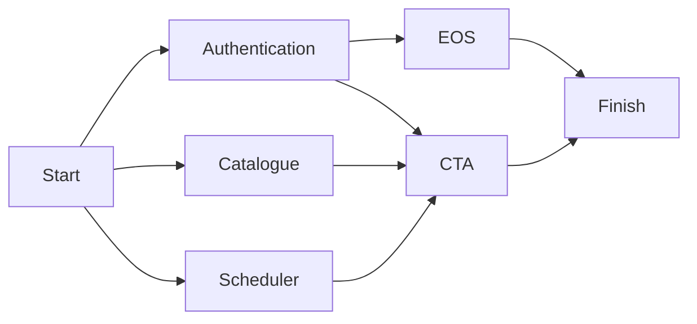

# CTA Orchestration

This page details the architecture and decisions behind the containerized deployment of CTA that we use in CI.
**Note that this setup is not intended to be run in production; we use this purely for testing.**

## Pre-requisites

In order to allow the containerized setup of CTA to work, you need at least to have two things:

- A kubernetes cluster
- mhvtl installed on each node running a tape daemon. In theory a real drive could also be used, but this has not been tested. Similarly, we have only tested single-node clusters so far.

## How an instance is spawned

A CTA instance is fully deployed using [Helm](https://helm.sh/). Helm uses the concept of charts. To quote: "Helm uses a packaging format called charts. A chart is a collection of files that describe a related set of Kubernetes resources.". Helm makes it simpler for us to define a configurable complex Kubernetes application such as CTA. The configuration of the cluster is done through `values.yaml` files. Provided that the `values.yaml` has the expected structure (verified through the corresponding `schema.version.json`), we can pass in any configuration we want. The default `values.yaml` file provided in each corresponding chart will already have _most_ of the required values set correctly. However, there are a few things that need to be provided manually, as they will either change frequently or are specific to your own setup.

To understand each of these required configuration options, we will go through the spawning of each component separately, detail how it works and what configuration is expected from you. Note that you most likely won't have to interact with Helm directly; all of the important/required configuration can be done through the `create_instance.sh` script located in `ci/orchestration`.

Charts that have CTA-specific functionality (nearly all of them), rely on an image `ctageneric`. This is the image built as specified in the `docker/` directory. This image contains all of the CTA RPMs, in addition to the startup-scripts required for each container.

The installation order of the charts details below is import. The order is as follows:



### Authentication

The first chart that will be installed is the `auth` chart. This chart sets up any required secrets (such as SSS and gRPC secrets), a Key Distribution Center (KDC) which can be used to grant Kerberos tickets, and a Keycloak instance. In a production environment, the KDC and keycloak instances would be pre-existing centralized services somewhere. Do not use the `auth` chart in production! The Authentication chart must be installed first, because it creates the resources that other charts depend on.

### Catalogue

The `catalogue` chart does a few things:

- First and foremost, it will create a configmap with the database connection string, i.e. `cta-catalogue.conf`.
- If configured, it will spawn a job that wipes the catalogue database (i.e. the one defined in `cta-catalogue.conf`).
- If Postgres is used as a catalogue backend, it will spawn a local Postgres database.

The catalogue supports both Oracle and Postgres backends. A Postgres database can be deployed locally, but an Oracle database cannot. As such, **when using Oracle it will use a centralized database**. This is of course not ideal, but there is no way around this. For development purposes, you are expected to use your own Oracle account (see [internal docs](https://tapeoperations.docs.cern.ch/dev/centrally_managed_resources/#oracle-dbs-for-development-and-ci)). This is also something extremely important to be aware of for the CI. It is crucial that there is only ever a single instance connecting with a given account. Multiple instances connecting with the same account **will interfere with eachother**. To prevent this, each of our custom CI runners has their own Oracle account and jobs are not allowed to run concurrently on the same runner.

For the sake of repeatable tests, it is therefore important to always wipe the catalogue. Not doing so will cause the database to have potential leftovers from previous runs. It should also be noted, that at the end of the wipe catalogue job, the catalogue will be re-initialised with the configured catalogue schema. That means even an empty database will need to be "wiped" in order to initialise the catalogue. As such, the only situation in which one would not want to wipe the catalogue is if there is important data in the catalogue that you want to test on.

### Scheduler

The `scheduler` chart:

- Generates a a configmap containing `cta-objectstore-tools.conf`.
- If CEPH is the configured backend, it will create an additional configmap with some CEPH configuration details
- If configured, spawns a job that wipes the scheduler.

The `scheduler` can be configured to use one of three backends: CEPH, VFS (virtual file system), or Postgres. This is configured through the scheduler configuration. It can be explicitly provided using the `--scheduler-config` flag. If not provided, it will default to `presets/dev-scheduler-vfs-values.yaml`.

### Disk Buffer - EOS

The CTA instance will need a disk buffer in front. This can be either dCache or EOS. The EOS disk buffer is spawned using the EOS charts provided [in the eos-charts repo](https://gitlab.cern.ch/eos/eos-charts). It uses the values file in `presets/dev-eos-values.yaml`. Note that once the EOS instance has been spawned it is not yet fully ready. To finalize the setup, additional configuration needs to be done. This is all handled by the `deploy_eos.sh` script called from `create_instance.sh`. The EOS chart requires the `authentication` chart to have been installed as there are init containers requiring access to the KDC, in addition to needing the secrets containing the EOS SSS keytab.

Similarly, the dCache deployment is done through the `deploy_dcache.sh` chart.

### CTA

Finally, we have the `cta` chart. This chart spawns the different components required to get a running instance of CTA:

- `cta-cli`
  - The cta command-line tool to be used by tape operators.
  - This pod has the keytab of an admin user who is allowed to type `cta` admin commands.
- `cta-frontend`
  - A CTA XRootD frontend if enabled.
  - A CTA gRPC frontend if enabled.
  - Communication between the XRootD frontend and EOS happens through SSS, while for the gRPC frontend keycloak is used.
- `cta-tpsrvxx`
  - One `cta-taped` daemon running in a `taped` container. Each pod will have as many `taped` containers as drives specified in the `cta-taped` config.
  - One `rmcd` daemon running in `rmcd` container of `cta-tpsrvxx` pod.
  - The tape daemon SSS to be used by cta-taped to authenticate its file transfer requests with the EOS mgm (all tape daemons will use the same SSS).
- `cta-client`
  - This pod is only used for testing. It primarily acts as a client for EOS, but is able to execute cta-admin commands as well.

The CTA chart is special in that it expects a `cta-taped` configuration. The main reason for this is that each taped config file is unique per taped process. This prevents us from using simple replication, so we need to know beforehand exactly what kind of drives we have and how we can spawn the taped processes. The `cta-taped` configuration can be provided explicitly to `create_instance.sh` using `--tapeservers-config <config-file>`. Alternatively, if this file is not provided, the script will auto-generate one based on the (emulated) hardware it finds using `lsscsi` commands. Such a configuration looks as follows:

```yaml
tpsrv01:
  libraryType: 'MHVTL'
  libraryDevice: 'sg0'
  libraryName: 'VLSTK10'
  drives:
    - name: 'VDSTK01'
      device: 'nst2'
    - name: 'VDSTK02'
      device: 'nst0'
tpsrv02:
  libraryType: 'MHVTL'
  libraryDevice: 'sg0'
  libraryName: 'VLSTK10'
  drives:
    - name: 'VDSTK03'
      device: 'nst1'
```

Each Helm deployment of CTA will get an annotation to specify which libraries it is using. When spawning a new CTA instance, it will first check if there are libraries available by looking at all the available libraries and looking at what is deployed. If a config file is provided with a library that is already in use, the instance spawning will fail.

### The whole process

To summarise, the `create_instance.sh` script does the following:

1. Generate a library configuration if not provided.
2. Check whether the requested library is not in use.
3. Install the `auth`, `catalogue`, and `scheduler` charts simultaneously.

- The `auth` chart sets up a KDC, keycloak and generates some required secrets (such as SSS)
- The `catalogue` chart produces a configmap containing `cta-catalogue.conf` and spawns a job that wipes the catalogue. If Postgres is the provided backend, will also spawn a local Postgres DB.
- The `scheduler` chart generates a configmap `cta-objectstore-tools.conf` and spawns a job to wipe the scheduler. If Postgres is the provided backend, will also spawn a local Postgres DB.

4. Once the `auth` chart is installed, it will start installing the `eos` chart, spawning components such as the MGM and FST.
5. Once the `auth`, `catalogue` and `scheduler` charts are installed, it will start installing the `cta` chart, spawning all the different CTA pods: a number of tape daemons, a frontend, a client to communicate with the frontend, and an admin client (`cta-cli`). The EOS instance does not need to be deployed before the CTA instance starts.
6. Wait for both `cta` and `eos` to be installed and then perform some simple initialization of the EOS workflow rules and kerberos tickets on the client/cta-cli pods.

Note that once this is done, the instance is still relatively barebones. For example, you won't be able to execute any `cta-admin` commands on the `cta-cli` yet. To get something to play with, you are advised to run `tests/prepare_tests.sh`, which will set up some basic resources.

## Deleting a CTA instance

The deletion of an instance is relatively straightforward and can be done through the `delete_instance.sh` script. At its simplest, it just deletes the namespace. However, this script has some extra features to collect logs from any of the pods it is about to delete. Note that this deletion script does not clean up any resources outside of the namespace (except some cluster-wide resources that could have been created as a result of the startup). That means that it will not perform any clean up on centralized databases or do any unloading of tapes still in the drives. This is all expected to be done BEFORE tests start.

## Some example commands

- Creating a test instance from a local build:

  ```sh
  ./build-deploy.sh
  ```

- Redeploying a local build:

  ```sh
  ./build-deploy.sh --skip-build --skip-image-reload
  ```

- Spawning a test instance from a tagged `ctageneric` image `gitlab-registry.cern.ch/cta/ctageneric` (Postgres catalogue + VFS scheduler):

  ```sh
  ./deploy.sh --cta-image-tag <some-tag>
  ```

- Running a system test locally from a tagged `ctageneric` image `gitlab-registry.cern.ch/cta/ctageneric` (Postgres catalogue + VFS scheduler):

  ```sh
  ./run_systemtest.sh -n dev --test-script tests/test_client.sh --scheduler-config presets/dev-scheduler-vfs-values.yaml --catalogue-config presets/dev-catalogue-postgres-values.yaml --cta-image-tag <some-tag>
  ```

- Running a system test locally from a local image (Postgres catalogue + VFS scheduler):

  ```sh
  ./run_systemtest.sh -n dev --test-script tests/test_client.sh --scheduler-config presets/dev-scheduler-vfs-values.yaml --catalogue-config presets/dev-catalogue-postgres-values.yaml --cta-image-tag <some-tag> --cta-image-repository localhost/ctageneric
  ```

Of course, once an instance is spawned, you can also run some simple tests manually instead of relying on `run_systemtest.sh`:

```sh
./tests/test_client.sh -n dev
```

## Troubleshooting

When something goes wrong, start by looking at the logs:

- If the pod did not start correctly, run `kubectl describe pod <pod> -n <namespace>` to get information on why it is not starting
    - If this does not provide enough information, running `kubectl get events -n <namespace>` might provide additional info.
- Run `kubectl logs <pod> -c <container> -n <namespace>` to get the logs of a given container in a pod (`-c is optional if there is only one container).
- Run `kubectl exec -it -n <namespace> <pod> -c <container> -- bash`. This will start an interactive shell session in the given container. You can use that to e.g. inspect the logs in `/var/log/`.
