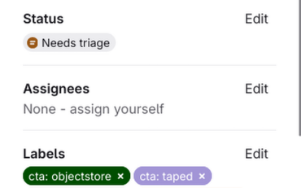

# Issues

GitLab issues are used to track the development work that needs to be done. Please respect the following guidelines when creating issues:

- Check if an issue already exists before creating one.
- Use one of the provided issue templates if possible.
- The title should describe the desired change, not the initial problem.
- Ensure all relevant information is present in the issue.
- Be clear and concise.
- Issues should have a clearly defined scope. When the issue starts to derail or require other changes, create a separate issue.
- Typically we have one issue associated per commit. If a single commit is too broad for the issue, then split the issue into multiple more specific issues.

There are two important issue boards that we use to plan which tasks will be worked on:

- [Development](https://gitlab.cern.ch/cta/CTA/-/boards/27040): provides an overview of the workflow states.
- [Priority Management](https://gitlab.cern.ch/cta/CTA/-/boards/26993): provides an overview of the priority states.

## Assigning Labels

Labels play a crucial role in keeping a hygienic and organised issue environment. Below we discuss the various type of labels that we have. When creating an issue, follow these steps:

- Assign a `type::` label.
- Assign a `~"priority::<>"` label (if relevant)
- Assign any relevant labels with the prefix `cta:`
- Assign any relevant labels with the prefix `external:`
- Optionally assign an assignee if you know who will take care of the issue.

### Type

Issues should be categorized in one of these five types:

- `~"type::addition"`
    - Issues that contain work to add new functionality
- `~"type::change"`
    - Issues that contain work to change existing functionality
- `~"type::bug"`
    - Issues that report undesirable or incorrect behaviour.
- `~"type::deprecation"`
    - Issues that mark functionality are deprecated.
- `~"type::removal"`
    - Issues for the removal of functionality.
- `~"type::performance"`
    - Issues for performance improvements (without affecting functionality).
- `~"type::security"`
    - Issues for security risks.
- `~"type::maintenance"`
    - Issues that are not a feature or a bug that involve updates, clean-up, and minor corrections to keep the repository healthy and up-to-date.
- `~"type::documentation"`
    - Issues that report required changes to the documentation.
- `~"type::release"`
    - Used for new code releases.
- `~"type::other"`
    - Issues for anything that does not fall into one of the above categories.

Types are used to categorise what kind of change is being doing to the project.

Are you unsure of whether an issue counts as a feature or a bug? Have a look at the [guidelines that GitLab uses](https://handbook.gitlab.com/handbook/product/product-processes/#issues).

### Priority

To classify the priority of an issue, there are four different options:

- `~"priority::critical"`
- `~"priority::high"`
- `~"priority::medium"`
- `~"priority::low"`

Each of these labels are part of the `priority::` scope. Priority labels are assigned based on ***Urgency*** and ***Impact***. For concrete definitions of these terms, you can have a look [here](https://support.atlassian.com/jira-service-management-cloud/docs/how-impact-and-urgency-are-used-to-calculate-priority/).

|               |               |               |
| ------------- | ------------- | ------------- |
|               | ***Urgency*** | ***Impact***  |
| **High**  🔺  | Can no longer perform primary functions. | System-wide impact.|
| **Medium** 🔶 | Functions impaired. Work around possible.| Multiple users affected. Experiment affected.|
| **Low** 🟡    | Inconvenient.                            |Single user affected. Single event. Operation affected.|

Using these two concepts, we assign priorities based on the following urgency-priority matrix:

|        |        |        |        |
| ------ | ------ | ------ | ------ |
| ***Urgency \ Impact*** | **High**  🔺 | **Medium** 🔶 | **Low** 🟡 |
| **High**  🔺  | `critical` | `high`   | `medium` |
| **Medium** 🔶 | `high`     | `medium` | `low`    |
| **Low** 🟡    | `medium`   | `low`    | `low`    |

### Workflow

To complement our Git workflow, we use the GitLab Issue status to indicate the status of the issue. This issue status can be found on the top right of the issue overview:

The typical lifecycle of an issue as follows:

1. All issues start out with `Needs triage`. This means the issue needs to be accepted by the dev team and someone is assigned to it.
2. When an issue has been accepted, it should move to `To do`
3. Once the assignee actively starts working on it, they should move the issue to `In progress`
4. Once the issue is done, it should be closed and the issue status will be set to `Done`. Closing an issue is typically done automatically through the merge request if the MR was created through the GitLab UI.

There are three special issue states:

- `Blocked` for issues that have passed triage, but cannot be worked on because they are blocked by another issue.
- `Won't do` for issues that will not be worked on. This can be due to a variety of reasons. For example a lack of time or a feature we do not want to support. This status is only associated with closed tickets.
- `Duplicate` for issues that are duplicates of other issues. This status is only associated with closed tickets.

An overview of all open issues and their status can be found in [this Issue Board](https://gitlab.cern.ch/cta/CTA/-/boards/32164)

!!! info

    Developers should regularly review their open tickets to ensure that the issue status tag accurately reflects the state of the issue, and that the issue is closed after it is finished.

### Components

CTA consists of many different components. As such, it is useful to know which component is being worked on. To do this, we have two categories of labels: `cta: <>` and `external: <>`. Issues can concern multiple components. As such, these labels are *not* scoped, but prefixed instead.

- The `cta:` prefix is used for components that concern the components within CTA itself. Concretely that means that any work on components in the CTA repository will have have this prefix.
- The CTA works together with other external components, such as FTS or EOS. When these external systems are relevant to the issue, the `external:` prefix is used.

### Additional labels

Apart from the labels discussed above, there are a few other notable labels:

- `breaking change`
    - Changes that would break backward compatibility of CTA
- `building and packaging`
    - Changes to the build and packaging system
- `changelog required`
    - Changes that require a changelog entry
- `ci: *`
    - Updates or changes to the continuous integration
- `code quality`
    - Improvements to the code quality
- `code quality: sonarcloud`
    - Sonarcloud fixes
- `monitoring`
    - Changes that affect monitoring (logs, metrics)
- `needs discussion`
    - Issue needs to be discussed in the next dev meeting
- `pgsched: *`
    - Changes to Postgres scheduler
- `repack`
    - Changes to repack
- `tools`
    - Changes to any of the CLI tools

This list is not exhaustive. Please have a look at the [full label list](https://gitlab.cern.ch/cta/CTA/-/labels) if you want to familiarize yourself with all of them.
