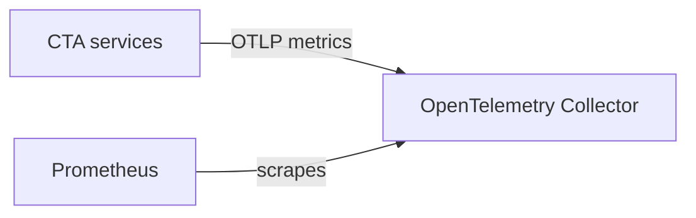

# Testing Metrics

Validate both the meaning of a measurement and its exported representation. A metric appearing in Prometheus confirms delivery, but does not by itself show that the value or attributes are correct.

## Check the measurement

- Trigger an operation with a known outcome. Check the counter increment, histogram observation count and values, or expected gauge value.
- Verify names, units, bounded attributes, and resource identity. Include failure and retry paths where they affect the metric's meaning.
- Account for unrelated activity and cumulative values: compare before/after measurements for the relevant service and attributes rather than assuming a zero starting value.
- Allow for periodic collection and export. For automated checks, poll with a timeout rather than relying on an arbitrary short sleep.
- Confirm the operation still works with telemetry disabled. Where measurement logic can be tested independently, cover it in unit tests without requiring a monitoring deployment.

For direct inspection, use a development console or file exporter if supported by the implementation. Follow the language guide for available configuration; [C++ exporter inspection](cpp.md#inspect-exported-metrics) covers the current C++ paths. Exporter configuration varies, but the checks above apply to every language.

## Inspect metrics locally

Deploy the local collector and Prometheus with the development instance:

```bash
cta-dev deploy --local-telemetry
```

This redeploys the environment; see [cta-dev Reference](../tools-and-environment/cta-dev.md#deployment-options). The local flow is:



Run the relevant operation or [system test](../testing/system-tests.md), then forward Prometheus's port:

```bash
kubectl --namespace dev port-forward svc/prometheus-server 9090:80
```

If the development environment is on a remote machine, run this additional command on your workstation:

```bash
ssh -N -L 9090:localhost:9090 <user>@<dev-machine>
```

Open `http://localhost:9090/query` and select the metric and service instance. Use [PromQL](https://prometheus.io/docs/prometheus/latest/querying/basics/) to inspect changes and distributions. Exported names may differ from the OpenTelemetry instrument names because of Prometheus name and unit translation.

## Investigate missing or unexpected metrics

- Check that the operation reached the recording point and the selected service build contains the instrumentation.
- Verify that telemetry is enabled and targets the local collector. Allow for both export and scrape intervals.
- Inspect service and collector logs, and check Prometheus scrape targets. Use [Working with Development Pods](../tools-and-environment/development-pods.md) for inspection commands.
- Check the selected time range, service identity, attributes, and process restarts before interpreting a missing series or a counter reset.

Production monitoring configuration belongs in [Operations](../../../ops/run-and-maintain/monitoring/health-and-alerts.md).
