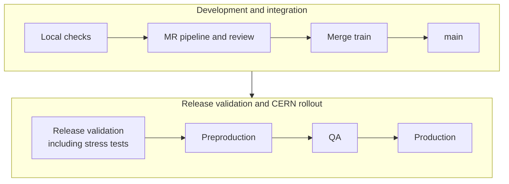

# CI Overview

CTA validates changes through local checks, GitLab pipelines, and release testing before deployment. CI provides feedback on builds, code quality, and behaviour; release and operational validation also check performance and integration with the deployment environment.

## Validation flow

This diagram shows the typical path from a change to production. It is not a pipeline dependency graph: release validation and rollout include decisions that CI does not enforce automatically.

| Stage | Purpose |
| --- | --- |
| Local checks | Run relevant [unit tests](../unit-tests.md), [system tests](../system-tests.md), and hooks while developing the change. |
| MR pipeline and review | Build and test the proposed change, review its behaviour, and address failures. Pipeline selection depends on the trigger and configuration; see [CI Pipelines](pipelines.md). |
| Merge train | Validate the queued changes before merging; see [Contributing through CERN GitLab](../../../contributing/gitlab.md#merge). |
| Release validation | Review the release pipeline results, including [Stress Tests](../stress-tests.md) and migration tests where relevant. Follow [Release Procedure](../../../contributing/maintainers/releases.md) for validation and publication. |

The responsibilities broadly follow the flow:

- **Developers** run local checks, prepare MRs, and address review and CI feedback.
- **Maintainers** oversee review and merging, assess release validation, and publish releases.
- **Operations** coordinate preproduction, QA, and production rollout, including operational validation and rollback.

These roles can overlap; developers and maintainers help investigate failures found during rollout, and operations provide the production-validation evidence needed for stable promotion.

## Dependency changes

Changes to dependencies such as EOS, operating-system packages, and deployment configuration also need validation. Test the intended versions together rather than assuming that a successful CTA build establishes compatibility. [CI Pipelines](pipelines.md) describes the available regression pipelines; [CI Maintenance](../../../contributing/maintainers/ci-maintenance.md) covers updates to the pinned pipeline images.

## Beyond CI

At CERN, releases progress through preproduction and QA before broader production deployment. Preproduction checks integration with physical tape hardware, monitoring, and operational configuration. QA introduces the change to a limited part of production before wider rollout.

QA can interact with live catalogue and scheduler state, so it is not an isolated test environment. Deployment and rollback decisions belong to the operational procedure; see [CTA Upgrades](../../../../ops/run-and-maintain/upgrades/cta.md). Stable publication follows production validation, as described in [Release Procedure](../../../contributing/maintainers/releases.md#stable-promotion-and-announcements).
