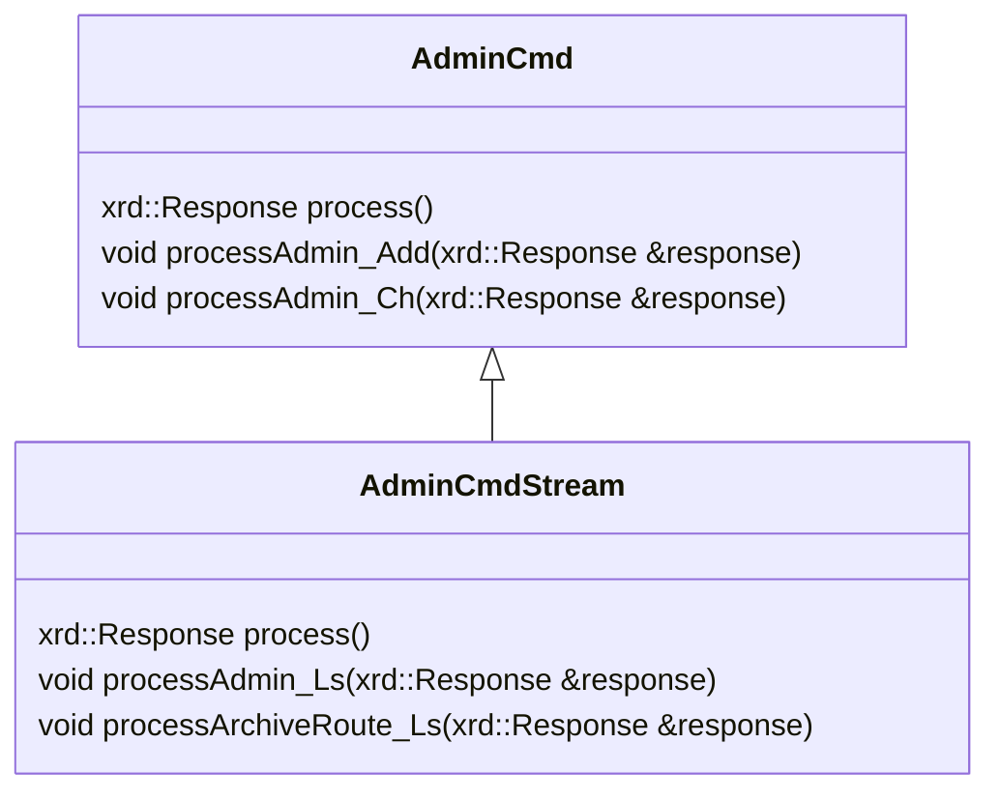

# Admin API Internals

Command dispatch and authentication for administrative clients. Operator settings belong in [Admin API Configuration](../../ops/configuration/admin-api.md).

## Admin request dispatch


Processing the request message is done by the `process` method of the class `AdminCmd` in the case of non-streaming commands or the `AdminCmdStream` class in the case of streaming commands.
Non-streaming admin commands are implemented as methods of the `CtaAdmin` class while streaming admin commands are implemented as methods of `CtaAdminStream`.
<!-- Streaming admin commands all inherit from the class `XrdCtaStream` class. Their implementations are found in the respective header file in the `xroot_plugins` directory. -->




<!-- void RequestMessage::process(const cta::xrd::Request& request, cta::xrd::Response& response, XrdSsiStream*& stream) -->

<!-- ```mermaid
classDiagram
class FrontendService {
  getters/setters for the members
  m_log
  m_catalogue
  m_scheddbInit
  m_scheddb
  m_scheduler
  m_acceptRepackRequests
  ....
  m_namespaceMap
}

class GrpcClient {
  std::unique_ptr<eos::rpc::Eos::Stub> stub_
  std::string m_token
  uint64_t m_tag
}
``` -->


## Authentication dependencies


JWT authentication uses the `jwt-cpp` header-only library for JWT decoding, validation, and signature verification.
The only supported algorithm is RS256 (RSA with SHA-256). The library is added as a git submodule at `common/jwt-cpp`.

For fetching JWKS from remote endpoints the CURL library is used.

TLS transport uses the gRPC TLS stack.


## Kerberos negotiation


Each Kerberos-authenticated `cta-admin` command consists of two remote procedure calls:
First, the client calls `Negotiate`, which is a bidirectional streaming rpc. The client and the server perform the kerberos token exchange.
When the server successfully authenticates the client, it generates and stores a 256-bit nonce to be used for this session, then the nonce is sent back to the client.

1. Obtain Kerberos Ticket: The client must have a valid Kerberos ticket-granting ticket (TGT), typically obtained via kinit. The ticket must be valid for the configured Kerberos realm.
2. Initiate Negotiation: The client calls the dedicated `Negotiate` bidirectional streaming RPC. This is a separate service from the main CTA admin API, specifically designed for Kerberos authentication. The client also learns the Service Principal Name to use for the GSSAPI calls when beginning the Negotiate rpc.
3. GSSAPI Token Exchange: The client generates a GSSAPI/SPNEGO token using `gss_init_sec_context()` and sends it in the challenge field of the negotiation request. The server validates this
token using `gss_accept_sec_context()` against its service keytab.
4. (Multi-Round) Negotiation: GSSAPI context establishment may require multiple round-trips. If the server returns `is_complete=false` with a challenge, the client must process that challenge
with `gss_init_sec_context()` and send the resulting token back. This continues until `is_complete=true`.
5. Receive Session Token: Upon successful authentication, the server extracts the client principal name from the security context and generates a nonce/session token. This nonce is stored
server-side (in TokenStorage) mapped to the authenticated username, and returned to the client.
6. Execute Command: The client includes the session token in the gRPC metadata using the `"Authorization: Negotiate"` header and calls the Admin rpc to execute the requested command. The
server validates that the token exists in token storage, confirms that the associated username exists in the admin database, removes the session token from its storage and proceeds with command execution.

Each `cta-admin` command invocation repeats this entire process: negotiation, token exchange, and command execution.

The Kerberos implementation relies on the system's GSSAPI libraries (typically provided by `krb5-libs` or equivalent).

## Shared implementation

The APIs currently share frontend code and dependencies. This separation follows their responsibilities; it does not imply that the implementation split is complete.

See [Workflow API Internals](workflow-api.md) for disk-system workflow requests.
