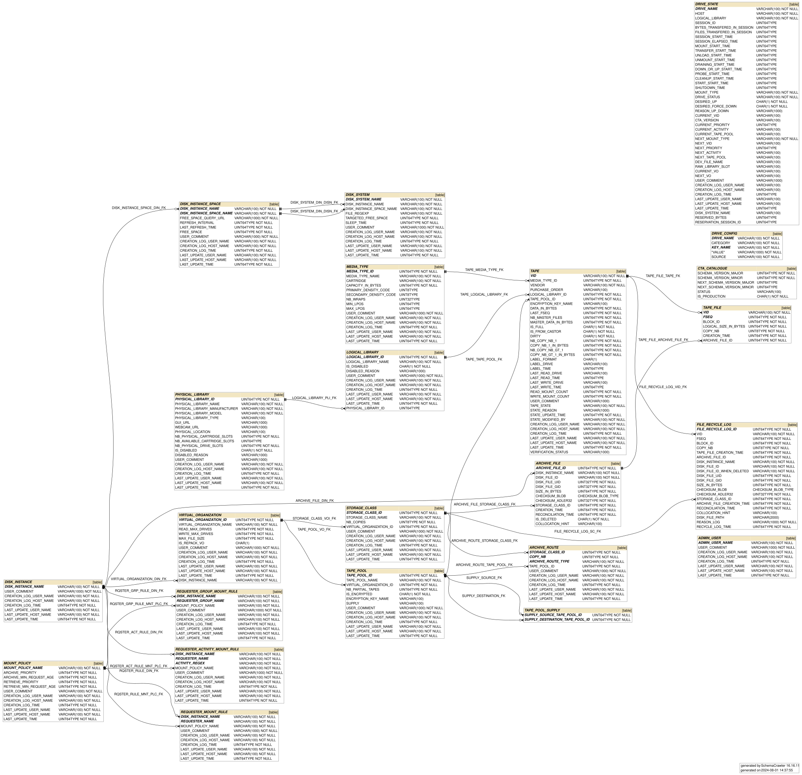
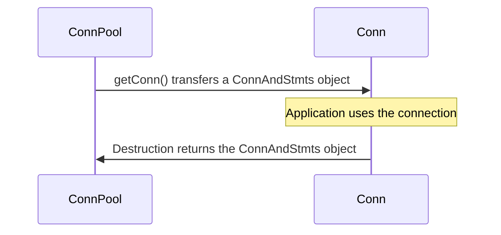
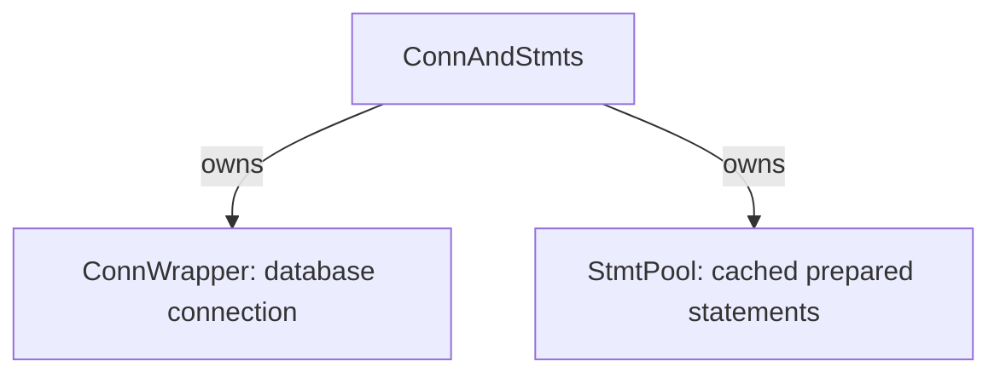
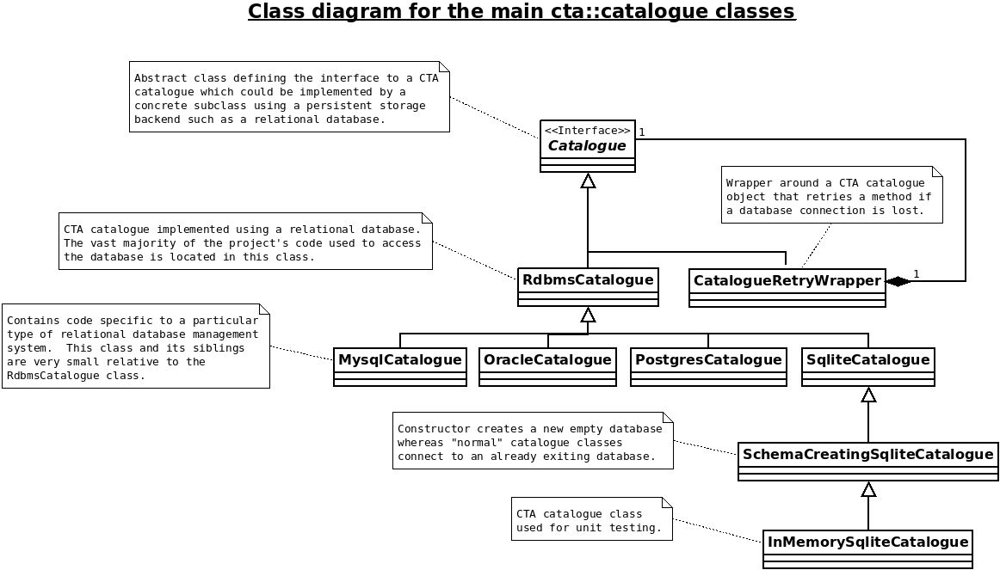

!!! info "Documentation incomplete"

    This page contains TODOs for unfinished documentation. Address the marked items before removing this notice.

# Catalogue

The CTA Catalogue schema is used to store all persistent metadata about tape pools, tapes and tape files. It is also used to
store some transient data including drive states, drive configuration and disk instance configuration.

## What the CTA catalogue does

The CTA catalogue uses a database to store the following non-exhaustive list of information:

  1. The location of each file stored on tape.
  2. The placement of tapes into tape libraries.
  3. The organisation of tapes into tape pools.
  4. The archive routes which decide which files get written to which tape pools.
  5. The rules defining when tapes get mounted for which users.

## Working on the catalogue

| Task | Guide |
| --- | --- |
| Develop schema changes and migration scripts | [Schema Development](schema-development.md) |
| Validate upgrades before release, including the planned production-clone checks | [Testing Migrations](testing.md) |
| Coordinate, tag, and publish schema releases | [Catalogue Schema Releases — for maintainers](../../../contributing/maintainers/catalogue-schema-releases.md) |
| Upgrade a deployed catalogue | [Upgrading the schema — for operators](../../../../ops/run-and-maintain/upgrades/catalogue-schema/index.md) |

Development and validation come before release coordination. The migration guides here apply to anyone developing or reviewing a schema change, not only release maintainers.

## Catalogue Description

The diagram shows the catalogue tables and their relationships. The sections below describe selected tables.

### Mount Rule Tables

There are 3 mount rule tables defined:

`requester_activity_mount_rule`
`requester_group_mount_rule`
`requester_mount_rule`

The Scheduler code checks these 3 tables for each archive/retrieve request at queueing time by the CTA-Frontend. The purpose is to find a matching mount rule row(s) and resolve the appropriate mount policy. `mount_policy_name` is a column referencing the Mount Policy table.

### Mount Policy Table

This table stores named mount policies which are matched with each archive/retrieve request at queueing time via the Mount Rule tables. They are one of the key parameters determining if the Scheduler shall schedule a mount.

Each row corresponds to a mount policy defined by the following 5 values which are being assigned to each queued Archive and Retrieve Requests:

| Value | Type | Description |
|---|---|---|
| mount_policy_name | String | The name of the mount policy |
| archive_priority | Unsigned int | The priority of Archive Requests. If this number is high, the Archival priority will be high |
| archive_min_request_age (in seconds) | Unsigned int | The minimum age of the queued Archive Request to trigger a mount |
| retrieve_priority | Unsigned int | The priority of RetrieveRequests. If this number is high, the Retrieval priority will be high |
| retrieve_min_request_age (in seconds) | Unsigned int | The minimum age of the queued Retrieve Request to trigger a mount |. Example : if this value is set to 1, the user will have 1 drive for retrieval and one drive for archival within the same tapepool. |

## Design overview of the CTA catalogue and the supporting `rdbms` layer

The CTA catalogue supports the following database management systems:

  1. Oracle.
  2. PostgreSQL.
  3. SQLite.

SQLite is only used for implementing C++ unit tests and in this capacity is configured to run as an “in-memory” database.  Oracle is used at CERN for the production deployments of CTA because it has a team of database administrators behind it who ensure its smooth running and recovery in case of disaster.  PostgreSQL is actually the target database management system for CTA because it is open source.

Database management systems differ in at least the following 3 areas with respect to developing software systems on top of them:

  1. Differences in SQL syntax and features.
  2. Differences in API syntax and functionality.
  3. Differences in transaction management.

The CTA catalogue is composed of three layers which together help tackle the differences between database management systems:

  1. The CTA Catalogue class and its subclasses
  2. The rdbms layer
  3. The database schema

The main design goal is to implement the majority of the database persistency logic in common classes and code and to only write specialised code when absolutely necessary.  Please note that PL/SQL has been purposely avoided in the CTA project because it can easily lead to the project getting locked into one specific database management system.

Starting at the bottom of the three layers, the database schema of the CTA catalogue is visualised in [Catalogue Description](#catalogue-description) above.

The source of the schema is located in the `catalogue/cta-catalogue-schema/` submodule:

  1. `common_catalogue_schema.sql`
  2. `oracle_catalogue_schema_header.sql`
  3. `oracle_catalogue_schema_trailer.sql`
  4. `postgres_catalogue_schema_header.sql`
  5. `postgres_catalogue_schema_trailer.sql`
  6. `sqlite_catalogue_schema_header.sql`
  7. `sqlite_catalogue_schema_trailer.sql`

Do not be alarmed by the number of SQL files.  Most of the schema is in `common_catalogue_schema.sql`.  The rest of the files contain very small amounts of SQL that show the differences between different database management systems.

Moving up the layers, the source code of the CTA rdbms layer is located in `rdbms/`.

The goal of this layer is to hide as much as possible the difference in API syntax and functionality.  The main classes of the layer are:

  1. `ConnPool` - A database connection pool
  2. `ConnAndStmts` - A connection and its prepared statements
  3. `Conn` - A connection from which statements can be created
  4. `Stmt` - A database statement that can be executed
  5. `Rset` - The result set from the execution of a statement

Users of these classes do not need to know which database technology is being used underneath.  The classes are smart with respect to the management of the underlying database resources.  The specific implementation details that make these classes work with different database management systems are coded within wrapper classes in `rdbms/wrapper/`.

### Database resource ownership

Application code uses `Conn`, `Stmt`, and `Rset` to work with a database. These objects manage resource lifetimes: connections and prepared statements return to their pools when they go out of scope, while result sets are released.

#### Borrowing a connection

`ConnPool::getConn()` returns a `Conn` that temporarily owns one `ConnAndStmts` object: a database connection together with its prepared-statement pool. While borrowed, these resources are unavailable to other callers. When the `Conn` goes out of scope, it returns them to `ConnPool` for reuse.

#### What travels with the connection

A `ConnAndStmts` object keeps the database connection and its statement pool together. Prepared statements belong to that particular database connection, so they stay with it when it is borrowed and returned.

The statement pool must be destroyed before the database connection. `ConnAndStmts` enforces this by declaring the connection member before the statement-pool member: C++ destroys members in reverse declaration order.

#### Borrowing statements and releasing results

`Conn::createStmt()` returns a `Stmt`. It reuses a prepared statement from the connection's `StmtPool` when the same SQL is already cached; otherwise, it prepares a new one. When the `Stmt` goes out of scope, it returns the prepared statement to that pool.

A query produces an `Rset`. Keep the connection and statement alive while reading its results. Release resources in this order:

1. Release the `Rset`.
2. Destroy the `Stmt`, returning its prepared statement to `StmtPool`.
3. Destroy the `Conn`, returning the connection and its statement pool to `ConnPool`.

#### Backend implementations

The underlying resources implement the `wrapper::ConnWrapper`, `wrapper::StmtWrapper`, and `wrapper::RsetWrapper` interfaces. Oracle uses `OcciConn`, `OcciStmt`, and `OcciRset`; PostgreSQL and SQLite have corresponding implementations. Application code uses the same `Conn`, `Stmt`, and `Rset` interfaces regardless of the backend.

The historical `rdbms_classes.pdf` labels these wrapper interfaces `wrapper::Conn`, `wrapper::Stmt`, and `wrapper::Rset`.

### Catalogue implementations

Moving to the top layer, the classes representing the CTA catalogue are located in `catalogue/`.

The five main classes to note are:

  1. `Catalogue`
  2. `RdbmsCatalogue`
  3. `OracleCatalogue`
  4. `PostgresCatalogue`
  5. `InMemoryCatalogue`

The `Catalogue` class is an interface class.  Its purpose is to allow the CTA catalogue to be implemented by any form of persistent store and not just relational database management systems.  The `RdbmsCatalogue` class inherits from `Catalogue` and implements the majority of the CTA catalogue logic.  The design goal is to implement as much of the logic in common code as is possible and to only implement specialised code when absolutely necessary.  The `InMemoryCatalogue` class is used solely for implementing C++ unit tests.  The remaining classes contain the code required to work with specific database management systems.

Backend-specific implementations handle operations requiring vendor-specific API access, such as bulk inserts, or vendor-specific SQL, such as database sequences. The shared logic now lives in the relational component implementations as well as `RdbmsCatalogue`.

`InMemoryCatalogue` objects differ from catalogues that connect to existing external databases because they create the database schema when instantiated. `InMemoryCatalogue` inherits from `SchemaCreatingSqliteCatalogue`, which inherits from `SqliteCatalogue`; the `SchemaCreatingSqliteCatalogue` constructor creates the schema.

The following historical class diagram shows the catalogue implementation layers, including `SchemaCreatingSqliteCatalogue` and `CatalogueRetryWrapper`. `MysqlCatalogue` is no longer supported, and the class labelled `InMemorySqliteCatalogue` is now named `InMemoryCatalogue`. Catalogue operations are now exposed through component interfaces in `catalogue/interfaces/`, with shared relational implementations in `catalogue/rdbms/`.

Follow [Schema Development](schema-development.md) when changing the schema, including [creating a new version](new-version.md) before modifying SQL and updating `ReleaseNotes.md` to reflect the change.

## Extending the implementation

TODO: Explain backend selection, transaction boundaries, and the steps and tests for adding a catalogue operation.
