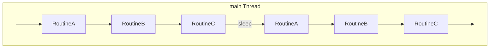
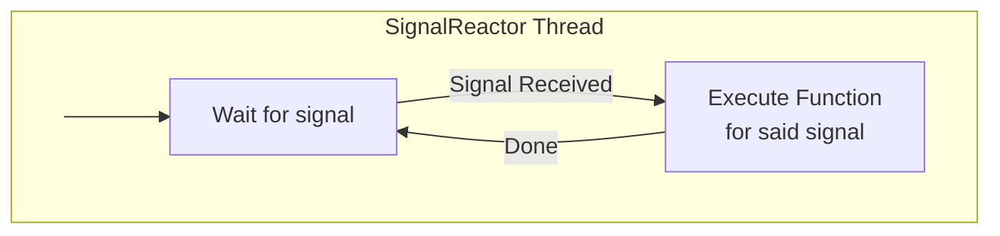

!!! info "Documentation incomplete"

    This page contains TODOs for unfinished documentation. Address the marked items before removing this notice.

# CTA Maintenance Daemon (`cta-maintd`)

The maintenance daemon primarily interacts with the SchedulerDB to perform scheduling operations that do not require the involvement of a tape drive. These include reporting requests back to the disk buffer, converting repack requests into the individual retrieve and archive jobs required, and garbage collecting dead agents. The maintenance daemon consists of a set of routines, each of which performs a specific task. The maintenance daemon ensures these routines are run periodically.

## Routine execution and signal handling

`maintd/RoutineRunner.cpp` runs enabled routines sequentially, then sleeps for `routines.cycle_sleep_interval_secs`. To use different cycle intervals, run separate instances with different subsets of routines enabled. See [maintenance-daemon configuration](../../../ops/deploy-and-configure/configuration/maintenance-daemon.md).

`maintd/RoutineRunnerFactory.cpp` creates the enabled routines for the scheduler backend selected at build time. Implementations live in `maintd/routines/`. Each routine implements `IRoutine::execute()`. The runner logs exceptions from a routine and continues with the remaining routines.




In addition to the main thread, the `maintd` process also spawns a dedicated SignalReactor thread whose job it is to capture incoming signals (e.g. `SIGTERM`, `SIGHUP`) and execute the function associated with said signal. This ensures that the logic for dealing with signals is not spread out through all of the code.




## Routine inventory

The tables below list all concrete routines registered by `RoutineRunnerFactory`. Configuration controls which routines or groups are enabled and supplies batch sizes, timeouts, and retention limits. See `maintd/MaintdConfig.hpp` and [maintenance-daemon configuration](../../../ops/deploy-and-configure/configuration/maintenance-daemon.md) for these settings.

### Shared routines

These routines are available with both scheduler backends.

| Routine | Purpose |
| --- | --- |
| `DiskReportArchiveRoutine` | Reports archive success or failure to the disk instance. |
| `DiskReportRetrieveRoutine` | Reports retrieve success or failure to the disk instance. |
| `RepackExpandRoutine` | Expands repack requests into individual retrieve and archive jobs. |
| `RepackReportRoutine` | Processes successful and failed retrieve/archive reports for repack requests. |

### Objectstore routines

| Routine | Purpose |
| --- | --- |
| `GarbageCollectRoutine` | Garbage collects dead agents and the objects they own. |
| `QueueCleanupRoutine` | Takes ownership of retrieve queues marked for cleanup and requeues their jobs or fails jobs without another tape copy. See [Queue Cleanup Routine](#queue-cleanup-routine). |

### PostgreSQL routines

#### Inactive mounts

Active-queue routines move jobs belonging to dead mounts back to the corresponding pending queues, provided reporting has not started. Pending-queue routines clear stale mount assignments so another mount can pick up the jobs. Once cleanup for a `(MOUNT_ID, QUEUE_TYPE)` pair is complete, its `MOUNT_QUEUE_LAST_FETCH` tracking entry is removed.

| Routine | Purpose |
| --- | --- |
| `ArchiveInactiveMountActiveQueueRoutine` | Requeues user archive jobs from inactive mounts' active queues. |
| `RetrieveInactiveMountActiveQueueRoutine` | Requeues user retrieve jobs from inactive mounts' active queues. |
| `RepackArchiveInactiveMountActiveQueueRoutine` | Requeues repack archive jobs from inactive mounts' active queues. |
| `RepackRetrieveInactiveMountActiveQueueRoutine` | Requeues repack retrieve jobs from inactive mounts' active queues. |
| `ArchiveInactiveMountPendingQueueRoutine` | Clears inactive mount assignments from pending user archive jobs. |
| `RetrieveInactiveMountPendingQueueRoutine` | Clears inactive mount assignments from pending user retrieve jobs. |
| `RepackArchiveInactiveMountPendingQueueRoutine` | Clears inactive mount assignments from pending repack archive jobs. |
| `RepackRetrieveInactiveMountPendingQueueRoutine` | Clears inactive mount assignments from pending repack retrieve jobs. |

See [PostgreSQL maintenance](scheduler/garbage-collection.md) for dead-mount detection and queue cleanup.

#### Reporting and scheduler maintenance

| Routine | Purpose |
| --- | --- |
| `ResubmitInactiveReportingRoutine` | Resets stale `IS_REPORTING` flags so jobs can be picked up for reporting after a reporting process dies. Enabled with the user active-queue cleanup group. |
| `DeleteOldFailedQueuesRoutine` | Deletes jobs from failed queues after the configured retention period. |
| `CleanMountLastFetchTimeRoutine` | Deletes old `MOUNT_QUEUE_LAST_FETCH` entries for inactive mounts. |
| `DeleteExpiredDiskSystemSleepEntriesRoutine` | Deletes expired disk-system sleep entries. Mount decisions already ignore expired entries; this routine removes the leftover rows. |

The last three routines are enabled together by the scheduler maintenance cleanup group.

TODO: Expand routine contracts, backend differences, failure handling, and tests beyond this inventory.

## Queue Cleanup Routine

The queue ownership and agent mechanisms below describe the objectstore backend. See [Scheduler](scheduler/index.md) for backend scope and missing objectstore guidance and [PostgreSQL maintenance](scheduler/garbage-collection.md) for that backend.

TODO: Move the detailed reservation and locking algorithm into the objectstore backend during its content review; retain the routine contract here.

When a tape state change is requested, i.e through a `cta-admin` command, the tape state in the Catalogue is set to `XXX_PENDING` (for more details on the tape states see [Tape Life Cycle](../../../concepts/tape/lifecycle.md) ). If there are requests for that tape in a queue, the queue will be flagged for cleanup through the `doCleanup` flag. This renders the tape to be ineligible for mounting and causes the queue to be skipped. This operation is synchronous.

The Queue Cleanup Routine (QCR) checks whether any of the retrieve queues have the cleanup flag set. Multiple QCRs can run simultaneously, but we need to ensure that only one process works on one queue at a time to avoid lock contention at the retrieve queue level, which could be disastrous for the entire system [QCR Implementation Changes](https://gitlab.cern.ch/cta/CTA/-/issues/1142). To prevent multiple QCRs working on the same queue, a reservation mechanism has been put in place. It involves populating the `assignedAgent` field of the `cleanupInfo` struct of the queue. This modification is done under mutual exclusion.

```
 "cleanupInfo": {
  "doCleanup": false,
  "assignedAgent": "",
  "heartbeat": "0" # Legacy field, no longer used.
 }
```

Once we have reserved the `RetrieveQueueToTransfer`, we create and reserve a `RetrieveQueueToReport`. This is necessary to avoid lock contention with other maintenance daemons that are running Disk Reporter Routines. The Disk Reporter will skip any `ToReport` queues flagged for cleanup.

This reservation mechanism differs from the normal behaviour of a drive serving user requests, which prevents other drives from mounting the tape. The default mechanism simply check the Catalogue to see if any of the drives is working with that tape while holding a global lock on the root entry to prevent other drives to mount the same tape. As we have no information about the maintenance daemon in the Catalogue, we need an alternative mechanism to address this situation.

Once the QCR has reserved both queues, it will reference them in the maintenance agent's ownership list. This way, if the process dies for some reason, the Garbage Collector will detect the dead agent and it will garbage collect the retrieve queue when the agent's heartbeat times out. Garbage collecting a retrieve queue means clearing the `assignedAgent` flag so that it can be picked up by another process. We do not Garbage Collect normal `RetrieveQueueToTransfer` as they are not added to agent ownership.

After this, the QCR fetches a batch of jobs from the `ToTransfer` queue, classifies them and then requeues the requests.

1. Fetching a batch of jobs involves taking ownership of several jobs from the queue and removing them from the retrieve queue. [^1]
1. The classification consist on determining whether there are any additional copies of the file on other tape. If so, the request will be requeued. Note that for a tape with multiple copies (i.e. 2), all the second copies do not necessarily have to be located on the same tape. Therefore, the classification is performed on a file-by-file basis. If no other copies are available, the request is classified as failed.
1. Once the entire batch has been classified, we requeue the requests in batches, with one batch per queue destination.
1. Then we loop back to the fetching step until there are no more jobs to fetch.
1. Once we have finished moving the jobs, the `ToTransfer` queue will be deleted. The `doCleanup` flag of the `ToReport` queue is then cleared so that the Disk Reporter can report the failed jobs. If all the jobs have been requeued to other tapes, we delete the `ToReport` queue.
1. Finally, the runner moves the tape state in the Catalogue out of the `PENDING` state.

[^1]: If the maintenance daemon crashes while holding ownership of a batch of requests we will perform normal the garbage collection on those jobs. This involves going through each job and fetching and inserting, a process which has been demonstrated to be inefficient, although we have not yet seen a maintenance process crashing during queue cleanup. Additionally, this would only affect 500 jobs at most, making it non-critical.
