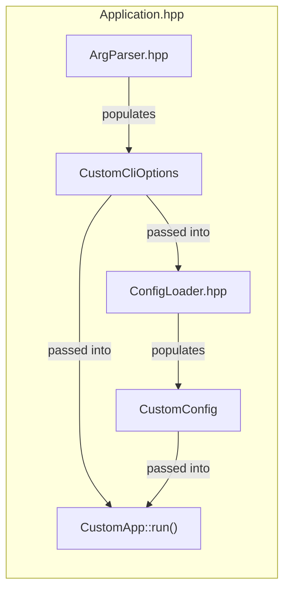

# Service Runtime

The runtime library in `lib/runtime/` provides common application startup, configuration, logging, signals, health, and telemetry infrastructure. It reduces boilerplate and checks application contracts at compile time. This page is for developers implementing tools and daemons; deployed-service settings belong in [Operations](../../ops/deploy-and-configure/configuration/service-runtime.md).

## Application model

Each application/tool has the same two inputs:

1. The commandline arguments.
2. The config file.

The main idea behind the implementation library here is to separate between (1) what the code representation of these two inputs look like and (2) how this code representation is populated from what the user provided.

Both the commandline arguments and the config file are internally defined as simple immutable struct (a data class if you will).
In addition, the main App is specified as a simple class.
This means that the developer defines three things (in this order):

1. The struct to store the commandline options
2. The struct to store the config
3. The class of your main application

Then the way you define an app is as follows:

```c++
runtime::Application<CustomApp, CustomConfig, CustomCliOptions> app("my-app", "This is a description of my app");
app.run(argc, argv);
```

A picture is worth a few words; a very simplified view of `Application.hpp` is this:



## Configuration validation

Config loading is done using a combination of [tomlplusplus](https://github.com/marzer/tomlplusplus) to read TOML files and a custom parser to populate the struct.

The only thing the developer needs to take care of is that the structure of the config struct matches the structure of TOML files. Both in terms of types and in terms of hierarchy and names. See e.g. `maintd/` for an example of what this looks like.

Configuration checking is split into three layers with distinct responsibilities:

1. The TOML parser reads TOML into the config struct. It checks syntax, structure, types, numeric bounds, signedness, and strict-mode requirements such as missing or unknown fields.
2. The config struct's `ValidationResult validate() const` method checks the fully initialized struct. It collects semantic constraints such as non-empty strings, strictly positive values, supported values, and valid combinations of entries. It must not read TOML or inspect external resources.
3. Application-specific initialization checks external state. Examples include checking that a configured file exists or is readable, connecting to a database, and verifying that a remote service is reachable.

`ConfigLoader` calls `validate()` after the parser has successfully populated the root config struct. If validation reports errors, the loader presents all of them in one `UserError`. Root and parent config structs must explicitly merge the validation result from each custom config child. Keeping these calls explicit makes the validation flow visible and allows parent validation to enforce relationships between its children.

## Application configuration

```c++
struct CustomConfig final {
  // Add this if the app/tool uses the catalogue
  cta::runtime::CatalogueConfig catalogue;
  // Add this if the app/tool uses the scheduler
  cta::runtime::SchedulerConfig scheduler;
  // Must always be present; all tools and apps support logging
  cta::runtime::LoggingConfig logging;
  // Add this if the app should be able to produce telemetry
  cta::runtime::TelemetryConfig telemetry;
  // Add this if the app needs a separate health endpoint
  // Don't add this if the app already natively exposes a health endpoint (e.g. a REST API)
  cta::runtime::HealthServerConfig health_server;
  // Add this if the app has experimental options
  // For now, this must be added if telemetry is there as telemetry is considered experimental
  cta::runtime::ExperimentalConfig experimental;
  // Add this if the app uses XRootD
  cta::runtime::XRootDConfig xrootd;
  // Put whatever you want here; will be populated from the config file and available in the run() function
  MyCustomConfStruct customConf;

  // All configs must have this function (limitation of custom reflection implementation)
  // If this number is not consistent with the actual number of members, it won't compile
  static constexpr std::size_t memberCount() { return 8; }

  cta::runtime::ValidationResult validate() const {
    cta::runtime::ValidationResult result;
    result.merge("catalogue", catalogue.validate());
    result.merge("scheduler", scheduler.validate());
    result.merge("logging", logging.validate());
    result.merge("telemetry", telemetry.validate());
    result.merge("health_server", health_server.validate());
    result.merge("experimental", experimental.validate());
    result.merge("xrootd", xrootd.validate());
    result.merge("customConf", customConf.validate());
    return result;
  }
};

class CustomApp {
public:
  CustomApp() = default;
  ~CustomApp() = default;
  void stop(); // Every app MUST have a stop() function
  int run(const CustomConfig& config, cta::log::Logger& log);
  // Alternatively this would compile as well:
  // int run(const CustomConfig& config, const runtime::CommonCliOptions& opts, cta::log::Logger& log);
  bool isLive() const; // Since there is a health_server config, it MUST have an isLive() function
  bool isReady() const; // Since there is a health_server config, it MUST have an isReady() function
  // Optional program-owned OpenTelemetry resource attributes.
  std::map<std::string, std::string> getStaticTelemetryAttributes(const CustomConfig& config) const;
  // Optional program-owned attributes added to every log record.
  std::map<std::string, std::string> getStaticLogAttributes(const CustomConfig& config) const;
};

int main(const int argc, char** const argv) {
  using namespace cta;
  return runtime::safeRun([argc, argv]() {
    runtime::Application<CustomApp, CustomConfig, runtime::CommonCliOptions> app("cta-custom-app", "description");
    return app.run(argc, argv);
  });
}
```

Program-owned telemetry resource attributes can be returned by the optional `getStaticTelemetryAttributes()` application method.
Operator-configured resource attributes belong in the declarative OpenTelemetry configuration file.
For temporary backward compatibility, the runtime replaces hyphens in the application name with dots for `service.name`.
Runtime identity attributes such as `service.name`, `service.version`, `service.instance.id`, `host.name`, and the scheduler namespace are reserved.
Attribute keys and values cannot contain commas, equals signs, carriage returns, or line feeds because they are serialized into `CTA_OTEL_RESOURCE_ATTRIBUTES`.
Program-owned attributes added to every log record can be returned by the optional `getStaticLogAttributes()` application method.

## Custom command-line options

```c++
struct CustomCliOptions : public cta::runtime::CommonCliOptions {
  std::string iAmExtra;
};

// Typically if you want to add custom CLI options, it means your app should consume them.
// As such, the run() method of CustomApp example would change to:
int run(const CustomConfig& config, const CustomCliOptions& opts, cta::log::Logger& log);

int main(const int argc, char** const argv) {
  using namespace cta;
  return runtime::safeRun([argc, argv]() {
    runtime::Application<CustomApp, CustomConfig, CustomCliOptions> app("cta-custom-app", "description");
    app.parser().withStringArg(&CustomCliOptions::iAmExtra, "extra", 'e', "STUFF", "my description");
    return app.run(argc, argv);
  });
}
```

## Minimal application

```c++
struct MinimalConfig final {
  cta::runtime::LoggingConfig logging;

  static constexpr std::size_t memberCount() { return 1; }

  cta::runtime::ValidationResult validate() const {
    cta::runtime::ValidationResult result;
    result.merge("logging", logging.validate());
    return result;
  }
};

class MinimalApp {
public:
  MinimalApp() = default;
  ~MinimalApp() = default;
  void stop(); // Every app MUST have a stop() function
  int run(const MinimalConfig& config, cta::log::Logger& log);
  // Alternatively this would compile as well:
  // int run(const MinimalConfig& config, const runtime::CommonCliOptions& opts, cta::log::Logger& log);
};

int main(const int argc, char** const argv) {
  using namespace cta;
  return runtime::safeRun([argc, argv]() {
    runtime::Application<MinimalApp, MinimalConfig, runtime::CommonCliOptions> app("cta-custom-app", "description");
    return app.run(argc, argv);
  });
}
```


## Lifecycle and runtime state

`lib/runtime/include/runtime/Application.hpp` owns the startup sequence and shared services. It parses the command line, loads and validates configuration, initializes logging and signals, and starts configured health and telemetry services before calling the application's `run()` method. `--config-check` exits after validation without starting the application.

The signal reactor invokes `stop()` on `SIGTERM`; the application must arrange for its work to finish and `run()` to return. `SIGHUP` refreshes the log file descriptor without reloading configuration. Register additional application signal handlers with `Application::addSignalFunction()`.

When `--runtime-dir` is supplied, the runtime records configuration and process metadata there. It copies referenced configuration files before consuming those copies, so the snapshot reflects what was loaded. The deployment creates and owns this directory; the application does not remove it. Use a separate directory for each process because filenames are deterministic. See [runtime-directory configuration](../../ops/deploy-and-configure/configuration/service-runtime.md#runtime-directory).

The runtime keeps the health server and telemetry alive during application execution, including fatal-error reporting. Adding `health_server` to the configuration requires `isLive()` and `isReady()` methods. See [Readiness and Liveness](health-checks.md), [Telemetry Internals](telemetry.md), and the [C++ instrumentation guide](../guides/instrumentation/cpp.md).

## Implementation and tests

- `include/runtime/Application.hpp` and `SafeRun.hpp`: application contracts, lifecycle, and error handling.
- `include/runtime/config/` and `src/config/`: configuration loading, parsing, and validation.
- `include/runtime/cli/`: argument parsing and common options.
- `src/signals/` and `src/health/`: signal handling and health serving.
- `test/ApplicationTest.cpp`: application integration tests.
- `test/config/`, `test/cli/`, `test/signals/`, and `test/health/`: focused tests of the shared infrastructure.

Paths above are relative to `lib/runtime/`. When changing lifecycle behavior, cover startup failure, shutdown, and cleanup in the affected tests. Use `maintd/` as a working application example. Packaging and deployment rules belong in [RPM SPEC and Service Integration](../guides/conventions/rpm-packaging.md).
