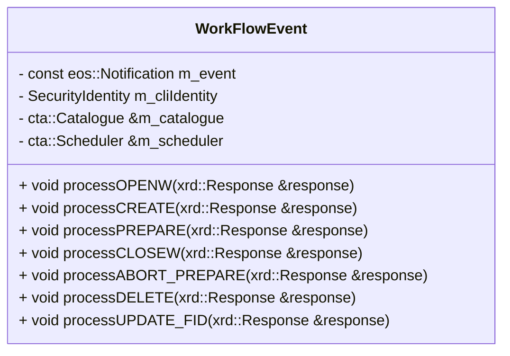

# Workflow API Internals

Request dispatch for disk-system workflows. Operator settings belong in [Workflow API Configuration](../../ops/configuration/workflow-api.md).

## Workflow request dispatch

The WFE frontend handles physics workflow events. The gRPC methods wrap the corresponding `WorkFlowEvent` class methods:

gRPC method                | common method
---------------------------|-------------------
CtaRpcImpl::Create()       | processCREATE()
CtaRpcImpl::Archive()      | processCLOSEW()
CtaRpcImpl::Delete()       | processDELETE()
CtaRpcImpl::Retrieve()     | processPREPARE()
CtaRpcImpl::CancelRetrieve | processABORT_PREPARE()

Processing the request message is done by the process method of the `RequestMessage` class (defined in XrdSsiCtaRequestMessage) and handling of the request is done by the methods defined in the `WorkFlowEvent` class, which fill in the response:

## Authentication dependencies

JWT authentication uses the `jwt-cpp` header-only library for JWT decoding, validation, and signature verification.
The only supported algorithm is RS256 (RSA with SHA-256). The library is added as a git submodule at `common/jwt-cpp`.

For fetching JWKS from remote endpoints the CURL library is used.

mTLS relies on the gRPC TLS stack and standard X.509 certificate infrastructure.

## Shared implementation

The APIs currently share frontend code and dependencies. This separation follows their responsibilities; it does not imply that the implementation split is complete.

See [Admin API Internals](admin-api.md) for administrative commands.
