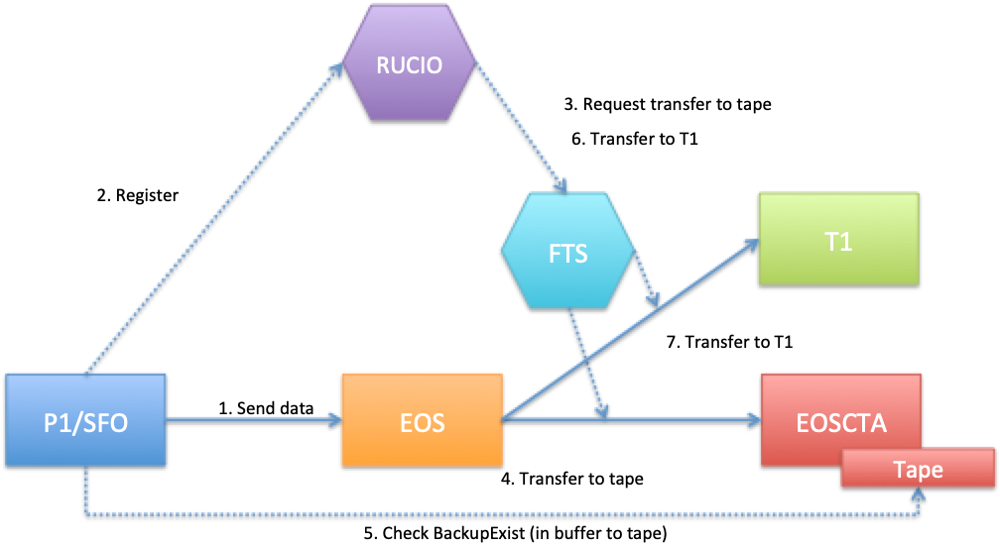

!!! warning "Deprecated"
    This page is deprecated and may contain information that is no longer up to date.

# Archive Workflow

CTA validates the request, creates archive jobs, transfers file data, and reports completion to the disk system.

## CTA implementation

See [Workflow API Internals](../workflow-api.md) and [Scheduling Workflow](scheduling.md). This section will describe the disk-independent request path and failure handling.

## EOS

The integration details below describe EOS and its client-facing workflows.

!!! Presentation
    See also [this presentation to the X-Section meeting](https://codimd.web.cern.ch/UrbDTKOLQbOfBzUkYa3kcA#).

### Introduction and Overview

There are two main use cases for archiving files to tape:

1. Raw data, sent to EOSCTA from the "pit" (DAQ) via FTS or XRootD copy (`xrdcp`)
1. Reprocessed data, in most cases a transfer between EOS and EOSCTA using FTS and a data management framework such as Rucio or Dirac.

The file movements may or may not use FTS to orchestrate the transfer. The example of ATLAS is shown in the
figure below; other experiments have similar workflows but the details vary.



On the EOSCTA side, files are created in the namespace by a **CREATE** workflow event and are archived to tape
following a **CLOSEW** (CLOSE Write) workflow event.

It is important to note that the EOS instance in EOSCTA is a temporary staging area for files on their way to/from tape. When the
file is successfully archived, it will be automatically deleted from the buffer.

Likewise, if archiving fails *before the archive request is queued*, the file will be deleted from the EOS disk buffer, and an error
will be reported to the client. It is expected that the client will attempt to re-send the file in this case. See below for more
details on how different errors are handled.

### Archive File

The figure below shows the sequence of a client writing a file to EOS. The storage class is checked
on **CREATE** and a synchronous archive request is queued on **CLOSEW**.

*This figure is slightly out-of-date; now there is direct communication between the FST and CTA Frontend for some
parts of the workflow, bypassing the MGM. To be updated.*

")

##### EOS Events handled by CTA Frontend

* [CREATE](#2-create-workflow-event): Validate Storage Class, allocate Archive ID
* [CLOSEW](#3-closew-workflow-event): Archive the file to tape

EOS-CTA events are synchronous. If CTA fails during either event, no archive request is queued. The file will be deleted
from the EOS buffer and an error is reported to the client.

For more details on error handling, see
[How failures are handled before and after the Archive Request is queued](#how-failures-are-handled-before-and-after-the-archive-request-is-queued).

##### EOS Events *not* handled by CTA Frontend

* **OPENW**: We do not handle OPENW events, because files on tape are immutable

EOS generates an **OPENW** event when an **already-existing** file is opened for writing. CTA does not allow file modification, so the **OPENW**
workflow is not supported. This should be enforced by system administrators by adding an immutable flag (`!u`) to the ACL of tape-backed directories
in EOS, or as a rule.

#### 1. Configure EOS for tape-backed operation

Operator configuration is documented under [EOS Configuration](../../../ops/integrations/eos/configuration.md).

#### 2. CREATE Workflow Event

##### EOS MGM

The process starts when the client transfers a file to EOS via FTS or `xrdcp`.

The XRootD copy call is handled by the MGM OFS plugin method `XrdMgmOfsFile::open()`. This calls
`workflow.Trigger("sync::create", ...)`, which passes the event to the Workflow Engine dispatcher
`WFE::Job::DoIt()`.

If the extended attribute `sys.workflow.sync::create.default="proto"` has been defined on the directory
(see [EOS Configuration](../../../ops/integrations/eos/configuration.md#b-create-extended-attributes-on-destination-directory)), then the event handler is called:

```
else if (gOFS->mTapeEnabled && method == "proto") {
  return HandleProtoMethodEvents(errorMsg, ininfo);
}
```

The `sync::create` workflow event is handled by `WFE::Job::HandleProtoMethodCreateEvent()`. This method populates a Google
Protocol Buffer with the file metadata and sends it to CTA using the [XRootD SSIv2](http://xrootd.org/doc/dev42/ssi_reference.htm)
protocol.

The protocol buffer message format is defined in the Git submodule [xrootd-ssi-protobuf-interface](https://gitlab.cern.ch/eos/xrootd-ssi-protobuf-interface),
which is shared by EOS and CTA.

The SSI Protobuf wrapper API is also implemented in this submodule. The `Send()` method sends a protocol buffer across the
SSI transport layer and  adds synchronisation to the asynchronous SSI protocol. It is called from `WFE::Job::SendProtoWFRequest()`:

```
service.Send(request, response);
```

The `request` message contains the file metadata, including the Storage Class (inherited from the directory if not explicitly defined).

##### CTA Frontend

When the CTA Frontend receives a **CREATE** event, it performs the following operations:

1. Validate the Storage Class:
       *the Storage Class (`sys.cta.storage_class`) exists in the DB
       * there is a valid archive route(s) and mount policy for the Storage Class and Requester ID
1. Generate a unique Archive ID and return it to EOS in the synchronous response

The **Storage Class** of a file specifies how many tape copies will be created. The archive route maps the Storage Class to a tape pool
(or two tape pools in the case of dual-copy Storage Classes). Each Storage Class belongs to a specific Virtual Organisation (VO). Usually
it is set as an extended
attribute on the directory, which is inherited by new files, *e.g.*:

```
sys.archive.storage_class="atlas_raw"
```

It can also be set explicitly as a parameter in the XRootD URL. The validity of the Storage Class is checked
on **CREATE** in order to fail early for files which cannot be archived. This catches failures due to configuration
problems, for example no valid archive route.

The **Archive ID** of a file is a unique, monotonic number allocated by the CTA Frontend. It is stored as an extended
attribute on the file, *e.g.*:

```
sys.archive.file_id="4294967296"
```

The CTA Frontend will reject operations on files which do not have a valid Archive ID.

On receiving a successful response from CTA, EOS writes the Storage Class (`sys.cta.storage_class`) and the Archive ID
(`sys.archive.file_id`) into file metadata as extended attributes.

##### Failures during CREATE

The **CREATE** workflow is a pure metadata operation. If any part of the **CREATE** workflow fails, the
MGM will delete the file metadata from the EOS namespace and an error is reported to the client.

#### 3. CLOSEW Workflow Event

##### EOS FST

When a file has been written to disk, the FST OFS plugin is called, see `XrdFstOfsFile::_close()`:

```
if (mTapeEnabled && isCreation && mSyncEventOnClose &&
    mEventWorkflow != common::RETRIEVE_WRITTEN_WORKFLOW_NAME) {
  // Queueing error: queueing for archive failed
  queueingerror = !QueueForArchiving(statinfo, queueing_errmsg,
    archive_req_id);

  if (queueingerror) {
    deleteOnClose = true;
    mLayout->Remove();

    if (mLayout->IsEntryServer()) {
      capOpaqueString += "&mgm.dropall=1";
    }

    // Delete the replica in the MGM
    XrdOucErrInfo lerror;

    if (gOFS.CallManager(&lerror, mCapOpaque->Get("mgm.path"),
      mCapOpaque->Get("mgm.manager"), capOpaqueString)) {
      eos_warning("(unpersist): unable to drop file id %s fsid %u at
      manager %s", hex_fid.c_str(), mFmd->mProtoFmd.fid(),
      mCapOpaque->Get("mgm.manager"));
    }
  }
```

This code explicitly checks that `tapeenabled` is set to true and that the workflow event is `sync::closew.default`. If
so, `XrdFstOfsFile::QueueForArchiving()` is called, which in turn calls `XrdFstOfsFile::NotifyProtoWfEndPointClosew()`.

`XrdFstOfsFile::NotifyProtoWfEndPointClosew()` fills a protocol buffer with the file metadata, including the Archive File
ID and Storage Class extended attributes. The protobuf also contains four URL fields which are constructed by EOS and used
by CTA as callbacks:

```
message Service {
  string name = 1;              //< name of the service
  string url  = 2;              //< access url of the service
}

message Transport {
  string dst_url          = 1;  //< transport destination URL
  string report_url       = 2;  //< URL to report successful archiving
  string error_report_url = 3;  //< URL to report errors
}
```

Three of these URLs are used for file archival. The transport destination URL `dst_url` is required only for Retrieve events.

`Request.notification.wf.instance.url` is used by the CTA Tape daemon `cta-taped` to read the disk file from the
EOS MGM during an Archive event. It has the format:

```
root://<hostname>.cern.ch/<path>/<filename>?eos.lfn=<fid>
```

`Request.notification.transport.report_url` (and `error_report_url`) is used by the Tape Daemon to asynchronously report
to the EOS MGM that a file has been safely archived to tape (or an error has occurred). It has the format:

```
eosQuery://<hostname>.cern.ch/<path>/<filename>?mgm.pcmd=event
&mgm.fid=<fid-hex>&mgm.logid=cta&mgm.event=archived&mgm.workflow=default
&mgm.path=<path>/<filename>& mgm.ruid=<ruid>&mgm.rgid=<rgid>
```

where:

* `mgm.pcmd=event`: execute a workflow event.
* `mgm.event=archived`, `mgm.workflow=default`: execute the **archived.default** event. In case of failure, the
  **archive_failed.default** workflow will be executed instead.
* `mgm.ruid=<ruid>`, `mgm.rgid=<rgid>`: execute the event as user/group `<ruid>:<rgid>`.

This protobuf is sent by the FST to the CTA Frontend using the `Service.Send()` method, exactly as the MGM did for the **CREATE** event.

Finally, when the FST receives a response from the CTA Frontend, it sends a **CLOSEW** Event to the MGM as well, to process
the metadata (extended attributes) returned by the `Send()` method.

##### CTA Frontend

When the CTA Frontend receives the protobuf, it queues the archive request in the Object Store and synchronously returns
a status code to EOS. The address of the request in the Object Store is written as an extended attribute:

```
sys.cta.archive.objectstore.id="ArchiveRequest-Frontend-ctatest.cern.ch-14148-20200518-14:16:34-0-0"
```

This address is required to cancel an archival request. One common use case is that ALICE write "probe" files to the EOSCTA endpoint and
delete them after a short time. In the meantime, the file is queued for archival. When the probe file is deleted from disk, we want to delete
the archive request to avoid an unnecessary tape mount. The address of the request is required because queues in the Object Store do not
have an index of their contents (besides the object ID).

Once the file has been written to tape, the tape daemon notifies EOS via the callback above, which executes the `archived.default` workflow.
*In the case of 2-copy files, the callback is called after all copies have been written. (To be checked)*

The `archived.default` event is handled by `WFE::Job::HandleProtoMethodArchivedEvent()`. This:

* Adds the tape replica. EOS reserves filesystem ID 65535 for tape copies, treating `fs-id=65535` as a phantom filesystem in the EOS namespace.
  Note that regardless of the number of tape copies, only one tape replica will be displayed in EOS. The existence of this phantom replica is
  equivalent to *m-bit set* in CASTOR.
* Removes the disk replica
* Cleans up the extended attributes

Finally the file metadata should indicate the existence of a tape replica and no disk replica:

```
$ eos fileinfo /eos/test/motd.1
  File: '/eos/test/motd.1'  Flags: 0640
  Size: 603
Modify: Fri Aug 21 13:50:11 2020 Timestamp: 1598010611.886602000
Change: Fri Aug 21 13:52:53 2020 Timestamp: 1598010773.799959325
 Birth: Fri Aug 21 13:50:11 2020 Timestamp: 1598010611.844446962
  CUid: 71761 CGid: 1077 Fxid: 1000000f6 Fid: 4294967542 Pid: 4294967297 Pxid: 100000001
XStype: adler    XS: 11 a2 b7 40    ETAGs: "1152921570641969152:11a2b740"
Layout: plain Stripes: 1 Blocksize: 4k LayoutId: 00100002 Redundancy: d0::t1
  #Rep: 2
TapeID: 4294967296 StorageClass: single
┌───┬──────┬────────────────────────┬────────────────┬────────────────┬──────────┬──────────────┬────────────┬────────┬────────────────────────┐
│no.│ fs-id│                    host│      schedgroup│            path│      boot│  configstatus│       drain│  active│                  geotag│
└───┴──────┴────────────────────────┴────────────────┴────────────────┴──────────┴──────────────┴────────────┴────────┴────────────────────────┘
 0    65535                localhost           tape.0  /does_not_exist                       off      nodrain  offline
```

The status of the file can be checked with `eos ls -y`, `xrdfs stat` or `xrdfs query prepare`.

##### How failures are handled before and after the archive request is queued

Up until the point where the archive request is queued, failures are **synchronous** and are reported immediately to the client. The file will be
deleted from the EOS disk cache, to ensure that the disk buffer does not fill up with failed transfers, and to allow the client to retry.

If there is a failure during **CREATE**, no file is written and the MGM will delete the file metadata from the EOS namespace. If there is a failure
while writing the file to the EOS disk buffer, the FST will delete the file and the **CLOSEW** event will not be executed. The FST will also delete the
file if there is a failure during the processing of the **CLOSEW** event in the CTA Frontend.

After the request has been queued, failures in the archival process are **asynchronous**. The client must poll the status of the file to determine
if an error has occurred. This is typically done with `xrdfs query prepare`, which can query the status of many files at once.
Another possibility is to use `stat` and `eos attr ls` to check files one-at-a-time.

If there is a failure on the CTA side (cannot authenticate to EOS or read the file, cannot mount a tape, tape write error, ...), the CTA tape daemon
will retry six times in total (three times per mount session over two separate mounts). At the end of six attempts, the archive request is sent to
the *failed requests queue* in the Object Store and the tape daemon calls back EOS with the **archive_failed.default** workflow event.

When EOS receives the **archive_failed.default** event, the MGM updates the file metadata with the error message, in the extended attribute
`sys.archive.error`. The file is left in the disk cache to allow an operator to investigate and possibly resubmit the archive request manually.

Failed requests will remain in the queue until removed by an administrator. The queue can be inspected using `cta-admin failedrequest ls`.
The script `cta-send-event.sh` can be used to resubmit failed archive or retrieve requests. Failed requests can be deleted using
`cta-admin failedrequest rm`.
