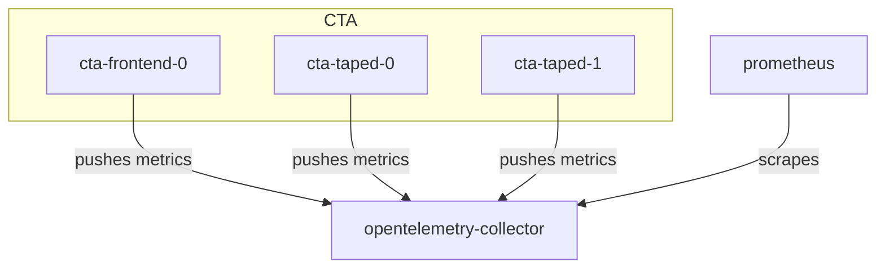

# Testing OpenTelemetry Metrics in CI

As metrics are something typically sent to an external service by the application, it can be difficult to test that the correct metrics are being produced. For that reason, the CI allows developers to set up the required local infrastructure to do some basic visualization.

The full chain from generating metrics to visualising them consists of a number of components:

1. A service publishing metrics (e.g. `cta-taped`, `cta-frontend`).
2. An OpenTelemetry Collector.
3. A time series DB, such as Prometheus.
4. A Grafana instance to visualize the metrics in the time series DB.

In production, the infrastructure for steps 2-4 are typically provided by an external team. In our CI, we allow developers to spawn a local OpenTelemetry collector and Prometheus instance, so that it is possible to debug metrics. This page describes how the CI deployment works.

In CI, we deploy the OpenTelemetry Collector using a [Helm chart](https://opentelemetry.io/docs/platforms/kubernetes/helm/) and use Prometheus as our time-series DB. A simplified diagram can be seen below.



## 1. Pushing Metrics

Each service has a number of entries in its configuration file that tells it how Telemetry should be configured. For example, there are five main backends that can be configured in the service itself:

- A `NOOP` backend. If this is configured, no metrics are pushed anywhere and every telemetry-call in the code will be a [NOOP](https://en.wikipedia.org/wiki/NOP_(code)).
- An `STDOUT` backend. This is only for debugging. The service will print its metrics to `stdout`.
- A `FILE` backend. This is only for debugging. The service will print its metrics to the configured file.
- An `OTLP_HTTP` backend, which tells the service to push its metrics to an OpenTelemetry Collector over HTTP. When this option is specified, the config should also provide the endpoint of said Collector, so that the service knows where to push it to.
- An `OTLP_GRPC` backend, which tells the service to push its metrics to an OpenTelemetry Collector over gRPC. When this option is specified, the config should also provide the endpoint of said Collector, so that the service knows where to push it to.

By default, each service will have the `NOOP` backend configured. Additional configuration options are available to set e.g. the `exportInterval` or `exportTimeout` that provide information about how often metrics should be pushed. For performance reasons, metrics are buffered internally and then pushed periodically.

## 2. Scraping Metrics

Prometheus periodically scrapes the OpenTelemetry Collector for metrics. This is possible assuming that the Collector has been configured to expose a [Prometheus endpoint](https://opentelemetry.io/docs/collector/configuration/#exporters). Note the different models we use here:

1. Metrics are PUSHED periodically to the local OpenTelemetry Collector.
2. The local Prometheus instance periodically PULLS metrics from the OpenTelemetry Collector.

As you can see, the service is fully decoupled from any particular time series backend.

## 3 Visualising Metrics on your Dev Machine

To visualize metrics locally, you can connect to the local Prometheus instance. To do this, first ensure that telemetry is enabled when deploying a local instance:

```shell
./build_deploy.sh --local-telemetry
```

Now forward the Prometheus server port:

```shell
kubectl port-forward svc/prometheus-server 9090:80 -n dev
```

Now the port is available on the VM, so we can forward the same port from the VM to our local machine:

```shell
ssh -L 9090:localhost:9090 cirunner@<dev_machine>
```

Now it's possible to go to `http://localhost:9090/query` and visualise whatever time series have been collected using [PromQL](https://prometheus.io/docs/prometheus/latest/querying/basics/).
