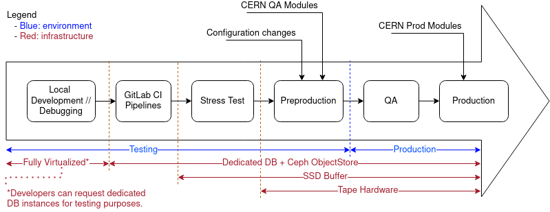

# CI Overview

The Continuous Integration process is a continuous effort that extends from the developer's environment to the deployment of binaries and configuration changes in production machines. The goal of this is to have an early and automated feedback loop on the submitted changes and catch bugs before they reach production. The sooner feedback can be provided, the better. This is crucial to improve developer productivity, improve confidence in the correctness of release and reducing operational problems.

## Dependencies

The CTA project does not exist in a vacuum: in addition to testing changes to the software itself, it must also be integrated against external dependencies. We can classify external dependencies into two categories: core and operational.

- Core dependencies are pieces of software that directly interact with the CTA workflows but are not developed or maintained by the CTA team. An example of this is EOS and its respective software stack.
- Operational dependencies include all other software not directly tied to CTA, from the core OS libraries needed for running the machines to monitoring.

Core dependencies are first tested in the early stages of the CI process. It is important to note that we do not currently 'continuously integrate' these core dependencies against the their latest releases, but only periodically jump to newer versions when they have been stable for some time. To do this, we follow the same CI workflow as for code changes.

Operational dependencies are first partially checked during the stress testing and fully checked in pre-production. Any machine from stress test to production environments is centrally managed. In contrast, developer machines and CI runners are not managed this way, so the surrounding software may not be exactly the same.

## Continuous Integration Flow

Figure 1 shows how a change to any of the aforementioned components is integrated and the steps this change will go through until it reaches production.

*Figure 1. Continuous Integration Flow.*

**Local Development**
The integration process starts with the local changes done by a developer, at this stage, the first step is usually to test the changes by compiling the source code and running unit tests. In addition, system tests can be set up and run locally for faster iteration in cases where unit tests are not sufficient. When the developer considers that the changes are ready, they are pushed to the GitLab repository, triggering the GitLab CI pipelines.

**GitLab CI Pipelines**
The GitLab CI pipelines ensure that the submitted code is in a healthy state; this means it is statically checked, compiled and thoroughly tested. Once the pipeline is green and the changes have been reviewed, they are merged into the main branch. The commits are then typically included in the next batch of changes for the next release. Additional details on the pipelines can be found in the page on [GitLab Pipelines](pipelines.md).

**Stress Test**
When it is time for a new release, a commit in the main branch is tagged and the binaries for that tag are compiled (see [Release Procedure](../../maintainers/releases.md)). Before a tag is created, a stress test is run on the commit that will be tagged. This checks that no change in the batch will affect the performance once deployed. It might be the case that the stress test is unsuccessful, i.e. there is a performance drop compared to previous versions. In this case, the reason for this is investigated and mitigated.

**Preproduction**
If the stress test is successful, we deploy the binaries into the pre-production environment. This is the first environment in the workflow that includes real tape hardware. It also ensures the new release correctly integrates with the monitoring stack and other production-specific tooling.

**QA**
Before new changes reach production, there is an additional buffer zone, QA. This is a small subset of the production machines. For the tape daemons we select a few per logical library; in the case of the frontend the dedicated operations instance serves as QA, while the main frontend is the one in the production environment. It is important to note that changes that make it to QA can affect live core components of the architecture such as the SchedulerDB or the Catalogue. This is due to the fact that their state is persistent and shared between these two stages.

**Production**
If all this completes successfully, the changes will be fully deployed in production.
