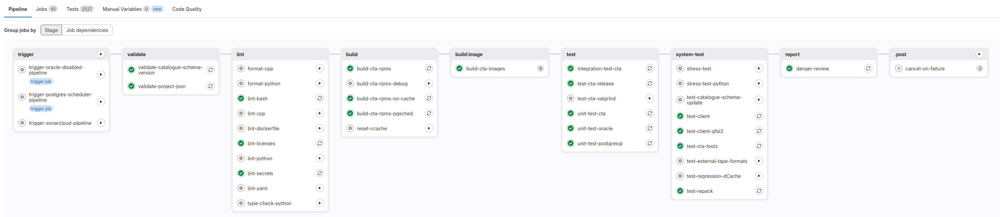

# CI Pipelines

As seen in the CI overview, developers can easily interact and iterate while their changes are in their local machines or in the GitLab pipelines. In this section we will cover the versatility and possible uses of these pipelines to get the most out of them.

Pipelines consist of stages and jobs. Stages are logical groupings of jobs. Our pipeline does not rely on stages to sequence the jobs. Instead, it uses the [Directed Acyclic Graph](https://docs.gitlab.com/ee/ci/yaml/needs.html) feature from GitLab. This allows us to start executing jobs as soon as their conditions are met. This improves parallelism and reduces the runtime of our pipelines.

Below you can find the DAG of the default pipeline running in CTA:

!!!info

    Before doing any development work on the (GitLab) CI, please read through [conventions](../../conventions/ci/gitlab.md)

## Pipeline types

We introduced the logical concept of **pipeline type** to our CI to address the need for different use cases outside of the merge request pipelines. Currently we have the following types of pipelines:

- `DEFAULT`: the full pipeline that runs most of the jobs including validation, linting, building and testing. This runs automatically on merge-requests and on pushes to `main`.
- `REGR_AGAINST_CTA_BRANCH`: runs the default pipeline, but with possible different versions for XRootD or EOS.
- `REGR_AGAINST_CTA_VERSION`: tests an existing CTA image against a provided version of EOS.
- `UPDATE_PIPELINE_IMAGES`: builds a set of new Docker images, tags them, and creates a Merge Request to `main` to replace the base image tag for all of the custom-build pipeline images. See [Pipeline Images](#pipeline-images)

## Pipeline Images

Nearly every pipeline job requires some dependency to run the required tools/scripts. Downloading these at every job invocation is extremely inefficient: it makes the pipeline take longer and needlessly stresses the download targets. There have been various cases in the past of jobs failing due to `429` errors. Instead, every images in CI should come with the required dependencies installed where possible. However, creating custom images comes with a few challenges:

1. Where and how the images are published. It can't be from within the same pipeline, because that would defeat the purpose.
2. How often the images are published. Images need to be updated periodically, because packages maybe updated (for new features, but also security fixes).
3. How do we reference these images in the CI. We cannot use `latest` tags because that may mean checking out an older commit will break the pipeline as it would use dependency versions perhaps not intended for that commit. Every pipeline definition must be self-contained and refer to a specific image tag.
4. How to require minimal manual intervention. We don't want to spend time each weak just to manually update these images.

We address these challenges as follows:

1. We have a pipeline type `UPDATE_PIPELINE_IMAGES` which is used for building these CI images.
2. Images are built and published weekly on a scheduled pipeline.
3. Images have a date in their tag (for easy reference), which is explicitly referenced from the CTA pipeline in the global GitLab CI variables.
4. The scheduled pipeline automatically creates a commit and merge request on the CTA repository to update these image tags.

## Scheduled Pipelines

Certain jobs and workflows are unnecessary or too long to run in every single pipeline. However, these should still be run periodically. For this we use scheduled pipelines, which can be checked at: <https://gitlab.cern.ch/cta/CTA/-/pipeline_schedules>.

These scheduled pipelines help keep the developer workflow as streamlined as possible while checking new changes don't break compatibility with different configurations. There is drawback for this approach, which is that the developer must check if its changes caused some of the nightly pipelines to fail. Any failures to the nightly pipelines should be taken seriously. If such a failure occurs, a ticket should be created for it so that it can be fixed.

## Pipeline stages and jobs

A job is the building block of the CI and jobs are logically grouped into stages. Our CI consists of the following stages and jobs, which may or may not be executed depending on the type of pipeline:

- **stage: `.pre`**
    - `modify-project-json`: on certain pipeline types, dependency versions change. This job modifies the `project.json` by updating those dependency versions so that they are used in the rest of the build/deploy process.
    - `generate-pipeline-images-tag`: generates the tag to be used in the `UPDATE_PIPELINE_IMAGES` pipeline type.
- **stage: `trigger`**
    - `trigger-postgres-scheduler-pipeline`: triggers a [child pipeline](https://docs.gitlab.com/ci/pipelines/downstream_pipelines/#parent-child-pipelines) in CTA to build and test with the Postgres scheduler instead of the objectstore
    - `trigger-oracle-disabled-pipeline`: triggers a [child pipeline](https://docs.gitlab.com/ci/pipelines/downstream_pipelines/#parent-child-pipelines) in CTA to build and test without Oracle support (i.e. Postgres only)
    - `trigger-sonarcloud`: Asynchronously triggers a [pipeline on GitHub](https://github.com/cern-cta/CTA/actions) that will run the full build and scan with SonarCloud. Note that a completion of this trigger job only means the pipeline was triggered. It does not wait for it to complete. The analysis results can be found [on sonarcloud.io](https://sonarcloud.io/project/overview?id=cern-cta_CTA). It is not executed synchronously with the pipeline because the analysis is heavy and takes too long to be integrated into the developer workflow. To run it we use a GitHub mirror of the CTA repository that does the analysis for every commit on the main branch. You should also check the results of the analysis run after your commits reach the main branch to check if the committed code generated any new issues.
- **stage: `validate`**
    - `validate-catalogue-schema-version`: performs various consistency checks on the schema versions indicated in the `project.json` and those in the `cta-catalogue-schema` submodule.
    - `validate-project-json`: ensures the integrity, completeness and correctness of the `project.json` file in the root of the repository.
- **stage: `lint`**
    - `lint-cpp`: static analysis for C++ using [cppcheck](https://github.com/danmar/cppcheck). For cppcheck, a number of errors are suppressed based on the [.cppcheck-supression](https://gitlab.cern.ch/cta/CTA/-/blob/main/.cppcheck-suppressions.txt) file.
    - `lint-bash`: static analysis for Bash using [shellcheck](https://github.com/koalaman/shellcheck).
    - `lint-python`: static analysis for Python using [Ruff](https://github.com/astral-sh/ruff).
    - `lint-yaml`: static analysis for YAML files using [yamllint](https://github.com/adrienverge/yamllint) and a custom script that checks the key order in `*.gitlab-ci.yml`  files.
    - `lint-licenses`: static analysis for all files using [REUSE](https://reuse.readthedocs.io/en/stable/man/reuse-lint.html) to check for license correctness.
    - `lint-secrets`: check for secret presence using [detect-secrets](https://github.com/Yelp/detect-secrets).
    - `lint-dockerfile`: static analysis for Dockerfiles using [Hadolint](https://github.com/hadolint/hadolintl).
    - `format-cpp`: run a formatter on all C++ code. Specifically, checks clang-format for the lines that differ from the main branch. Does not perform the formatting itself. This is the job of the developer (or better: the pre-commit hook)
    - `format-python`: run a formatter on all Python code. Uses [black](https://github.com/psf/black).
    - `type-check-python`: runs a static type check on all Python files using [Pyright](https://github.com/microsoft/pyright).
- **stage: `build`**
    - `build-cta-rpms`: build the RPMs for the current commit. The output can be used to build a container image for the development setup or uploaded to a repository as a tagged CTA version.
    - `build-cta-rpms-no-cache`: same as `build-cta-rpms` but with `ccache` disabled.
    - `build-cta-rpms-pgsched`: additional build job to verify the commit compiles correctly with Postgres scheduler enabled. Not used further down in the pipeline as this is only a quick compilation check during merge request pipelines.
    - `build-cta-rpms-debug`: additional build job to verify the commit compiles correctly when using `Debug` instead of `RelWithDebInfo` (default). Not used further down in the pipeline as this is only a quick compilation check during merge request pipelines.
    - `reset-ccache`: reset `ccache` for builds on the current branch. Can be manually invoked by the developer if issues with `ccache` arise.
    - `build-docs`: builds the documentation from `docs/`, including manpages and configuration examples from the same checkout.
- **stage: `build:image`**
    - `build-cta-images`: build and push the container images for each of the different CTA services from the RPMs generated in the build stage.
    - `build-pipeline-images`: build, push and tag the container images used for the CI pipeline. Used only in the `UPDATE_PIPELINE_IMAGES` pipeline type.
- **stage: `test`**
    - `integration-test-cta`: small set of integration tests for CTA.
    - `test-cta-valgrind`: runs valgrind tests to check for memory leaks.
    - `test-cta-release`: checks that the `cta-release` RPM works as expected.
    - `unit-test`: series of unit tests for CTA.
    - `unit-test-postgresql`: series of CTA Catalogue unit tests run against a live Postgres DB.
    - `unit-test-oracle`: series of CTA Catalogue unit tests run against a live Oracle DB.
- **stage: `system-test`**
    - `test-client`: tests rest API compliance; file immutability; archival, retrieval, eviction, retrieval abort and deletion of 10.000 files; multiple retrieve test; idempotent prepare; deletion on `closew` errors; eviction before archival; EOS evict command; ObjectStore queue cleanup.
    - `test-client-gfal2`: archival, retrieval, eviction and deletion of 2.000 files. Using the gfal2 library, core library for FTS, 1.000 files are tested against the XRootD protocol and the other 1.000 against the HTTP protocol. It also checks for activity passing through the gfal2 stack.
    - `test-repack`: tests of repacking workflows.
    - `test-tools`: exercises the execution and tests the different `cta-amdin` commands.
    - `test-catalogue-schema-update`: tests the upgrade and downgrade of the different schema versions of the Catalogue.
    - `test-external-tape-formats`: tests the support of tapes configured by other tape software.
    - `test-regression-dCache`: dCache regression tests.
    - `stress-test`: runs the stress test on a dedicated runner.
    - `stress-test-python`: runs the new Python implementation of the stress test on a dedicated runner.
- **stage: `sbom`**
    - `prepare-rootfs`: Installs all CTA components in a plain root file system.
    - `generate-sbom-trivy`: Uses [Trivy](https://trivy.dev/) to generate a Software Bill of Materials (SBOM) by doing an analysis of the rootfs with all CTA components installed.
    - `enrich-sbom-cern-info`: Enriches the generated SBOM with additional information.
    - `score-sbom`: Analysis the SBOM and produces a score so that we have some insights into the quality of the generated SBOM.
- **stage: `report`**
    - `danger-review`: runs the Danger bot. Only triggered in merge requests.
- **stage: `release`**
    - `changelog-preview`: produces a preview of the changelog based on all the commits between two commits (the latest commit and the latest tag by default)
    - `changelog-update`: generates a merge request with an update to the `CHANGELOG.md` file.
    - `internal-release-cta`: publishes the RPMs to a CTA internal repo, making them available to be deployed in the stress tests and later stages.
    - `public-release-cta-unstable`: publishes the RPMs to the public unstable repository.
    - `public-release-cta-testing`: publishes the RPMs to the public testing repository.
    - `public-release-cta-stable`: publishes the RPMs to the public stable repository.
    - `publish-images-private`: publishes the Docker images to the private `cta/ctageneric` registry.
    - `publish-images-public`: publishes the Docker images to the public `cta/public_registry` registry. Is only available when Oracle RPMs are not present.
- **stage: `.post`**
    - `cancel-on-failure`: cancels the CI pipeline on failure of certain jobs. GitLab provides an option to auto-cancel on any failure, but this is too aggressive for our use case as it can prevent developer from getting all the feedback they need and we don't need to protect the runner resources as much. Instead, this job allows us to carefully control which job failures should cancel the entire pipeline.
    - `update-pipeline-image-version`: generates the merge request to update the pipeline image tags in the `UPDATE_PIPELINE_IMAGES` pipeline type.

### System tests organization and design constraints

For system tests we have at our disposal a limited number of custom runners, (5 at the time of writing). Each runner can only run one test at a time. The current run time of the longest system test (`test_client.sh`) is around 10 minutes. Whenever a test is run, the virtual environment is created and it is destroyed after the test. The creation of the environment has an overhead of ~2 minutes, the destruction is much faster. This is important to ensure consistency and reproducibility.

Ideally, the tests should be logically grouped together, this means that related workflows should be tested in the creation of the same environment, this helps to better understand the source of the failure. Nevertheless the logs produced by the tests should be clear enough about what was being tested and why it failed.

This ideal is not always achievable, as it is important to find the right balance of number of tests and execution length to minimize execution time. Having a single test containing everything leads to resource under-utilization and longer pipelines, especially when there are not many developers pushing to the repository at the same time; and splitting them too much will create an excessive amount of overhead due to instance creation/deletion which leads to wasted time, specially when many pipelines are being executed at the same time.

The main reason these tests need to run on dedicated runners is `mhvtl`, which is a kernel module. This prevents from using just any Kubernetes cluster.
