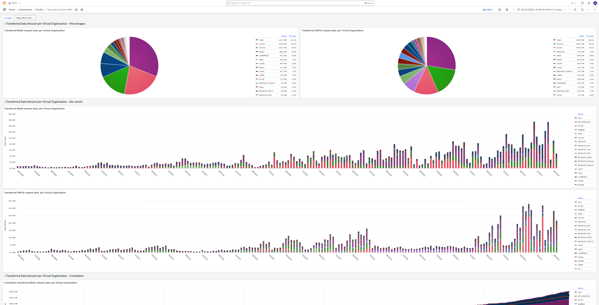

# CTA Operations Data Monitoring

Provides high-level tools for monitoring the data transferred during CTA sessions.

This tool may be used to create dashboards such as the CTA data volume monitoring overview at CERN:



## Configuration

The tool can be configured in the standard config file, under the `tools` section, like so:

``` yaml
  # -------------------------------
  # CTA Data Monitoring
  # -------------------------------
  cta-ops-data-monitoring:
    # Details for the source data InfluxDB connection, used for regular aggregate creation
    src_influxdb_username: "changeme"
    src_influxdb_password: "changeme"
    src_influxdb_host: "changeme"
    src_influxdb_port: changeme
    src_influxdb_database: "changeme"
    src_influxdb_client_timeout: 300  # Seconds
    src_influxdb_measurement: "downsampled_ctataped_tapeSessionFinished"
    src_retention_policy: "long_term_1d"
    # Details for the destination InfluxDB connection to write to
    dst_influxdb_username: "changeme"
    dst_influxdb_password: "changeme"
    dst_influxdb_host: "changeme"
    dst_influxdb_port: changeme
    dst_influxdb_database: "changeme"
    dst_influxdb_client_timeout: 300  # Seconds
    dst_influxdb_measurement: "downsampled_ctataped_tapeSessionFinished"
    dst_daily_retention_policy: "long_term_1d"
    dst_monthly_retention_policy: "long_term_1mo"
    # Details for InfluxDB connection to import existing data from
    import_influxdb_username: "changeme"
    import_influxdb_password: "changeme"
    import_influxdb_host: "changeme"
    import_influxdb_port: changeme
    import_influxdb_database: "changeme"
    import_influxdb_client_timeout: 300  # Seconds
    import_influxdb_measurement_cta: "tape_sessions_daily_datavolume_cta"
    import_influxdb_measurement_castor: "tape-sessions-daily-datavolume"
    import_retention_policy: "aggregations"
    # Default rolling window
    rolling_window: "7d"
```

## Usage

### cta-ops-data-monitoring

``` sh
cta-ops-data-monitoring

```

This script produces daily and monthly aggregates of CTA transfer information, to summarize how much data was read/written.
The information comes from json-formatted CTA log messages, containing the `dataVolume` field and the message `Tape session finished`.
This setup assumes you have a data collector, such as Fluentd, running to track these metrics and populate an InfluxDB database.

The script has three modes of operation, depending on the chosen flag(s):

1. No additional flags (default): Read the configured `src` monitoring database and creates real-month aggregates, which are written to the `dst` database.
2. `--taped-logs`: Read a set of json-formatted `cta-taped` log files and compute daily and real-month aggregates, which are written to the `dst` database.
3. `--import-data`: Read an existing set of daily data points from the configured `import` database, create real-month aggregates and write these to the configured `dst` database. This option may be combined with the `--taped-logs option`.

Additionally, during import, this tool may be used to import existing CASTOR monitoring data, from the format used at CERN, and translate it into data points that fit into the same measurement.

