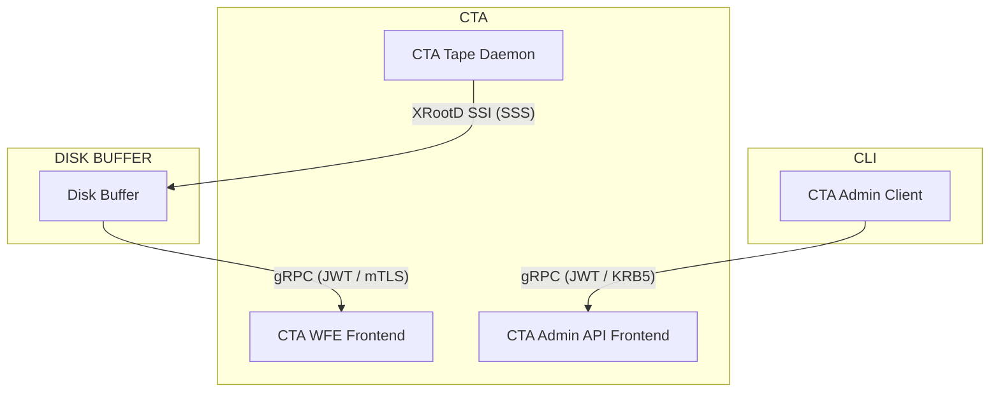

# Authentication

Globally, CTA supports multiple authentication methods: SSS (Simple Shared Secret), Kerberos, JWT (JSON Web Token), and mTLS (mutual TLS).
In CTA we distinguish between three different catagories of authentication:

- The authentication between the disk buffer and the CTA frontend. The disk buffer will send workflow events to the frontend and needs to be authenticated in order to do so.
- The authentication between the tape daemons and the disk buffer. The tape daemons need to be able to read/write data from/to the Disk buffer directly.
- The authentication of users interacting with CTA via the `cta-admin` tool.

## Authentication Methods by Interface

### Frontend
As explained in the [CTA Frontend Overview](./frontend.md), the frontend is split into two separate services:

- **Workflow Engine (WFE) Frontend**: supports JWT and mTLS authentication for workflow events
(see [WFE Authentication](./frontend.md/#mtls-authentication-wfe-only)).
- **Admin API Frontend**: supports JWT and Kerberos authentication for `cta-admin` commands
(see [Admin API Authentication](./frontend.md#kerberos-krb5)).

### Tape Daemon
The tape daemon use SSS authentication when communicating with the disk buffer. In addition to the Kerberos authentication for the admin-client, the client is also expected to be registered in the Catalogue before they are authorized to execute commands. The primary motivation behind using SSS is that this is the authentication method of choice for the disk buffer we are currently using (EOS).

An overview of this can be seen in the diagram below:

