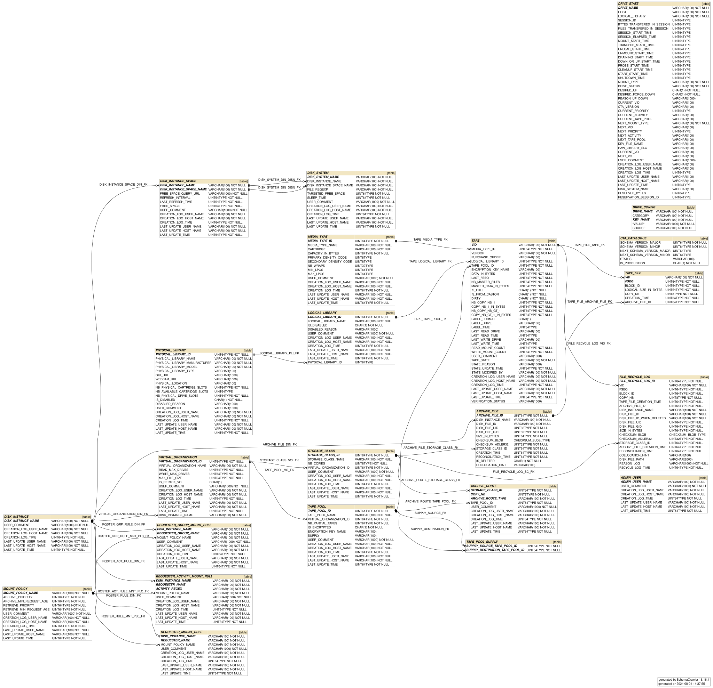

# CTA Catalogue

The CTA Catalogue stores all the persistent metadata of the system: file sizes and checksums, file location (tape 
volume ID and position for each copy of the file) and the state of all the physical resources managed by CTA (tapes, 
drives, libraries).

The catalogue is implemented using a relational database management system (RDBMS) backend, accessed by the frontend 
and all tape daemons. CTA supports both Oracle and Postgres database backends.

### CTA Catalogue development

The CTA Catalogue schema is managed as a separate project, to allow independent management of code development and 
schema changes. It is included into the main CTA project as a git submodule. See [Modifying the CTA Catalogue Schema](../../dev/procedures/catalogue-schema-update/index.md).

## CTA Catalogue schema

A diagram of the CTA Catalogue schema is automatically generated by the CTA CI after every commit of the `main` branch.
The latest version can be consulted in the
[cta/cta-catalogue-schema artifacts](https://gitlab.cern.ch/cta/cta-catalogue-schema/-/artifacts).

### CTA Catalogue schema deployment and upgrades

See the CTA Catalogue schema [upgrade procedure](../../ops/procedures/upgrading-cta-catalogue-schema/index.md).

### CTA Catalogue development

See [CTA Catalogue schema development](../../dev/architecture/components/catalogue.md).
