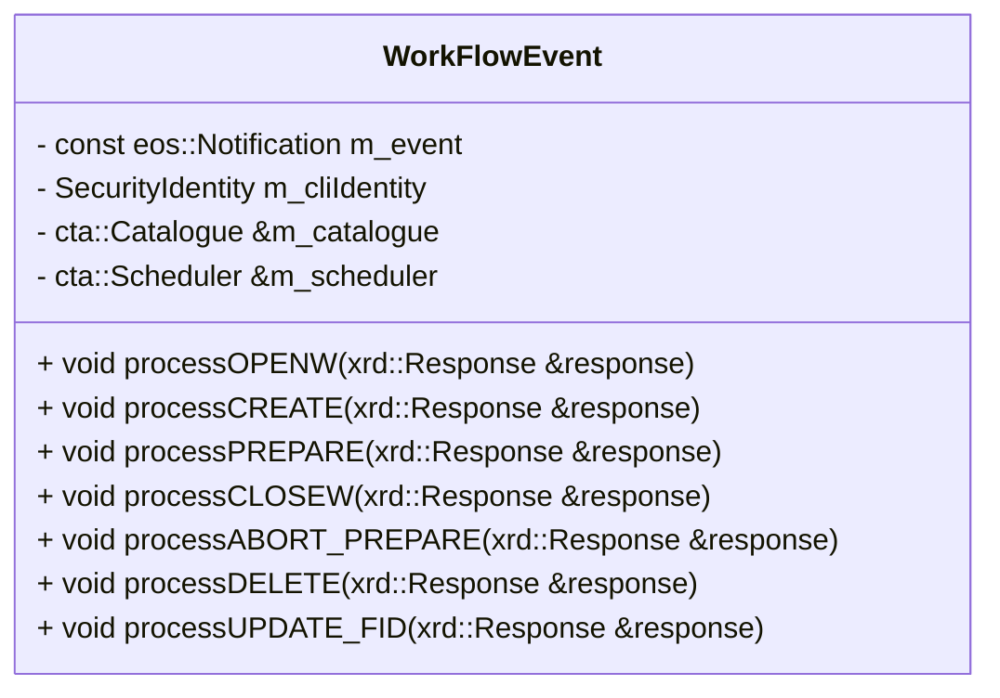
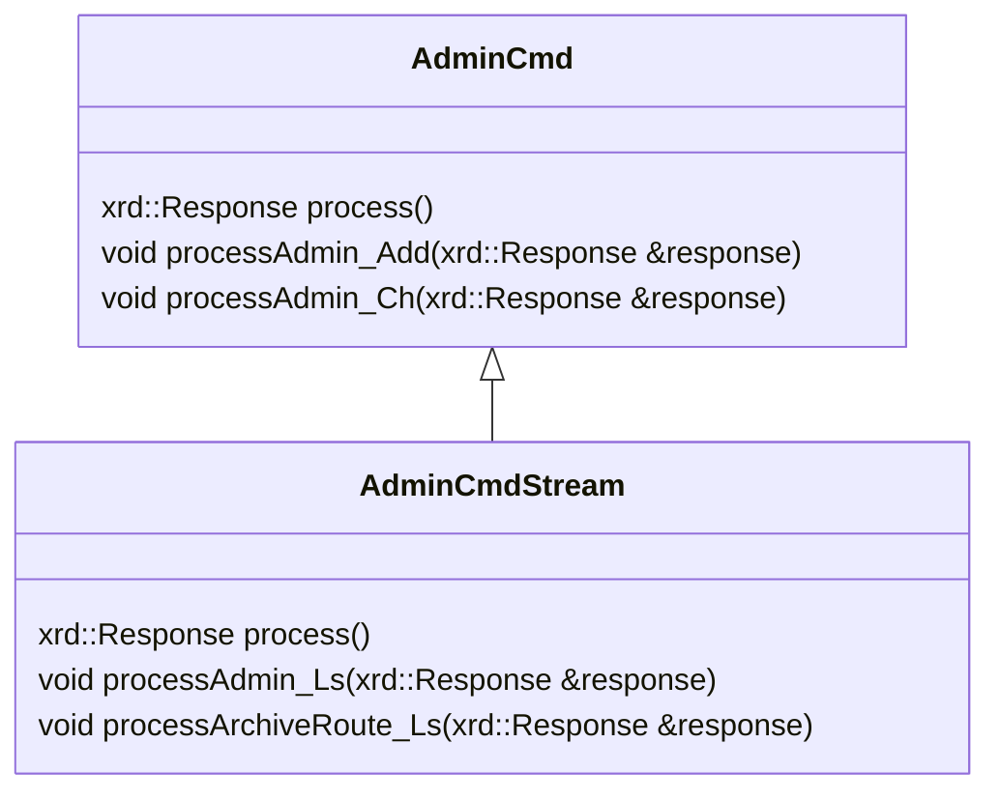

# CTA Frontend

The CTA frontend is responsible for serving two different types of requests:

- Workflow events, responsible for facilitating things such as archival and retrieval of files.
- `cta-admin` commands, which can be used to perform various operations.

The frontend acts as the public interface to CTA. It uses [gRPC](https://grpc.io/) for client-server communication and is deployed as two separate services:

- **Workflow Engine Frontend (WFE)**: handles physics workflow events (archive, retrieve, delete, etc.) from the disk buffer (EOS). Runs on port 10956.
- **Admin API Frontend**: handles `cta-admin` commands. Runs on port 10956.

## Workflow Engine Frontend (WFE)

The WFE frontend handles physics workflow events. The gRPC methods wrap the corresponding `WorkFlowEvent` class methods:

gRPC method                | common method
---------------------------|-------------------
CtaRpcImpl::Create()       | processCREATE()
CtaRpcImpl::Archive()      | processCLOSEW()
CtaRpcImpl::Delete()       | processDELETE()
CtaRpcImpl::Retrieve()     | processPREPARE()
CtaRpcImpl::CancelRetrieve | processABORT_PREPARE()

### Configuration

The WFE frontend is configured via `cta-frontend.conf`.

```ini
# Operation mode: this node is the Workflow Engine (WFE)
cta.operation_mode wfe

# gRPC port
grpc.port 10956

# WFE authentication method: "jwt" or "mtls"
grpc.wfe.auth_method jwt

# TLS
grpc.tls.server_key_path /path/to/server-wfe.key.pem
grpc.tls.server_cert_path /path/to/server-wfe.crt.pem
grpc.tls.chain_cert_path /path/to/ca.crt.pem

# JWKS Endpoint (required for JWT auth)
grpc.jwks.uri file:///etc/cta/jwks.json
# or a remote endpoint:
# grpc.jwks.uri http://auth-keycloak:8080/realms/master/protocol/openid-connect/certs
```

### Implementation Details
Processing the request message is done by the process method of the `RequestMessage` class (defined in XrdSsiCtaRequestMessage) and handling of the request is done by the methods defined in the `WorkFlowEvent` class, which fill in the response:



## Admin API

The Admin API frontend serves `cta-admin` commands.

### Configuration

The Admin API frontend is configured via `cta-frontend.conf`.

```ini
# Operation mode: this node serves admin commands
cta.operation_mode admin_all

# gRPC port
grpc.port 10956

# Admin authentication methods (space-separated list): "jwt", "kerberos"
grpc.admin.auth_methods jwt kerberos

# TLS
grpc.tls.server_key_path /path/to/server-admin.key.pem
grpc.tls.server_cert_path /path/to/server-admin.crt.pem
grpc.tls.chain_cert_path /path/to/ca.crt.pem

# JWKS Endpoint (required for JWT auth)
grpc.jwks.uri file:///etc/cta/jwks.json

# Kerberos (required when kerberos is in auth_methods)
grpc.keytab /etc/cta/cta-frontend.krb5.keytab
grpc.service_principal cta/cta-frontend-admin@REALM
```

#### Client-side configuration

`cta-admin` is configured through the `cta-cli.conf` file:
```ini
grpc.tls.enabled true
grpc.cta_admin_auth_method jwt | krb5
grpc.jwt_token_path /path/to/token
grpc.tls.chain_cert_path /path/to/cert
```
The configuration file is consulted first in order to determine which authentication method to use. If no method is specified, (grpc.cta_admin_auth_method is not set to one of the allowed options, jwt or krb5) then Kerberos authentication will be tried. It is also possible to override the method specified in the configuration through the environment variable `CTA_ADMIN_GRPC_AUTH_METHOD` which can be set to either `jwt` or `krb5`.

### Implementation Details

Processing the request message is done by the `process` method of the class `AdminCmd` in the case of non-streaming commands or the `AdminCmdStream` class in the case of streaming commands.
Non-streaming admin commands are implemented as methods of the `CtaAdmin` class while streaming admin commands are implemented as methods of `CtaAdminStream`.
<!-- Streaming admin commands all inherit from the class `XrdCtaStream` class. Their implementations are found in the respective header file in the `xroot_plugins` directory. -->




<!-- void RequestMessage::process(const cta::xrd::Request& request, cta::xrd::Response& response, XrdSsiStream*& stream) -->

<!-- ```mermaid
classDiagram
class FrontendService {
  getters/setters for the members
  m_log
  m_catalogue
  m_scheddbInit
  m_scheddb
  m_scheduler
  m_acceptRepackRequests
  ....
  m_namespaceMap
}

class GrpcClient {
  std::unique_ptr<eos::rpc::Eos::Stub> stub_
  std::string m_token
  uint64_t m_tag
}
``` -->

## Authentication

### JWT Authentication

Both the WFE and Admin API frontends support JWT (JSON Web Token) authentication, using JWKS (JSON Web Key Set) for public key validation.
The client should attach the JWT token to the gRPC call credentials. In general, client authentication is expected to work as follows:

1. **Obtain JWT Token**: Get a valid JWT token from your identity provider
2. **Include Authorization Header**: Add token to gRPC metadata:
   ```
   Authorization: Bearer <jwt-token>
   ```
3. **Make gRPC Calls**: All workflow operations (Create, Archive, Retrieve, etc.)

For more details one can refer to the implementation of the EOS client.

#### Expected Token Format

The tokens are expected to be valid [JWTs](https://www.jwt.io/introduction#what-is-json-web-token).

The subject field (`"sub"` claim) must contain:

- For **workflow events**: the name of the disk instance from which the request was submitted.
- For **admin commands**: the name of the authorized admin user.

The decoded header might look like this:
```json
{
  "alg": "RS256",
  "typ": "JWT",
  "kid": "he5OTFOKWnYEi4QKSxsIgdLb-0dncPMhFQNrKpZAdi8"
}
```

For workflow events, the decoded payload of a JWT might look like this:
```json
{
  "exp": 1776449678,
  "iat": 1776413678,
  "sub": "ctaeos",
  "typ": "Bearer",
  ...
}
```

For admin commands, the decoded payload might look like this:
```json
{
  "exp": 1776452706,
  "iat": 1776416706,
  "sub": "ctaadmin1",
  "typ": "Bearer",
  ...
}
```

The frontend validates the following claims:
- `kid`: The JWT must have a header claim that matches the key in the `grpc.jwks.uri` that signed the token
- `exp`: Must be after the current time in UTC
- `sub`: Must match one of the entries in the list of authorized admin users (`cta-admin admin ls`) for admin commands, or must match the instance name of the disk instance who sent the workflow event
- `alg`: Is expected to be RS256

#### Optional JWKS Cache Settings

A cache for the public keys is maintained so that the public keys used to validate tokens do not have to be looked up for every request.

```ini
# Cache refresh interval (default: 600 seconds)
grpc.jwks.cache.refresh_interval_secs 600

# Public key timeout (default: no expiration if not set)
grpc.jwks.cache.timeout_secs 3600
```


#### Dependencies

JWT authentication uses the `jwt-cpp` header-only library for JWT decoding, validation, and signature verification.
The only supported algorithm is RS256 (RSA with SHA-256). The library is added as a git submodule at `common/jwt-cpp`.

For fetching JWKS from remote endpoints the CURL library is used.

mTLS relies on the gRPC TLS stack and standard X.509 certificate infrastructure.


### mTLS Authentication (WFE only)

The WFE frontend supports mutual TLS (mTLS) as an alternative to JWT for authenticating workflow events.
In mTLS mode, the EOS client presents its own certificate during the TLS handshake.
The frontend maps the client certificate's Common Name (CN) to a disk instance name using a TOML mapping file (`mtls-map.toml`).

Example `mtls-map.toml`:
```toml
[aliases]
ctaeos = ["eos-mgm.example.ch", "eos-mgm.example"]
```

This allows a single logical disk instance (`ctaeos`) to be represented by certificates with different CNs.

### Kerberos (KRB5)

Each Kerberos-authenticated `cta-admin` command consists of two remote procedure calls:
First, the client calls `Negotiate`, which is a bidirectional streaming rpc. The client and the server perform the kerberos token exchange.
When the server successfully authenticates the client, it generates and stores a 256-bit nonce to be used for this session, then the nonce is sent back to the client.

1. Obtain Kerberos Ticket: The client must have a valid Kerberos ticket-granting ticket (TGT), typically obtained via kinit. The ticket must be valid for the configured Kerberos realm.
2. Initiate Negotiation: The client calls the dedicated `Negotiate` bidirectional streaming RPC. This is a separate service from the main CTA admin API, specifically designed for Kerberos authentication. The client also learns the Service Principal Name to use for the GSSAPI calls when beginning the Negotiate rpc.
3. GSSAPI Token Exchange: The client generates a GSSAPI/SPNEGO token using `gss_init_sec_context()` and sends it in the challenge field of the negotiation request. The server validates this
token using `gss_accept_sec_context()` against its service keytab.
4. (Multi-Round) Negotiation: GSSAPI context establishment may require multiple round-trips. If the server returns `is_complete=false` with a challenge, the client must process that challenge
with `gss_init_sec_context()` and send the resulting token back. This continues until `is_complete=true`.
5. Receive Session Token: Upon successful authentication, the server extracts the client principal name from the security context and generates a nonce/session token. This nonce is stored
server-side (in TokenStorage) mapped to the authenticated username, and returned to the client.
6. Execute Command: The client includes the session token in the gRPC metadata using the `"Authorization: Negotiate"` header and calls the Admin rpc to execute the requested command. The
server validates that the token exists in token storage, confirms that the associated username exists in the admin database, removes the session token from its storage and proceeds with command execution.

Each `cta-admin` command invocation repeats this entire process: negotiation, token exchange, and command execution.

The Kerberos implementation relies on the system's GSSAPI libraries (typically provided by `krb5-libs` or equivalent).
