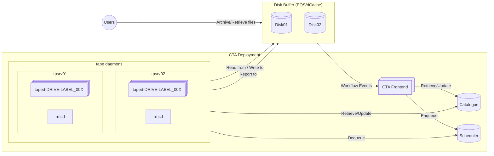

# Component Overview

The CTA system consists of the following components:

- [Disk Buffer](disk-buffer.md): A buffer for the files to be archived to/retrieved from tape.
  Sends [Workflow Events](../file-lifecycle/introduction.md) to the frontend.
- [CTA Catalogue](catalogue.md): Central database storing metadata for files, tapes, libraries, *etc.*
- [CTA Scheduler](scheduler.md): System for queueing archive and retrieve requests and assigning work
  to tape servers. The scheduler has a Just-in-Time architecture: jobs are pushed to the scheduler
  by the frontend and pulled from the scheduler by the tape daemons when a tape is mounted.
- [CTA Frontend](frontend.md): CTA's external interface. The frontend accepts workflow events from the
  disk buffer and administrative requests from the CLI tools.
- [CTA Tape Daemon](taped.md): Provides the low-level SCSI interface to the tape hardware. The scheduler
  logic is implemented in the tape server, including the decision when to mount a tape and the logic
  to pull work. The tape daemon also manages file transfers between the disk buffer and tape.
- [CTA Maintenance Daemon](maintd.md): Executes regular queue maintenance tasks including reporting
  success/failure of archival and retrieval jobs, repack expansion and maintenance of the objectstore
  state (queue cleanup and garbage collection).
- [Admin Client](../../ops/tools/cta-admin.md): A Command Line Interface client used by CTA operators
  to send administrative commands to the frontend.

