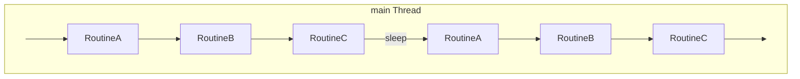
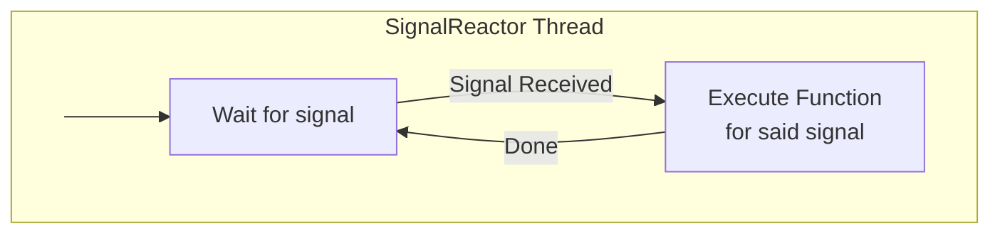

# CTA Maintenance Daemon

The responsibility of the maintenance daemon is to periodically run a number of routines.

At the moment, this works as follows:

The sleep interval can be configured in the config file.

In addition to the main thread, the `maintd` process also spawns a dedicated SignalReactor thread whose job it is to capture incoming signals (e.g. `SIGTERM`, `SIGHUP`) and execute the function associated with said signal. This ensures that the logic for dealing with signals is not spread out through all of the code.

## Routines

The routines are defined in `routines/`. Which routines are run depend on whether the Objectstore or Postgres scheduler is used. Using the config, routines can be enabled/disabled as desired. However, for a correct functioning of CTA, at least one of each routine must be running somewhere.

- **Disk Reporting**. All `buffer <-> tape` data transfers are divided into a two stage workflow, first the data movement takes place, and then, whether the operation was successful or not, a report job will get queued into the scheduler. The disk report archive/retrieve routines are responsible for executing the reporting of these jobs. For example, after a file has been archived, a reporting job will be queued, and later on picked up by a `DiskReportArchiveRoutine` that will inform the disk buffer that the file got successfully written to tape.

- **Repack**. The maintenance daemon performs two tasks when it comes to repack
    - Request Expansion: expanding a repack request means converting the request to repack a tape into the necessary retrieve and archive jobs to make effective the movement of the data to a new tape. For a more detailed explanation of tape repacking at CERN see [Repack Workflows](../../dev/architecture/workflows/repack.md). This is done by the `RepackExpandRoutine`.
    - Reporting: in a similar fashion to the disk reporting, all reporting related to repack requests are handled by a separate routine. Specifically, the `DiskReportRetrieveRoutine`.

- **Objectstore Garbage Collection**. Any process that interacts with the object store scheduler database registers itself as an unique `agent` into the object store, the process will periodically update the `agent`'s heartbeat. The way in which an agent interacts with the scheduler is by taking ownership of a batch of jobs and removing them from their queue. The role of the garbage collector is to move the jobs owned by a dead `agent` back into the scheduler. An agent is considered dead if the heartbeat has not being updated for a certain period of time, this can happen if the process has crashed or it got stuck processing some jobs.

- **Objectstore Queue Cleanup**. When a tape state change is requested, the tape is set to a `PENDING` state in the Catalogue and the queues in the Objectstore are flagged for cleanup. This routine looks for queues to clean up and it will take care of transferring the pending jobs to another queue if it is possible to retrieve the files from another tape (the files have a copy on a different tape) or report them as failed. After this, it changes the tape state from `PENDING` to the desired one, either `REPACKING` or `BROKEN`. For more details on the possible changes on the tape states see [Tape Lifecycle](../tape/lifecycle.md).

### Supported Routines

#### Objectstore

- `DiskReportArchiveRoutine`
- `DiskReportRetrieveRoutine`
- `RepackExpandRoutine`
- `RepackReportRoutine`
- `GarbageCollectRoutine`
- `QueueCleanupRoutine`

#### Postgres

- `DiskReportArchiveRoutine`
- `DiskReportRetrieveRoutine`
- `RepackExpandRoutine`
- `RepackReportRoutine`

