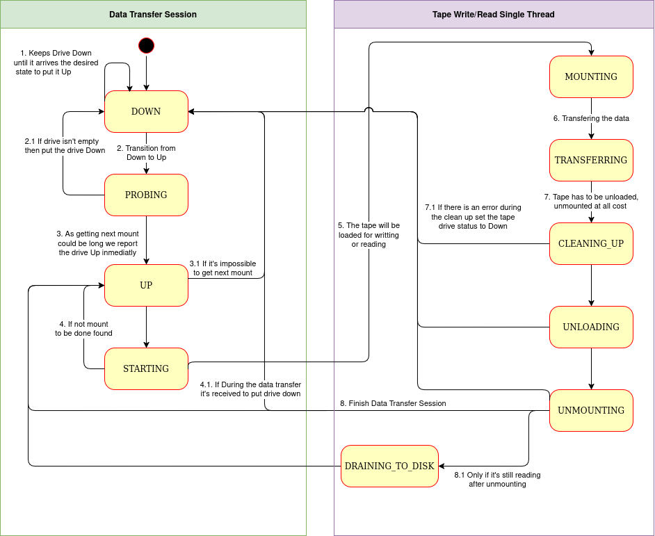

# CTA Tape Daemon

The CTA Tape Daemon (`cta-taped`) is a background process that runs on tape servers to handle the transfers from the disk buffer to tape and vice versa. The daemon consists of a main process that forks to create a **Drive Process**.

## Drive Process

The drive process is the process in charge of moving the data to/from tape. The main logic of the process is contained in a `Data Transfer Session` which consists of a scheduling loop and the subsequent mounting of the media, transfer of the data and unmounting of the media. Once the process is finished with a `Data Transfer Session` it exits and the parent process will create a new one; the drive process might exit due to an error during the session in this case, depending on the error, the parent process might shutdown the entire daemon. During the entire duration of a `Data Transfer Session` the process will periodically report its state to the Catalogue

### Drive States

When the Data Transfer Session starts the desired Tape Drive can be in one of two states: `DOWN` or `UP`. If it's in the `DOWN` state, then it will wait until the drive receives a desired state to put it `UP`, passing first through the `PROBING` state. If it fails to put the drive `UP` the system will put back the drive back into `DOWN` state.

When it gets a mount, then it passes to the state of `STARTING` and calls the Tape Write or Read Single Thread. Then it starts the `MOUNTING` of a tape and after that the `TRANSFERRING` of the data will start. After the data `TRANSFERRING` is finished the drive will start a `CLEANING_UP`, for thos process it is necessary to ddo an `UNLOADING` and an `UNMOUNTING` of the tape, then the system will pass to `UP`, or `DOWN` if during the data transfer session a signal to put the drive `DOWN` is received. Also, if the drive is still reading after `UNMOUNTING`, the state of the drive will change to `DRAINING_TO_DISK` until all the files have been read.

The scheduling logic to mount a tape on the transition from `STARTING` to `MOUNTING` is explained in detail in [Scheduler Overiew](./scheduler.md) and [Scheduler Architecture](../../dev/architecture/components/scheduler.md#scheduler)
