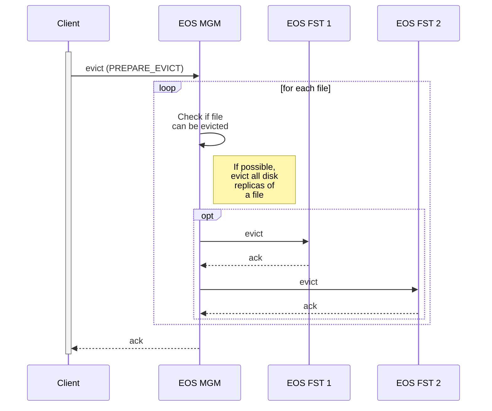
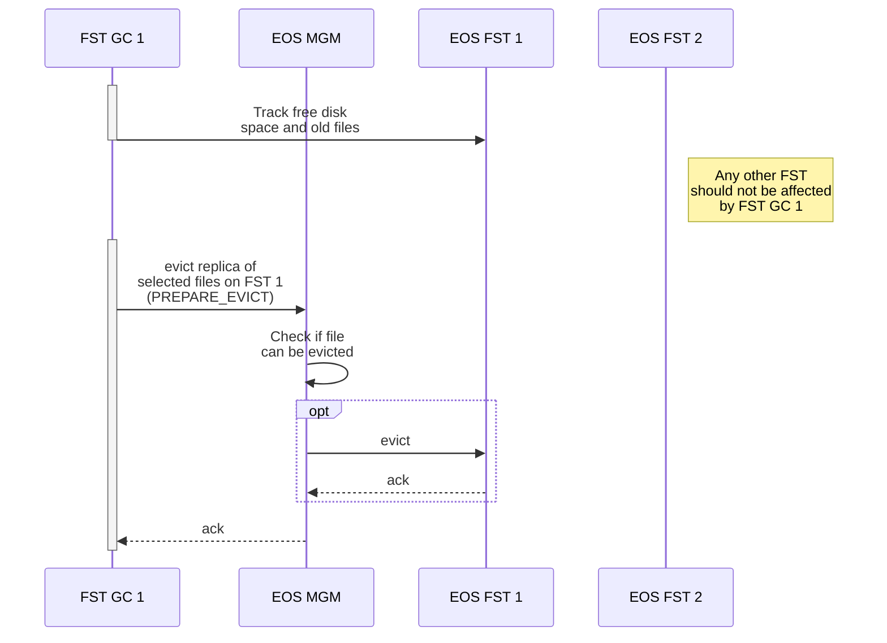
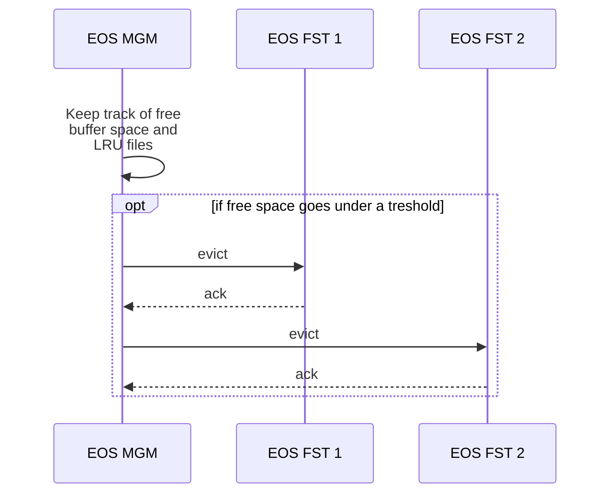

# Deletion

File deletion and recovering strategies. \
Here is the link of the draft documentation: https://codimd.web.cern.ch/f9JQv3YzSmKJ_W_ezXN3fA?view

## Different *delete* scenarios

Files can be affected by deletion under various scenarios:

- User-triggered disk copy removal
- Garbage collection disk copy removal
- Full deletion of files (both disk and tape copy removal)

### User-triggered disk copy removal

Previous experience has shown that it's not easy or even possible to implement an exact "garbage collection" policy required by experiments when it comes to evicting (deleting disk copies of) files safely stored on tape.

In order to provide the experiments with a high-bandwidth interface for reading/writing files from/to tape, the preferred EOSCTA configuration is to have a small but very fast disk buffer where the files will be temporarily staged (using SSDs).

Each large experiment has its own EOSCTA disk buffer. In order to prevent the buffer from quickly getting full, the experiments must explicitly request the disk copy to be removed once the file is no longer needed in the buffer. This is done with the *evict* command.

The *evict* command will only work if there is a copy of the file on tape (meaning that it has been archived). This protects experiments from unintentional loss of data.

***Note:** The example above shows a file with 2 disk replicas. Other replication modes are also supported.*

### Garbage collection of disk copies

It's not possible to fully rely on the clients for the file *eviction*. Files can slowly (or quickly) accumulate on the disk buffer for various reasons such as: misbehaving clients, failing retrieve workflows, namespace corruption, etc...

Therefore, it's important to back each EOSCTA instance with a proper garbage collection system. It will be responsible for clearing old disk replicas when they were not properly *evicted*.

In addition, it should guarantee that each FST always has some free space available. **This is a requirement for maximum archive/retrieve throughput.**

#### FST garbage collection

There is one FST Garbage Collector (FST GC) for each FST. \
It's responsible for keeping track of all the free space and files on that FST, and for *evicting* the oldest files whenever the free space available falls under a threshold.

This eviction should only remove the tape replica from the FST that the GC is monitoring. Any other copies should stay.

The FST Garbage Collector (GC) uses the *evict* command (replacing old *stagerrm* command) that it wants a file to
be removed.

#### MGM garbage collection

There is also another type of Garbage Collector running on each MGM. It has access to all *reads* and *writes* to EOS, as well as the EOS namespace, which allows it to keep a LRU (Least Recently Used) list of all files.

If the total available space goes under a threshold, it can trigger the *eviction* of the oldest files on the disk buffer.

!!! warning
    The MGM GC does not work with true High Availability (HA) MGM mode. If more than one MGM is used on a EOSCTA instance, both read and writes need to be redirected to the active MGM node for the MGM GC to work. This makes it preferable to use the FST GC instead of the MGM GC.

### Complete deletion of files

There is no need to report a failure to delete the file in CTA while the deletion proceeds in EOS, so synchronous and asynchronous implementations are equivalent. \
The complete deletion of files from EOS can raise several race conditions (delete while archiving, delete while retrieving), but all should be resolved by failure of data or metadata operations initiated from CTA to EOS, plus slow reconciliation. \
The deletion of the file can be represented by a notification message from EOS to CTA (as any file operations can).

#### Deletion order

When a user wants to definitely delete a file, he will use the *rm* command plus the path of the file. \
In response to the end user’s *rm* command the EOS MGM must first remove the tape location of a file from the EOS namespace before asking CTA to delete the actual tape file(s). It must also ignore any failure reported by CTA (but still log them as a failure).

If these two steps were reversed and if removing the tape location of a file from the EOS namespace failed after a successful deletion of the CTA tape file(s) then the end user would have a false sense of security that their tape file(s) still existed. This would be considered data loss.

The proper solution is to allow EOS to delete a file from its namespace even if CTA fails to delete the actual tape files. This will only result in temporary dark tape data which is not a critical problem. CTA can asynchronously reconcile its tape file catalogue with the EOS namespace at a later point in time.

#### The recycle bin

A recycle-bin has been implemented in CTA to allow for the recovery of data in the two following use cases:

- When a user deletes a file via the *rm* command, we need to log this deletion for future recovery if necessary.
- When an operator repacks a tape, the files located on the source tape will be moved to the destination tape(s). We want to keep a trace of the files that were on the source tape for future recovery if necessary.

The recycle-bin data is stored as table in the CTA Catalogue, where each entry corresponds to a deleted or repacked tape file. It contains all the formation necessary to recover the deleted file metadata both on CTA and EOS (including storing the disk file path given by EOS). The actual file data will remain on tape (dark data) until the tape is *reclaimed*.