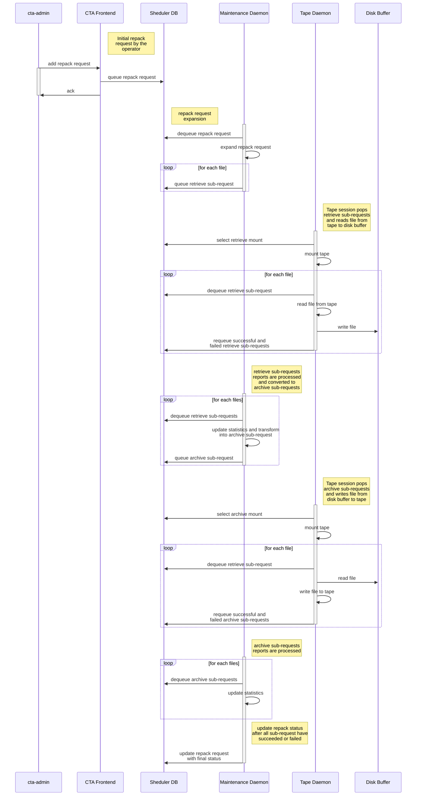

# Repack

Repacking a tape is very useful for operators who want to migrate data from one tape to another, to repair a tape, or to add missing dual-copies to several files.

Repack requests can only be submitted to tapes in *REPACKING* or *REPACKING_DISABLED* states. \
In addition, the operator must set up a default Virtual Organization (VO) for Repack.

## Setting up a VO for Repack

Any Virtual Organization can be defined as the default VO for Repack at the moment of its creation or during a modification.
This can be set with the optional parameter `--isrepackvo <true|false>`.

Examples:

```bash
cta-admin virtualorganization ch --vo vo_repack -isrepackvo true
```

```bash
cta-admin virtualorganization add --vo vo_repack --readmaxdrives 1 --writemaxdrives 1 --diskinstance ctaeos --comment "vo_repack" --isrepackvo true
```

## Submitting a Repack Request

In order to submit a repack request, the user should follow these steps:

1. Change the tape state to *REPACKING* or *REPACKING_DISABLED*, and set it as `full`:

   Example:

    ```bash
    cta-admin tape ch --state REPACKING --full true --reason "Testing" --vid V01001
    ```

2. Wait for the tape state change to be completed:

   Example:

    ```bash
    cta-admin --json tape ls --vid V01001
    ```

3. Finally, submit the repack request:

   ```bash
   cta-admin repack <add|rm|ls|err> [<parameters>]
   ```

Some parameters should be noted (partial list):

- `--bufferURL`:
  - Overwrites the default buffer URL set in the CTA Frontend configuration file. It should respect the following format `root://eosinstance//path/to/repack/buffer`.
- `--justmove`:
  - The files located on the tape to repack will be migrated on one or multiple tapes and removed from the original tape.
- `--justaddcopies`:
  - New (or missing) copies (as defined by the storage class) of the files located on the tape will be created and migrated. The original files on the tape won't be removed.
- `--mountpolicy`:
  - Allows to give a specific mount policy that will be applied to the repack subrequests (retrieve and archive requests). By default, a hardcoded mount policy is applied (every request priorities and minimum request ages = 1).

Once a repack request is submitted, it will be queued in the **RepackQueuePending**.
The Maintenance Daemon will then pop the repack request from the **RepackQueuePending** and start the repack request **expansion**.

**NOTE:** If the tape is on *REPACKING_DISABLED* the expansion will be performed and the requests enqueued, but the tape will not be mounted.
For the repacking to proceed, the state must be changed to *REPACKING*.

## Repack Workflow



### 1. Expansion of a Repack Request

The expansion of the repack request is the "transformation" of the repack request into multiple retrieve requests, by the Maintenance Daemon.
In order to perform that operations, the expansion algorithm will check the CTA Catalogue for all the files that are located in the source tape.

For each files in the source tape, the scheduler will create a retrieve sub-request and queue each subrequest into the **RetrieveQueueToTransfer**.

### 2. Repack Retrieve sub-request execution

According to the mount policies given to the repack request during its submission, the retrieve sub-request queue will eventually be selected by
a Tape Drive for a new tape read mount. During this process, the sub-requests will be popped from the **RetrieveQueueToTransfer** and executed.

The retrieved files will be kept on the Disk Buffer referenced by the buffer URL.

All successful retrieve requests will be queued in the **RetrieveQueueToReportToRepackForSuccess**. \
The failed retrieve requests will be queued in the **RetrieveQueueToReportToRepackForFailure** (after a number of failed attempts).

### 3. Reporting of the Repack Retrieve sub-requests

The Maintenance Daemon will pop the retrieve sub-requests from **RetrieveQueueToReportToRepackForSuccess** and **RetrieveQueueToReportToRepackForFailure**.
In both cases, the repack request will have its statistics updated (retrieved files, retrieved bytes, failed to retrieved files, failed to retrieve bytes).

The successful retrieve sub-requests will be transformed into **archive sub-requests** and queued into the **ArchiveQueueToTransferForRepack**.

### 4. Repack Archive subrequest execution

The repack archive sub-requests will be popped from the **ArchiveQueueToTransferForUser** and executed.
The successful ones will be queued into the **ArchiveQueueToReportToRepackForSuccess**, the failed ones will be queued in the **ArchiveQueueToReportToRepackForFailure**.

### 5. Reporting of the Repack Archive subrequests

The maintenance daemon will pop the archive sub-requests queued from **ArchiveQueueToReportToRepackForSuccess** and **ArchiveQueueToReportToRepackForFailure**.
It will then update the repack request statistics (archived files, archived bytes, failed to archive files, failed to archive bytes).

### 6. End of the general Repack workflow

When all the retrieve and archive sub-requests are reported as successful or failed, the repack request will have its status updated as `Complete` or `Failed`.

## Repack status

A Repack request can have all these status during the Repack workflow:

* `Pending` : the Repack request is in the **RepackQueuePending** waiting to be popped by the maintenance daemon.
* `ToExpand` : the Repack request is in the **RepackQueueToExpand** waiting to be popped by the maintenance daemon.
* `Running` : The first Retrieve or Archive subrequest has been reported as **successful** or **failed**
* `Complete` : All the Retrieve and Archive subrequest are completed have been reported as **successful** to the Repack Request.
* `Failed` : All the Retrieve and Archive subrequest are completed but at least one Retrieve or Archive subrequest has failed.

## Repack modes

### Just Move

The Repack "just move" workflow allows the user to **move** the files located in a source tape into another one (destination tape).

The files located in the source tape will be [moved to the recycle bin](./../../dev/architecture/workflows/recycle-bin.md). After a successful repack "just move", the source tape can be **reclaimed**.

In order to launch a Repack "just move" workflow, add the `--justmove` or `-m` option to the *repack add* command.

```sh
cta-admin repack add --vid V01001 --justmove --mountpolicy repack_mp
```

### Just Add Copies

The Repack "just add copies" workflow allow the user to create missing copies of the files that are on the source tape. \
In order to do that, the operator will have to update the storage class of the files present on the source tape in order to increase the number of copies the files should have.

The expansion algorithm of the repack request will create the retrieve sub-request and indicate them that multiple files should be archived.
According to this, one successful retrieve sub-request will be transformed into multiple archive sub-requests.

In order to launch a Repack "just add copies", add the `--justaddcopies` or`-a` option to the *repack add* command.

```sh
cta-admin repack add --vid V01001 --justaddcopies --mountpolicy repack_mp
```

### Move and Add Copies

This feature is the combination of the two previous ones.
It will allow the user to move data from the source tape to another destination one and to create any missing copies of the files of the source tape.

The files located in the source tape will be [moved to the recycle bin](./../../dev/architecture/workflows/recycle-bin.md). After a successful repack "just move", the source tape can be **reclaimed**.

In order to launch this workflow, no flags have to be added to the command :

```sh
cta-admin repack add --vid V01001 --mountpolicy repack_mp
```

### Tape Repair

This workflow allow the operator to reinject file copies from the repack buffer into CTA, via repack.

Imagine that a tape is broken and that 10 over 100 files could not be retrieved from the tape with a normal retrieve request. \
In this scenario, the operator can try to recover the files with specific tools and copy them directly into the repack buffer.
The name of each copied files should contain 9 characters and be named according to their *fSeq* in the source tape.

Example:

- For the file located at the *fSeq* 10 on the source tape, the name of the file copied in the buffer has to be `000000010`.

The operator can then launch the repack request to reinject the file.

During the expansion algorithm loop, `cta-taped` will detect that 10 files are already in the buffer. \
It will then create 10 Retrieve requests with the status **ToReportToRepackForSuccess** and queue them in the **RetrieveQueueToReportToRepackForSuccess**.
These 10 Retrieve requests will then be transformed into archive sub-requests and the repack process will continue.

## Other functionalities

Other repack-related functionalities are described here.

### Repack cancellation

The operator can cancel a running Repack request by using this command :

```sh
cta-admin repack rm --vid V01001
```

The CTA frontend will then remove all the Repack subrequests and the Repack request itself from the Scheduler DB.

### List destination tapes

By using the flag `--json`/`--jsonl`, an operator can see to which destination tapes the archived files from a repack request have been written to.

```sh
bash: cta-admin --json re ls | jq

[
    {
    "vid": "V01001",
    "repackBufferUrl": "root://ctaeos//eos/ctaeos/repack",
    "userProvidedFiles": "0",
    "totalFilesToRetrieve": "1153",
    "totalBytesToRetrieve": "17710080",
    "totalFilesToArchive": "1153",
    "totalBytesToArchive": "17710080",
    "retrievedFiles": "1153",
    "archivedFiles": "1153",
    "failedToRetrieveFiles": "0",
    "failedToRetrieveBytes": "0",
    "failedToArchiveFiles": "0",
    "failedToArchiveBytes": "0",
    "lastExpandedFseq": "1153",
    "status": "Complete",
    "destinationInfos": [
        {
        "vid": "V01003",
        "files": "1153",
        "bytes": "17710080"
        }
    ]
    }
]
```
