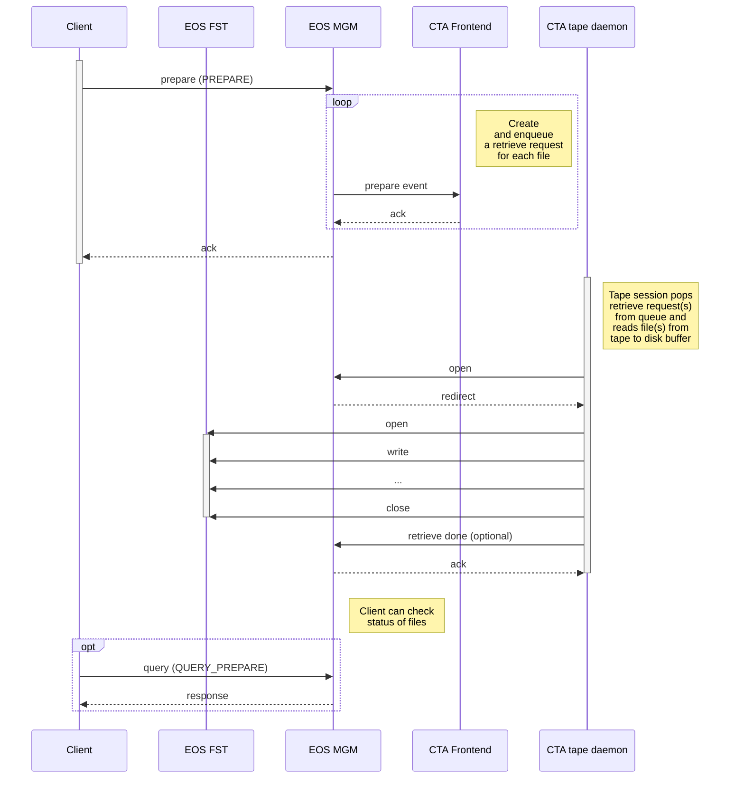

# Retrieval

To recall files from tape to disk, a **PREPARE** request is sent to EOSCTA. Most large experiments (such as ATLAS, CMS and LHCb) use FTS, which sends bulk **PREPARE** requests with 100's of files at a time.

The four main workflows associated with retrieving files from tape are:

- **PREPARE**: stage a file from tape to the EOS disk buffer; increments the *evict counter*;
- **QUERY_PREPARE**: query the status of a file (replica on disk or not; replica on tape or not; details of any in-flight requests; any errors);
- **ABORT_PREPARE**: cancel a previous PREPARE request;
- **EVICT_PREPARE**: decrement the *evict counter* of a previously-retrieved file replica and, if the value reached zero, remove it from the EOS buffer;

Note that not all requests are communicated from EOS to the CTA Frontend:

- **PREPARE** requests will only be passed to CTA they are the first request for a file;
- **ABORT_PREPARE** requests will decrease the evict counter and only be passed to CTA if it reaches zero;
- **QUERY_PREPARE** and **EVICT_PREPARE** are handled entirely by EOS and are never communicated to CTA;

#### *Evict counter*

It's possible to send several **PREPARE** requests to the same file. Only the first will be passed from EOS to CTA.
All the following ones will result in a incremented *evict counter* (after the file has been *staged*). \
**ABORT_PREPARE** and **EVICT_PREPARE**, on other hand, will decrease the *evict counter*. Once this value reaches zero, the file will be *evicted*.

This allows multiple clients to request and access the same file, while guaranteeing that EOSCTA keeps it *staged* until the last client no longer needs it.

#### ***PREPARE** Request IDs*

**PREPARE** takes a list of files and returns a *Request ID*. \
**QUERY_PREPARE**, **ABORT_PREPARE** and **EVICT_PREPARE** use this same *Request ID* and the list of files to reference the request.
The *Request ID* is a unique ID generated by EOS. One ID is generated for each request, and there can be multiple different requests for the same file. In other words, the relationship between *Request ID* and a file is many-to-many.

The XRootD API in EOS does not maintain the mapping between *Request IDs* and list of files (contrary bulk requests issued by the HTTP Tape REST API). This is usually done by FTS. In this scenario, EOS on its own is not able to provide a mechanism to look up the list of files associated with a given request. Instead, a file must be queried to see which *Request IDs* are attached to its metadata.

If FTS is not used, it is the responsibility of the client to keep track of which files belong to a given *Request ID* (unless the HTTP Tape REST API is used).

## Retrieve workflow

The figure below shows the sequence for queuing a **PREPARE** request and retrieving the file to EOS disk. \
It also depicts the **QUERY_PREPARE** workflow, used to query the staging status of a file.

