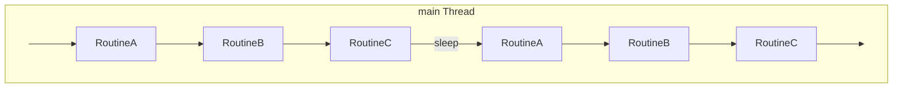
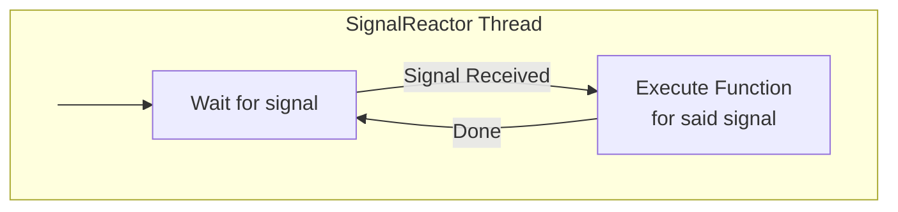

# cta-maintd

This directory contains the source code the maintenance daemon. The responsibility of the maintenance daemon is to periodically run a number of routines.

At the moment, this works as follows:

The sleep interval can be configured in the config file.

In addition to the main thread, the `maintd` process also spawns a dedicated SignalReactor thread whose job it is to capture incoming signals (e.g. `SIGTERM`, `SIGHUP`) and execute the function associated with said signal. This ensures that the logic for dealing with signals is not spread out through all of the code.

## Routines

The routines are defined in `routines/`. Which routines are run depend on whether the Objectstore or Postgres scheduler is used

### Objectstore

- `DiskReportArchiveRoutine`
  - Reports the state (fail or success) of archive jobs to the disk instance.
- `DiskReportRetrieveRoutine`
  - Reports the state (fail or success) of retrieve jobs to the disk instance.
- `RepackExpandRoutine`
  - Expands repack requests into separate archive/retrieve jobs.
- `RepackReportRoutine`
  - Takes care of the repack reporting.
- `GarbageCollectRoutine`
  - Performs garbage collection on agents and their objects in the objectstore.
- `QueueCleanupRoutine`
  - Finds queues marked for cleanup, takes ownership of these queues and moves the requests to other queues.

### Postgres

- `DiskReportArchiveRoutine`
  - Reports the state (fail or success) of archive jobs to the disk instance.
- `DiskReportRetrieveRoutine`
  - Reports the state (fail or success) of retrieve jobs to the disk instance.
- `RepackExpandRoutine`
  - Expands repack requests into separate archive/retrieve jobs.
- `RepackReportRoutine`
  - Takes care of the repack reporting.
- `ArchiveInactiveMountActiveQueueRoutine`
  - Handles jobs owned by dead archive mounts. The routine requeues dead jobs from active queue table to the pending queue table. 
  - Only jobs for which reporting did not start yet are selected. Jobs in reporting stage, will be picked up again for reporting automatically. 
- `RetrieveInactiveMountActiveQueueRoutine`
  - Handles jobs owned by dead retrieve mounts. The routine requeues dead jobs from active queue table to the pending queue table. 
  - Only jobs for which reporting did not start yet are selected. Jobs in reporting stage, will be picked up again for reporting automatically.
- `RepackArchiveInactiveMountActiveQueueRoutine`
  - Handles jobs owned by dead repack archive mounts. 
  - The routine requeues dead jobs from active queue table to the pending queue table. 
- `RepackRetrieveInactiveMountActiveQueueRoutine`
  - Handles jobs owned by dead repack repack retrieve mounts. 
  - The routine requeues dead jobs from active queue table to the pending queue table.
- `ArchiveInactiveMountPendingQueueRoutine`
  - Handles jobs owned by dead archive mounts. 
  - The routine requeues dead jobs from pending queue table after they have been requeued previously to the same mount which is now dead.
- `RetrieveInactiveMountPendingQueueRoutine`
  - Handles jobs owned by dead retrieve mounts. 
  - The routine requeues dead jobs from pending queue table after they have been requeued previously to the same mount which is now dead.
- `RepackArchiveInactiveMountPendingQueueRoutine`
  - Handles jobs owned by dead repack archive mounts. 
  - The routine requeues dead jobs from pending queue table after they have been requeued previously to the same mount which is now dead.
- `RepackRetrieveInactiveMountPendingQueueRoutine`
  - Handles jobs owned by dead repack repack retrieve mounts. 
  - The routine requeues dead jobs from pending queue table after they have been requeued previously to the same mount which is now dead.

For all the routines above, the following also applies:
  - After all clean up has been done for the respective (MOUNT_ID, QUEUE_TYPE), the corresponding row is deleted from MOUNT_QUEUE_LAST_FETCH tracking table preventing further cleanup.

- `DeleteOldFailedQueuesRoutine`
  - Deletes all jobs which hang in the failed queue tables for too long (2 weeks).
- `CleanMountLastFetchTimeRoutine`
  - Deletes all tracking MOUNT_QUEUE_LAST_FETCH entries for which the mount was not active since a very long time (e.g. 4 weeks; longer than the time limit defined for the collection routines). 
