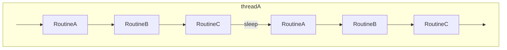

# cta-maintd

This directory contains the source code the maintenance daemon. The responsibility of the maintenance daemon is to periodically run a number of routines.

At the moment, this works as follows:

The sleep interval can be configured in the config file.

## Routines

The routines are defined in `routines/`. Which routines are run depend on whether the Objectstore or Postgres scheduler is used

### Objectstore

- `DiskReportRoutine`
  - Looks at all archive jobs that have been completed but not yet reported and reports these to the disk instance.
- `RepackManagerRoutine`
  - Expands repack requests and handles reporting of repack requests.
- `GarbageCollectRoutine`
  - Performs garbage collection on agents in the objectstore.
- `QueueCleanupRoutine`
  - Finds queues marked for cleanup, takes ownership of these queues and move the requests to other queues.

### Postgres

- `DiskReportRoutine`
  - Looks at all archive jobs that have been completed but not yet reported and reports these to the disk instance.
- `RepackManagerRoutine`
  - Expands repack requests and handles reporting of repack requests.
